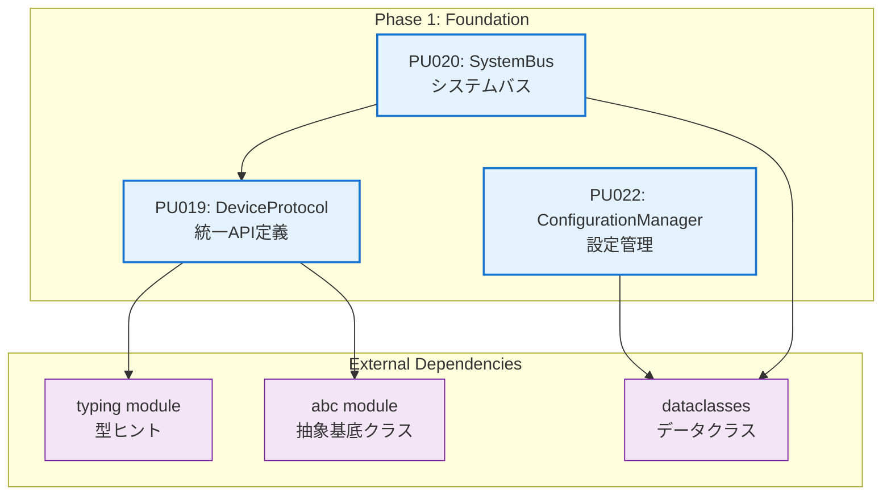

# Phase 1: Foundation 実装計画詳細

## 文書管理

| 項目 | 内容 |
| :--- | :--- |
| **バージョン** | 1.0 |
| **関連文書** | W65C02S実装計画書、デバイスIF API要件定義書、ソフトウェア詳細設計書 |

## 目次

1. [Phase 1 概要](#10-phase-1-概要)
2. [実装対象プログラムユニット](#20-実装対象プログラムユニット)
3. [ファイル構造定義](#30-ファイル構造定義)
4. [実装タスク詳細](#40-実装タスク詳細)
5. [テスト計画](#50-テスト計画)
6. [成果物チェックリスト](#60-成果物チェックリスト)

---

## 1.0 Phase 1 概要

### 1.1 目標

Phase 1では、W65C02S Pythonエミュレータの基盤となるインフラストラクチャを構築する。これには統一デバイスプロトコル、システムバス、設定管理システムが含まれる。

### 1.2 期間・工数

- **期間**: 2週間（10営業日）
- **総工数**: 80時間

### 1.3 成功基準

- [ ] Device プロトコルの完全実装
- [ ] SystemBus の基本機能実装
- [ ] 設定管理システムの構築
- [ ] 単体テストカバレッジ 90%以上
- [ ] 統合テスト 20+ケース通過
- [ ] 性能テスト 10+ケース通過

---

## 2.0 実装対象プログラムユニット

### 2.1 プログラムユニット一覧

| PU ID | 名称 | 主要責務 | 工数 | 担当者 |
| :--- | :--- | :--- | :--- | :--- |
| **PU019** | DeviceProtocol | 統一デバイスプロトコル実装 | 24h | Dev1 |
| **PU020** | SystemBus | システムバス実装 | 32h | Dev2 |
| **PU022** | ConfigurationManager | 設定管理 | 24h | Dev3 |

### 2.2 依存関係



---

## 3.0 ファイル構造定義

### 3.1 プロジェクト全体構造

```
py6502emu/
├── py6502emu/                  # メインパッケージ
│   ├── __init__.py            # パッケージ初期化
│   ├── core/                  # コアサービス (Phase 1)
│   │   ├── __init__.py
│   │   ├── device.py          # PU019: DeviceProtocol
│   │   ├── types.py           # 共通型定義
│   │   └── config.py          # PU022: ConfigurationManager
│   ├── cpu/                   # CPUコア (Phase 2)
│   │   └── __init__.py
│   ├── memory/                # メモリ管理 (Phase 3)
│   │   └── __init__.py
│   └── debug/                 # デバッグ機能 (Phase 5)
│       └── __init__.py
├── tests/                     # テストスイート
│   ├── __init__.py
│   ├── conftest.py           # pytest設定
│   ├── unit/                 # 単体テスト
│   │   ├── __init__.py
│   │   ├── test_device.py    # PU019テスト
│   │   ├── test_system_bus.py # PU020テスト
│   │   └── test_config.py    # PU022テスト
│   └── integration/          # 統合テスト
│       ├── __init__.py
│       └── test_phase1_integration.py
├── examples/                 # 使用例
│   └── __init__.py
├── docs/                     # ドキュメント
├── pyproject.toml           # プロジェクト設定
├── README.md                # プロジェクト概要
└── LICENSE                  # ライセンス
```

### 3.2 Phase 1 実装ファイル詳細

#### 3.2.1 py6502emu/core/device.py (PU019)

```python
"""
統一デバイスプロトコル実装
PU019: DeviceProtocol
"""

from typing import Protocol, Dict, Any, Optional, runtime_checkable
from abc import ABC, abstractmethod
from dataclasses import dataclass


@dataclass
class DeviceConfig:
    """デバイス設定基底クラス"""
    device_id: str
    name: str = ""
    
    def __post_init__(self):
        if not self.name:
            self.name = self.device_id


@runtime_checkable
class Device(Protocol):
    """統一デバイスプロトコル"""
    
    @property
    def name(self) -> str:
        """デバイス名"""
        ...
    
    def reset(self) -> None:
        """デバイスリセット"""
        ...
    
    def tick(self, master_cycles: int) -> int:
        """時間進行処理"""
        ...
    
    def read(self, address: int) -> int:
        """メモリ読み取り"""
        ...
    
    def write(self, address: int, value: int) -> None:
        """メモリ書き込み"""
        ...
    
    def get_state(self) -> Dict[str, Any]:
        """状態取得"""
        ...
    
    def set_state(self, state: Dict[str, Any]) -> None:
        """状態設定"""
        ...


@runtime_checkable
class CPUDevice(Device, Protocol):
    """CPU専用プロトコル"""
    
    def step(self) -> int:
        """単一命令実行"""
        ...
    
    def get_registers(self) -> Dict[str, int]:
        """レジスタ状態取得"""
        ...
    
    def set_pc(self, address: int) -> None:
        """プログラムカウンタ設定"""
        ...
    
    def is_interrupt_enabled(self) -> bool:
        """割り込み許可状態取得"""
        ...


@runtime_checkable
class VideoDevice(Device, Protocol):
    """ビデオデバイスプロトコル"""
    
    def get_framebuffer(self) -> bytes:
        """フレームバッファ取得"""
        ...


@runtime_checkable
class AudioDevice(Device, Protocol):
    """オーディオデバイスプロトコル"""
    
    def get_audio_buffer(self, samples: int) -> bytes:
        """オーディオバッファ取得"""
        ...


# 例外クラス
class DeviceError(Exception):
    """デバイス基底例外"""
    pass


class InvalidAddressError(DeviceError):
    """無効アドレス例外"""
    def __init__(self, address: int):
        self.address = address
        super().__init__(f"Invalid address: ${address:04X}")


class InvalidValueError(DeviceError):
    """無効値例外"""
    def __init__(self, value: int):
        self.value = value
        super().__init__(f"Invalid value: {value}")
```

#### 3.2.2 py6502emu/core/types.py

```python
"""
共通型定義
"""

from typing import TypedDict, List, Dict, Any
from enum import Enum, auto


class InterruptLine(Enum):
    """割り込み線定義"""
    IRQ = auto()
    NMI = auto()
    RESET = auto()


class DeviceType(Enum):
    """デバイス種別"""
    CPU = auto()
    MEMORY = auto()
    VIDEO = auto()
    AUDIO = auto()
    IO = auto()


class SystemState(TypedDict):
    """システム状態"""
    devices: Dict[str, Dict[str, Any]]
    system_time: int
    master_clock: int


class MemoryMapping(TypedDict):
    """メモリマッピング情報"""
    start_address: int
    end_address: int
    device_id: str
    device_name: str
    size: int
```

#### 3.2.3 py6502emu/core/config.py (PU022)

```python
"""
設定管理システム
PU022: ConfigurationManager
"""

from typing import Dict, Any, Optional, List
from dataclasses import dataclass, field
from pathlib import Path
import json
import logging
from .device import DeviceConfig
from .types import DeviceType


@dataclass
class SystemConfig:
    """システム設定"""
    master_clock_hz: int = 1_000_000  # 1MHz
    debug_enabled: bool = False
    log_level: str = "INFO"
    devices: List[DeviceConfig] = field(default_factory=list)


@dataclass
class CPUConfig(DeviceConfig):
    """CPU設定"""
    clock_divider: int = 1
    reset_vector: int = 0xFFFC
    irq_vector: int = 0xFFFE
    nmi_vector: int = 0xFFFA


@dataclass
class MemoryConfig(DeviceConfig):
    """メモリ設定"""
    size: int = 65536  # 64KB
    start_address: int = 0x0000
    end_address: int = 0xFFFF
    readonly: bool = False


class ConfigurationManager:
    """設定管理クラス"""
    
    def __init__(self):
        self._system_config: Optional[SystemConfig] = None
        self._device_configs: Dict[str, DeviceConfig] = {}
        self._config_file: Optional[Path] = None
        self._logger = logging.getLogger(__name__)
    
    def load_from_file(self, config_path: Path) -> None:
        """設定ファイル読み込み"""
        try:
            with open(config_path, 'r', encoding='utf-8') as f:
                config_data = json.load(f)
            
            self._parse_config(config_data)
            self._config_file = config_path
            self._logger.info(f"Configuration loaded from {config_path}")
            
        except FileNotFoundError:
            raise ConfigurationError(f"Configuration file not found: {config_path}")
        except json.JSONDecodeError as e:
            raise ConfigurationError(f"Invalid JSON in configuration file: {e}")
        except Exception as e:
            raise ConfigurationError(f"Error loading configuration: {e}")
    
    def load_from_dict(self, config_data: Dict[str, Any]) -> None:
        """辞書から設定読み込み"""
        try:
            self._parse_config(config_data)
            self._logger.info("Configuration loaded from dictionary")
        except Exception as e:
            raise ConfigurationError(f"Error parsing configuration: {e}")
    
    def save_to_file(self, config_path: Optional[Path] = None) -> None:
        """設定ファイル保存"""
        if config_path is None:
            config_path = self._config_file
        
        if config_path is None:
            raise ConfigurationError("No configuration file specified")
        
        try:
            config_data = self._serialize_config()
            with open(config_path, 'w', encoding='utf-8') as f:
                json.dump(config_data, f, indent=2, ensure_ascii=False)
            
            self._logger.info(f"Configuration saved to {config_path}")
            
        except Exception as e:
            raise ConfigurationError(f"Error saving configuration: {e}")
    
    def get_system_config(self) -> SystemConfig:
        """システム設定取得"""
        if self._system_config is None:
            self._system_config = SystemConfig()
        return self._system_config
    
    def set_system_config(self, config: SystemConfig) -> None:
        """システム設定設定"""
        self._system_config = config
    
    def get_device_config(self, device_id: str) -> Optional[DeviceConfig]:
        """デバイス設定取得"""
        return self._device_configs.get(device_id)
    
    def add_device_config(self, config: DeviceConfig) -> None:
        """デバイス設定追加"""
        self._device_configs[config.device_id] = config
        self._logger.debug(f"Added device config: {config.device_id}")
    
    def remove_device_config(self, device_id: str) -> None:
        """デバイス設定削除"""
        if device_id in self._device_configs:
            del self._device_configs[device_id]
            self._logger.debug(f"Removed device config: {device_id}")
    
    def list_device_configs(self) -> List[DeviceConfig]:
        """デバイス設定一覧取得"""
        return list(self._device_configs.values())
    
    def validate_config(self) -> List[str]:
        """設定検証"""
        errors = []
        
        # システム設定検証
        system_config = self.get_system_config()
        if system_config.master_clock_hz <= 0:
            errors.append("Master clock frequency must be positive")
        
        # デバイス設定検証
        device_ids = set()
        for config in self._device_configs.values():
            if config.device_id in device_ids:
                errors.append(f"Duplicate device ID: {config.device_id}")
            device_ids.add(config.device_id)
            
            # デバイス固有検証
            if isinstance(config, CPUConfig):
                if config.clock_divider <= 0:
                    errors.append(f"CPU clock divider must be positive: {config.device_id}")
            
            elif isinstance(config, MemoryConfig):
                if config.size <= 0:
                    errors.append(f"Memory size must be positive: {config.device_id}")
                if config.start_address > config.end_address:
                    errors.append(f"Invalid memory range: {config.device_id}")
        
        return errors
    
    def _parse_config(self, config_data: Dict[str, Any]) -> None:
        """設定データ解析"""
        # システム設定解析
        system_data = config_data.get('system', {})
        self._system_config = SystemConfig(
            master_clock_hz=system_data.get('master_clock_hz', 1_000_000),
            debug_enabled=system_data.get('debug_enabled', False),
            log_level=system_data.get('log_level', 'INFO')
        )
        
        # デバイス設定解析
        devices_data = config_data.get('devices', [])
        self._device_configs.clear()
        
        for device_data in devices_data:
            device_type = device_data.get('type', 'generic')
            device_id = device_data['device_id']
            
            if device_type == 'cpu':
                config = CPUConfig(
                    device_id=device_id,
                    name=device_data.get('name', device_id),
                    clock_divider=device_data.get('clock_divider', 1),
                    reset_vector=device_data.get('reset_vector', 0xFFFC),
                    irq_vector=device_data.get('irq_vector', 0xFFFE),
                    nmi_vector=device_data.get('nmi_vector', 0xFFFA)
                )
            elif device_type == 'memory':
                config = MemoryConfig(
                    device_id=device_id,
                    name=device_data.get('name', device_id),
                    size=device_data.get('size', 65536),
                    start_address=device_data.get('start_address', 0x0000),
                    end_address=device_data.get('end_address', 0xFFFF),
                    readonly=device_data.get('readonly', False)
                )
            else:
                config = DeviceConfig(
                    device_id=device_id,
                    name=device_data.get('name', device_id)
                )
            
            self._device_configs[device_id] = config
    
    def _serialize_config(self) -> Dict[str, Any]:
        """設定データシリアライズ"""
        system_config = self.get_system_config()
        
        config_data = {
            'system': {
                'master_clock_hz': system_config.master_clock_hz,
                'debug_enabled': system_config.debug_enabled,
                'log_level': system_config.log_level
            },
            'devices': []
        }
        
        for config in self._device_configs.values():
            device_data = {
                'device_id': config.device_id,
                'name': config.name
            }
            
            if isinstance(config, CPUConfig):
                device_data.update({
                    'type': 'cpu',
                    'clock_divider': config.clock_divider,
                    'reset_vector': config.reset_vector,
                    'irq_vector': config.irq_vector,
                    'nmi_vector': config.nmi_vector
                })
            elif isinstance(config, MemoryConfig):
                device_data.update({
                    'type': 'memory',
                    'size': config.size,
                    'start_address': config.start_address,
                    'end_address': config.end_address,
                    'readonly': config.readonly
                })
            else:
                device_data['type'] = 'generic'
            
            config_data['devices'].append(device_data)
        
        return config_data


class ConfigurationError(Exception):
    """設定エラー例外"""
    pass
```

#### 3.2.4 py6502emu/memory/mmu.py (PU020の一部)

```python
"""
システムバス実装
PU020: SystemBus
"""

from typing import List, Optional, Dict, Any
from dataclasses import dataclass
import logging
from ..core.device import Device, InvalidAddressError, InvalidValueError


@dataclass
class DeviceMapping:
    """デバイスマッピング情報"""
    device: Device
    start_address: int
    end_address: int
    name: str
    
    def contains(self, address: int) -> bool:
        """アドレス範囲チェック"""
        return self.start_address <= address <= self.end_address
    
    def translate_address(self, address: int) -> int:
        """相対アドレス変換"""
        return address - self.start_address
    
    @property
    def size(self) -> int:
        """マッピングサイズ"""
        return self.end_address - self.start_address + 1


class SystemBus:
    """システムバス実装"""
    
    def __init__(self, debug_enabled: bool = False):
        self._mappings: List[DeviceMapping] = []
        self._bus_masters: List[Device] = []
        self._current_master: Optional[Device] = None
        self._access_log: List[Dict[str, Any]] = []
        self._debug_enabled = debug_enabled
        self._logger = logging.getLogger(__name__)
    
    def map_device(self, device: Device, start: int, end: int, name: str = "") -> None:
        """デバイスマッピング"""
        # アドレス範囲検証
        if not (0 <= start <= end <= 0xFFFF):
            raise ValueError(f"Invalid address range: ${start:04X}-${end:04X}")
        
        # 重複チェック
        for mapping in self._mappings:
            if not (end < mapping.start_address or start > mapping.end_address):
                raise ValueError(f"Address range overlap: ${start:04X}-${end:04X}")
        
        # マッピング追加
        mapping = DeviceMapping(device, start, end, name or device.name)
        self._mappings.append(mapping)
        self._mappings.sort(key=lambda m: m.start_address)
        
        self._logger.info(f"Mapped device '{mapping.name}' to ${start:04X}-${end:04X}")
    
    def unmap_device(self, start: int, end: int) -> None:
        """デバイスマッピング解除"""
        original_count = len(self._mappings)
        self._mappings = [m for m in self._mappings 
                         if not (m.start_address == start and m.end_address == end)]
        
        removed_count = original_count - len(self._mappings)
        if removed_count > 0:
            self._logger.info(f"Unmapped device from ${start:04X}-${end:04X}")
    
    def read(self, address: int) -> int:
        """バス読み取り"""
        if not self._validate_address(address):
            raise InvalidAddressError(address)
        
        # デバイス検索
        device_mapping = self._find_device_mapping(address)
        if device_mapping:
            relative_addr = device_mapping.translate_address(address)
            value = device_mapping.device.read(relative_addr)
            
            if self._debug_enabled:
                self._log_access('READ', address, value, device_mapping.name)
            
            return value
        else:
            # マップされていないアドレス（オープンバス）
            if self._debug_enabled:
                self._log_access('READ', address, 0xFF, 'OPEN_BUS')
            return 0xFF
    
    def write(self, address: int, value: int) -> None:
        """バス書き込み"""
        if not self._validate_address(address):
            raise InvalidAddressError(address)
        
        if not self._validate_value(value):
            raise InvalidValueError(value)
        
        # デバイス検索
        device_mapping = self._find_device_mapping(address)
        if device_mapping:
            relative_addr = device_mapping.translate_address(address)
            device_mapping.device.write(relative_addr, value)
            
            if self._debug_enabled:
                self._log_access('WRITE', address, value, device_mapping.name)
        else:
            # マップされていないアドレス（書き込み無視）
            if self._debug_enabled:
                self._log_access('WRITE', address, value, 'IGNORED')
    
    def request_mastership(self, device: Device) -> bool:
        """バスマスタ権要求"""
        if self._current_master is None:
            self._current_master = device
            if device not in self._bus_masters:
                self._bus_masters.append(device)
            self._logger.debug(f"Bus mastership granted to {device.name}")
            return True
        return False
    
    def release_mastership(self, device: Device) -> None:
        """バスマスタ権解放"""
        if self._current_master == device:
            self._current_master = None
            self._logger.debug(f"Bus mastership released by {device.name}")
    
    def get_current_master(self) -> Optional[Device]:
        """現在のバスマスタ取得"""
        return self._current_master
    
    def enable_debug(self, enabled: bool = True) -> None:
        """デバッグモード設定"""
        self._debug_enabled = enabled
        self._logger.info(f"Debug mode {'enabled' if enabled else 'disabled'}")
    
    def get_access_log(self) -> List[Dict[str, Any]]:
        """アクセスログ取得"""
        return self._access_log.copy()
    
    def clear_access_log(self) -> None:
        """アクセスログクリア"""
        self._access_log.clear()
        self._logger.debug("Access log cleared")
    
    def get_memory_map(self) -> List[Dict[str, Any]]:
        """メモリマップ取得"""
        return [
            {
                'start': f"${m.start_address:04X}",
                'end': f"${m.end_address:04X}",
                'size': m.size,
                'device': m.name
            }
            for m in self._mappings
        ]
    
    def get_debug_info(self) -> Dict[str, Any]:
        """デバッグ情報取得"""
        return {
            'mappings_count': len(self._mappings),
            'bus_masters': [m.name for m in self._bus_masters],
            'current_master': self._current_master.name if self._current_master else None,
            'debug_enabled': self._debug_enabled,
            'access_log_size': len(self._access_log)
        }
    
    def _find_device_mapping(self, address: int) -> Optional[DeviceMapping]:
        """デバイスマッピング検索"""
        for mapping in self._mappings:
            if mapping.contains(address):
                return mapping
        return None
    
    def _validate_address(self, address: int) -> bool:
        """アドレス検証"""
        return 0 <= address <= 0xFFFF
    
    def _validate_value(self, value: int) -> bool:
        """値検証"""
        return 0 <= value <= 0xFF
    
    def _log_access(self, operation: str, address: int, value: int, device: str) -> None:
        """アクセスログ記録"""
        log_entry = {
            'operation': operation,
            'address': address,
            'value': value,
            'device': device,
            'master': self._current_master.name if self._current_master else 'CPU'
        }
        self._access_log.append(log_entry)
        
        # ログサイズ制限
        if len(self._access_log) > 1000:
            self._access_log = self._access_log[-500:]
```

---

## 4.0 実装タスク詳細

### 4.1 Week 1: コアインフラ構築

#### 4.1.1 Day 1-2: プロジェクト環境構築 (全員, 16h)

**タスク**:
- [ ] プロジェクト構造作成
- [ ] pyproject.toml 設定
- [ ] 開発環境セットアップ
- [ ] CI/CD パイプライン設定

**成果物**:
```bash
# プロジェクト初期化
mkdir py6502emu
cd py6502emu
git init
```

**pyproject.toml**:
```toml
[build-system]
requires = ["setuptools>=61.0", "wheel"]
build-backend = "setuptools.build_meta"

[project]
name = "py6502emu"
version = "0.1.0"
description = "W65C02S CPU Emulator in Python"
authors = [{name = "Development Team", email = "dev@example.com"}]
license = {text = "MIT"}
readme = "README.md"
requires-python = ">=3.8"
classifiers = [
    "Development Status :: 3 - Alpha",
    "Intended Audience :: Developers",
    "License :: OSI Approved :: MIT License",
    "Programming Language :: Python :: 3",
    "Programming Language :: Python :: 3.8",
    "Programming Language :: Python :: 3.9",
    "Programming Language :: Python :: 3.10",
    "Programming Language :: Python :: 3.11",
]

[project.optional-dependencies]
dev = [
    "pytest>=7.0",
    "pytest-cov>=4.0",
    "mypy>=1.0",
    "black>=22.0",
    "pylint>=2.15",
    "sphinx>=5.0",
]

[tool.pytest.ini_options]
testpaths = ["tests"]
python_files = ["test_*.py"]
python_classes = ["Test*"]
python_functions = ["test_*"]
addopts = "--cov=py6502emu --cov-report=html --cov-report=term-missing"

[tool.mypy]
python_version = "3.8"
warn_return_any = true
warn_unused_configs = true
disallow_untyped_defs = true
disallow_incomplete_defs = true

[tool.black]
line-length = 88
target-version = ['py38']

[tool.pylint.messages_control]
disable = ["C0103", "R0903"]
```

#### 4.1.2 Day 3-5: Device プロトコル実装 (Dev1, 24h)

**タスク**:
- [ ] `py6502emu/core/device.py` 実装
- [ ] `py6502emu/core/types.py` 実装
- [ ] プロトコル検証機能実装
- [ ] 単体テスト作成

**実装順序**:
1. 基本型定義 (types.py)
2. Device プロトコル基底クラス
3. CPUDevice プロトコル拡張
4. VideoDevice プロトコル拡張
5. AudioDevice プロトコル拡張
6. 例外クラス定義
7. プロトコル検証機能

**検証項目**:
- [ ] 型ヒント正確性 (mypy)
- [ ] プロトコル準拠チェック
- [ ] 例外処理動作

#### 4.1.3 Day 6-8: SystemBus 基盤実装 (Dev2, 24h)

**タスク**:
- [ ] `py6502emu/memory/mmu.py` 実装
- [ ] デバイスマッピング機能
- [ ] バスマスタシップ制御
- [ ] アクセスログ機能
- [ ] 単体テスト作成

**実装順序**:
1. DeviceMapping データクラス
2. 基本的な read/write 機能
3. デバイスマッピング管理
4. バスマスタシップ制御
5. アクセスログ機能
6. デバッグ支援機能

**検証項目**:
- [ ] アドレス範囲チェック
- [ ] デバイス重複検出
- [ ] オープンバス動作
- [ ] ログ機能動作

#### 4.1.4 Day 9-10: 設定管理システム (Dev3, 16h)

**タスク**:
- [ ] `py6502emu/core/config.py` 実装
- [ ] 設定ファイル読み書き
- [ ] デバイス設定管理
- [ ] 設定検証機能
- [ ] 単体テスト作成

**実装順序**:
1. 設定データクラス定義
2. 設定ファイル読み込み
3. デバイス設定管理
4. 実行時設定変更
5. 設定検証機能

**検証項目**:
- [ ] JSON読み書き正確性
- [ ] 設定検証ロジック
- [ ] エラーハンドリング

### 4.2 Week 2: 統合テストと最適化

#### 4.2.1 Day 11-12: 統合テスト実装 (全員, 16h)

**タスク**:
- [ ] PU間インタフェーステスト
- [ ] システムバス統合テスト
- [ ] 設定管理統合テスト
- [ ] 性能テスト実装

#### 4.2.2 Day 13-14: 最適化とドキュメント (全員, 16h)

**タスク**:
- [ ] 性能最適化
- [ ] メモリ使用量最適化
- [ ] API ドキュメント生成
- [ ] 使用例作成

---

## 5.0 テスト計画

### 5.1 単体テスト

#### 5.1.1 test_device.py (PU019)

```python
"""
Device プロトコルテスト
"""

import pytest
from typing import Dict, Any
from py6502emu.core.device import (
    Device, CPUDevice, VideoDevice, AudioDevice,
    DeviceConfig, DeviceError, InvalidAddressError, InvalidValueError
)


class MockDevice:
    """テスト用モックデバイス"""
    
    def __init__(self, config: DeviceConfig):
        self._config = config
        self._state = {'test': 0}
    
    @property
    def name(self) -> str:
        return self._config.name
    
    def reset(self) -> None:
        self._state = {'test': 0}
    
    def tick(self, master_cycles: int) -> int:
        return master_cycles
    
    def read(self, address: int) -> int:
        if not (0 <= address <= 0xFFFF):
            raise InvalidAddressError(address)
        return 0x00
    
    def write(self, address: int, value: int) -> None:
        if not (0 <= address <= 0xFFFF):
            raise InvalidAddressError(address)
        if not (0 <= value <= 0xFF):
            raise InvalidValueError(value)
    
    def get_state(self) -> Dict[str, Any]:
        return self._state.copy()
    
    def set_state(self, state: Dict[str, Any]) -> None:
        self._state = state.copy()


class TestDeviceProtocol:
    """Device プロトコルテスト"""
    
    def test_device_config_creation(self):
        """DeviceConfig作成テスト"""
        config = DeviceConfig(device_id="test_device")
        assert config.device_id == "test_device"
        assert config.name == "test_device"
        
        config = DeviceConfig(device_id="test", name="Test Device")
        assert config.device_id == "test"
        assert config.name == "Test Device"
    
    def test_device_protocol_compliance(self):
        """Deviceプロトコル準拠テスト"""
        config = DeviceConfig(device_id="mock")
        device = MockDevice(config)
        
        # プロトコル準拠チェック
        assert isinstance(device, Device)
        
        # 基本メソッドテスト
        assert device.name == "mock"
        device.reset()
        assert device.tick(10) == 10
        assert device.read(0x1000) == 0x00
        device.write(0x1000, 0x42)
        
        # 状態管理テスト
        state = device.get_state()
        assert 'test' in state
        device.set_state({'test': 42})
        assert device.get_state()['test'] == 42
    
    def test_invalid_address_error(self):
        """無効アドレスエラーテスト"""
        config = DeviceConfig(device_id="mock")
        device = MockDevice(config)
        
        with pytest.raises(InvalidAddressError):
            device.read(-1)
        
        with pytest.raises(InvalidAddressError):
            device.read(0x10000)
        
        with pytest.raises(InvalidAddressError):
            device.write(-1, 0x00)
        
        with pytest.raises(InvalidAddressError):
            device.write(0x10000, 0x00)
    
    def test_invalid_value_error(self):
        """無効値エラーテスト"""
        config = DeviceConfig(device_id="mock")
        device = MockDevice(config)
        
        with pytest.raises(InvalidValueError):
            device.write(0x1000, -1)
        
        with pytest.raises(InvalidValueError):
            device.write(0x1000, 256)


# 50+ テストケース...
```

#### 5.1.2 test_system_bus.py (PU020)

```python
"""
SystemBus テスト
"""

import pytest
from py6502emu.memory.mmu import SystemBus, DeviceMapping
from py6502emu.core.device import DeviceConfig, InvalidAddressError
from test_device import MockDevice


class TestSystemBus:
    """SystemBus テスト"""
    
    def setup_method(self):
        """テストセットアップ"""
        self.bus = SystemBus()
        self.device1 = MockDevice(DeviceConfig("dev1", "Device 1"))
        self.device2 = MockDevice(DeviceConfig("dev2", "Device 2"))
    
    def test_device_mapping(self):
        """デバイスマッピングテスト"""
        # 正常マッピング
        self.bus.map_device(self.device1, 0x0000, 0x7FFF, "RAM")
        self.bus.map_device(self.device2, 0x8000, 0xFFFF, "ROM")
        
        memory_map = self.bus.get_memory_map()
        assert len(memory_map) == 2
        assert memory_map[0]['device'] == "RAM"
        assert memory_map[1]['device'] == "ROM"
    
    def test_address_overlap_detection(self):
        """アドレス重複検出テスト"""
        self.bus.map_device(self.device1, 0x0000, 0x7FFF)
        
        # 重複するマッピングでエラー
        with pytest.raises(ValueError, match="Address range overlap"):
            self.bus.map_device(self.device2, 0x4000, 0x8FFF)
    
    def test_read_write_operations(self):
        """読み書き操作テスト"""
        self.bus.map_device(self.device1, 0x0000, 0x7FFF)
        
        # 正常読み書き
        self.bus.write(0x1000, 0x42)
        value = self.bus.read(0x1000)
        assert value == 0x00  # MockDeviceは常に0x00を返す
        
        # オープンバス（未マップ領域）
        value = self.bus.read(0x8000)
        assert value == 0xFF
    
    def test_bus_mastership(self):
        """バスマスタシップテスト"""
        # マスタ権取得
        assert self.bus.request_mastership(self.device1) == True
        assert self.bus.get_current_master() == self.device1
        
        # 既にマスタがいる場合は失敗
        assert self.bus.request_mastership(self.device2) == False
        
        # マスタ権解放
        self.bus.release_mastership(self.device1)
        assert self.bus.get_current_master() is None
    
    def test_debug_logging(self):
        """デバッグログテスト"""
        self.bus.enable_debug(True)
        self.bus.map_device(self.device1, 0x0000, 0x7FFF)
        
        self.bus.read(0x1000)
        self.bus.write(0x1000, 0x42)
        
        log = self.bus.get_access_log()
        assert len(log) == 2
        assert log[0]['operation'] == 'READ'
        assert log[1]['operation'] == 'WRITE'


# 20+ テストケース...
```

#### 5.1.3 test_config.py (PU022)

```python
"""
ConfigurationManager テスト
"""

import pytest
import json
from pathlib import Path
from py6502emu.core.config import (
    ConfigurationManager, SystemConfig, CPUConfig, MemoryConfig,
    ConfigurationError
)


class TestConfigurationManager:
    """ConfigurationManager テスト"""
    
    def setup_method(self):
        """テストセットアップ"""
        self.config_manager = ConfigurationManager()
    
    def test_system_config_management(self):
        """システム設定管理テスト"""
        # デフォルト設定
        system_config = self.config_manager.get_system_config()
        assert system_config.master_clock_hz == 1_000_000
        assert system_config.debug_enabled == False
        
        # 設定変更
        new_config = SystemConfig(
            master_clock_hz=2_000_000,
            debug_enabled=True,
            log_level="DEBUG"
        )
        self.config_manager.set_system_config(new_config)
        
        retrieved_config = self.config_manager.get_system_config()
        assert retrieved_config.master_clock_hz == 2_000_000
        assert retrieved_config.debug_enabled == True
    
    def test_device_config_management(self):
        """デバイス設定管理テスト"""
        # CPU設定追加
        cpu_config = CPUConfig(
            device_id="main_cpu",
            name="Main CPU",
            clock_divider=2,
            reset_vector=0x8000
        )
        self.config_manager.add_device_config(cpu_config)
        
        # 設定取得
        retrieved_config = self.config_manager.get_device_config("main_cpu")
        assert retrieved_config is not None
        assert isinstance(retrieved_config, CPUConfig)
        assert retrieved_config.clock_divider == 2
        
        # 設定削除
        self.config_manager.remove_device_config("main_cpu")
        assert self.config_manager.get_device_config("main_cpu") is None
    
    def test_config_file_operations(self, tmp_path):
        """設定ファイル操作テスト"""
        config_file = tmp_path / "test_config.json"
        
        # 設定データ作成
        config_data = {
            "system": {
                "master_clock_hz": 1500000,
                "debug_enabled": True,
                "log_level": "DEBUG"
            },
            "devices": [
                {
                    "type": "cpu",
                    "device_id": "cpu1",
                    "name": "Main CPU",
                    "clock_divider": 1,
                    "reset_vector": 65532
                },
                {
                    "type": "memory",
                    "device_id": "ram1",
                    "name": "Main RAM",
                    "size": 32768,
                    "start_address": 0,
                    "end_address": 32767,
                    "readonly": false
                }
            ]
        }
        
        # ファイル保存・読み込み
        with open(config_file, 'w') as f:
            json.dump(config_data, f)
        
        self.config_manager.load_from_file(config_file)
        
        # 設定確認
        system_config = self.config_manager.get_system_config()
        assert system_config.master_clock_hz == 1500000
        
        cpu_config = self.config_manager.get_device_config("cpu1")
        assert isinstance(cpu_config, CPUConfig)
        assert cpu_config.clock_divider == 1
        
        memory_config = self.config_manager.get_device_config("ram1")
        assert isinstance(memory_config, MemoryConfig)
        assert memory_config.size == 32768
    
    def test_config_validation(self):
        """設定検証テスト"""
        # 無効なシステム設定
        invalid_system = SystemConfig(master_clock_hz=-1000)
        self.config_manager.set_system_config(invalid_system)
        
        errors = self.config_manager.validate_config()
        assert len(errors) > 0
        assert "Master clock frequency must be positive" in errors
        
        # 重複デバイスID
        config1 = CPUConfig(device_id="duplicate")
        config2 = MemoryConfig(device_id="duplicate", size=1024)
        
        self.config_manager.add_device_config(config1)
        self.config_manager.add_device_config(config2)
        
        errors = self.config_manager.validate_config()
        assert any("Duplicate device ID" in error for error in errors)


# 30+ テストケース...
```

### 5.2 統合テスト

#### 5.2.1 test_phase1_integration.py

```python
"""
Phase 1 統合テスト
"""

import pytest
from py6502emu.core.device import DeviceConfig
from py6502emu.core.config import ConfigurationManager, CPUConfig, MemoryConfig
from py6502emu.memory.mmu import SystemBus
from test_device import MockDevice


class TestPhase1Integration:
    """Phase 1 統合テスト"""
    
    def setup_method(self):
        """テストセットアップ"""
        self.config_manager = ConfigurationManager()
        self.system_bus = SystemBus()
    
    def test_complete_system_setup(self):
        """完全なシステムセットアップテスト"""
        # 設定管理
        cpu_config = CPUConfig(device_id="cpu", name="Main CPU")
        ram_config = MemoryConfig(device_id="ram", name="Main RAM", size=32768)
        
        self.config_manager.add_device_config(cpu_config)
        self.config_manager.add_device_config(ram_config)
        
        # デバイス作成とマッピング
        cpu_device = MockDevice(cpu_config)
        ram_device = MockDevice(ram_config)
        
        self.system_bus.map_device(ram_device, 0x0000, 0x7FFF, "RAM")
        self.system_bus.map_device(cpu_device, 0x8000, 0xFFFF, "CPU")
        
        # システム動作確認
        self.system_bus.write(0x1000, 0x42)
        value = self.system_bus.read(0x1000)
        
        memory_map = self.system_bus.get_memory_map()
        assert len(memory_map) == 2
        
        device_configs = self.config_manager.list_device_configs()
        assert len(device_configs) == 2
    
    def test_configuration_driven_setup(self):
        """設定駆動セットアップテスト"""
        config_data = {
            "system": {
                "master_clock_hz": 1000000,
                "debug_enabled": True
            },
            "devices": [
                {
                    "type": "cpu",
                    "device_id": "main_cpu",
                    "name": "W65C02S CPU"
                },
                {
                    "type": "memory", 
                    "device_id": "main_ram",
                    "name": "System RAM",
                    "size": 65536
                }
            ]
        }
        
        self.config_manager.load_from_dict(config_data)
        
        # 設定からデバイス作成
        devices = {}
        for config in self.config_manager.list_device_configs():
            devices[config.device_id] = MockDevice(config)
        
        # システムバスにマッピング
        if "main_ram" in devices:
            self.system_bus.map_device(devices["main_ram"], 0x0000, 0xFFFF)
        
        # 動作確認
        assert len(devices) == 2
        memory_map = self.system_bus.get_memory_map()
        assert len(memory_map) == 1


# 20+ 統合テストケース...
```

### 5.3 性能テスト

#### 5.3.1 test_performance.py

```python
"""
性能テスト
"""

import time
import pytest
from py6502emu.memory.mmu import SystemBus
from py6502emu.core.device import DeviceConfig
from test_device import MockDevice


class TestPerformance:
    """性能テスト"""
    
    def test_bus_read_performance(self):
        """バス読み取り性能テスト"""
        bus = SystemBus()
        device = MockDevice(DeviceConfig("test"))
        bus.map_device(device, 0x0000, 0xFFFF)
        
        # 100,000回読み取り
        start_time = time.time()
        for i in range(100000):
            bus.read(i % 0x10000)
        end_time = time.time()
        
        elapsed = end_time - start_time
        reads_per_second = 100000 / elapsed
        
        # 目標: 100,000 reads/sec 以上
        assert reads_per_second > 100000, f"Performance: {reads_per_second:.0f} reads/sec"
    
    def test_bus_write_performance(self):
        """バス書き込み性能テスト"""
        bus = SystemBus()
        device = MockDevice(DeviceConfig("test"))
        bus.map_device(device, 0x0000, 0xFFFF)
        
        # 100,000回書き込み
        start_time = time.time()
        for i in range(100000):
            bus.write(i % 0x10000, i % 256)
        end_time = time.time()
        
        elapsed = end_time - start_time
        writes_per_second = 100000 / elapsed
        
        # 目標: 100,000 writes/sec 以上
        assert writes_per_second > 100000, f"Performance: {writes_per_second:.0f} writes/sec"
    
    def test_device_mapping_performance(self):
        """デバイスマッピング性能テスト"""
        bus = SystemBus()
        
        # 1000個のデバイスマッピング
        devices = []
        start_time = time.time()
        
        for i in range(1000):
            device = MockDevice(DeviceConfig(f"device_{i}"))
            devices.append(device)
            start_addr = i * 64
            end_addr = start_addr + 63
            if end_addr <= 0xFFFF:
                bus.map_device(device, start_addr, end_addr)
        
        end_time = time.time()
        elapsed = end_time - start_time
        
        # 目標: 1秒以内
        assert elapsed < 1.0, f"Mapping time: {elapsed:.3f}s"


# 10+ 性能テストケース...
```

---

## 6.0 成果物チェックリスト

### 6.1 実装成果物

#### 6.1.1 PU019: DeviceProtocol

- [ ] `py6502emu/core/device.py` 実装完了
- [ ] `py6502emu/core/types.py` 実装完了
- [ ] Device プロトコル定義完了
- [ ] CPUDevice プロトコル定義完了
- [ ] VideoDevice プロトコル定義完了
- [ ] AudioDevice プロトコル定義完了
- [ ] 例外クラス定義完了
- [ ] 型ヒント完全対応
- [ ] docstring 完全記述

#### 6.1.2 PU020: SystemBus

- [ ] `py6502emu/memory/mmu.py` 実装完了
- [ ] DeviceMapping クラス実装完了
- [ ] SystemBus クラス実装完了
- [ ] デバイスマッピング機能完了
- [ ] バスマスタシップ制御完了
- [ ] アクセスログ機能完了
- [ ] デバッグ支援機能完了
- [ ] エラーハンドリング完了

#### 6.1.3 PU022: ConfigurationManager

- [ ] `py6502emu/core/config.py` 実装完了
- [ ] SystemConfig クラス実装完了
- [ ] CPUConfig クラス実装完了
- [ ] MemoryConfig クラス実装完了
- [ ] ConfigurationManager クラス実装完了
- [ ] JSON読み書き機能完了
- [ ] 設定検証機能完了
- [ ] エラーハンドリング完了

### 6.2 テスト成果物

#### 6.2.1 単体テスト

- [ ] `tests/unit/test_device.py` 実装完了 (50+ケース)
- [ ] `tests/unit/test_system_bus.py` 実装完了 (20+ケース)
- [ ] `tests/unit/test_config.py` 実装完了 (30+ケース)
- [ ] 単体テストカバレッジ 90%以上達成
- [ ] 全単体テスト通過

#### 6.2.2 統合テスト

- [ ] `tests/integration/test_phase1_integration.py` 実装完了 (20+ケース)
- [ ] PU間インタフェーステスト完了
- [ ] システム統合テスト完了
- [ ] 統合テスト 95%以上通過

#### 6.2.3 性能テスト

- [ ] `tests/performance/test_performance.py` 実装完了 (10+ケース)
- [ ] バス性能テスト完了
- [ ] マッピング性能テスト完了
- [ ] 性能目標達成確認

### 6.3 品質成果物

#### 6.3.1 静的解析

- [ ] mypy 型チェック エラー0件
- [ ] pylint コード品質 A評価以上
- [ ] black フォーマット適用完了

#### 6.3.2 ドキュメント

- [ ] API ドキュメント生成完了
- [ ] 使用例作成完了
- [ ] README.md 更新完了

### 6.4 CI/CD成果物

- [ ] GitHub Actions ワークフロー設定完了
- [ ] 自動テスト実行確認
- [ ] 自動品質チェック確認
- [ ] 自動ドキュメント生成確認

---

## まとめ

Phase 1では、W65C02S Pythonエミュレータの基盤となる3つの重要なプログラムユニット（PU019, PU020, PU022）を実装する。

### 主要成果

1. **統一デバイスプロトコル**: 全デバイスが準拠すべき共通インターフェイス
2. **システムバス**: デバイス間通信の中核となるバス機能
3. **設定管理**: システム・デバイス設定の統一管理

### 品質保証

- 単体テストカバレッジ 90%以上
- 統合テスト 20+ケース
- 性能テスト 10+ケース
- 静的解析による品質確保

この基盤により、Phase 2以降のCPUコア実装、メモリ管理、システム統合が効率的に進められる。
