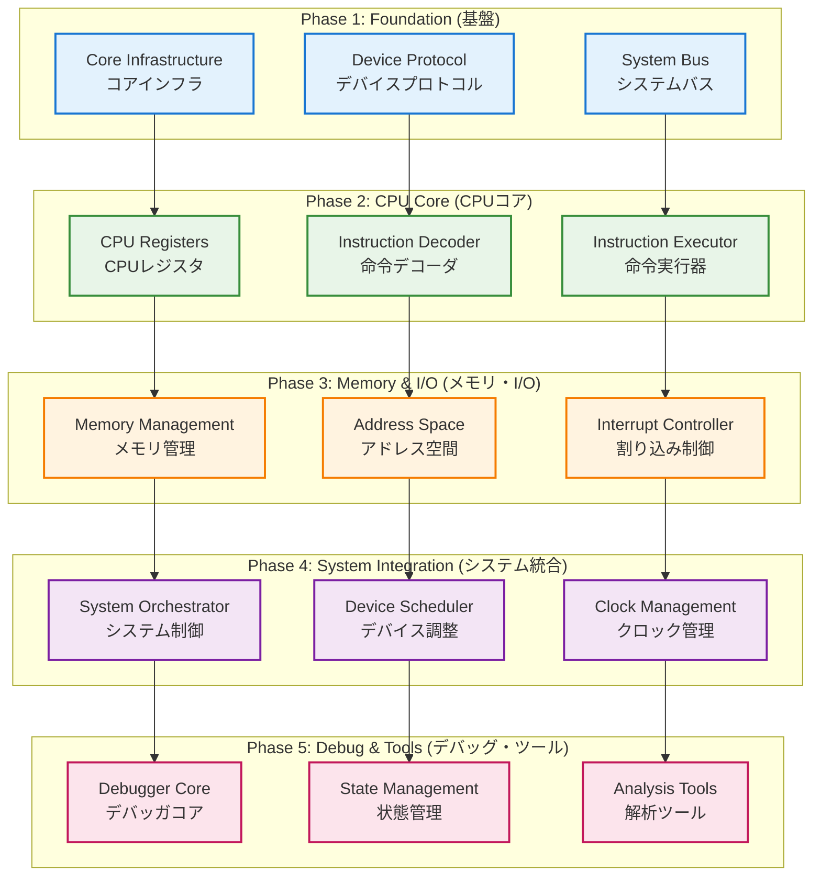
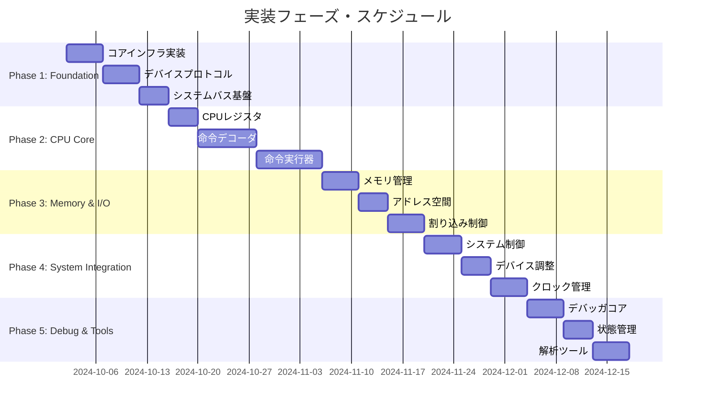
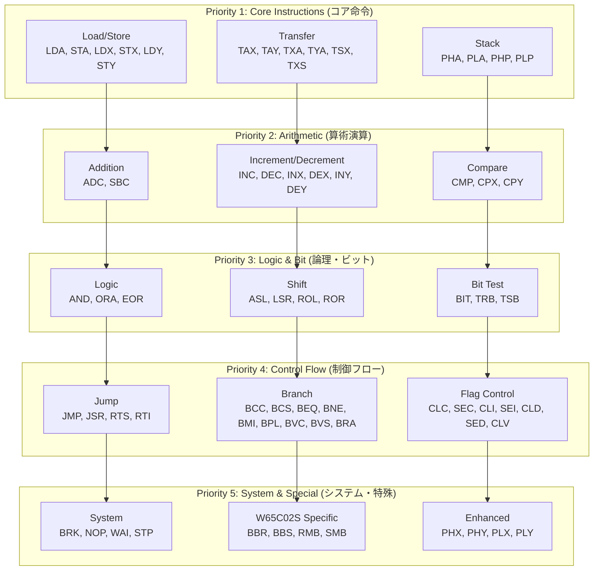
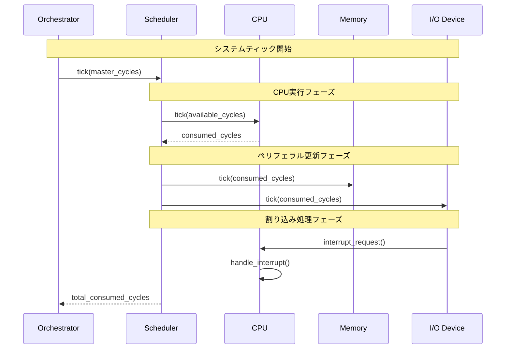
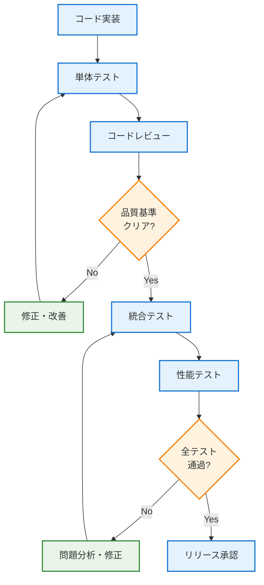
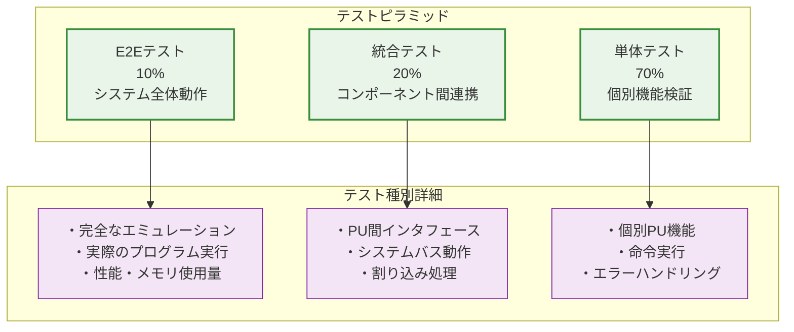
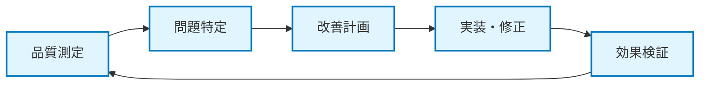
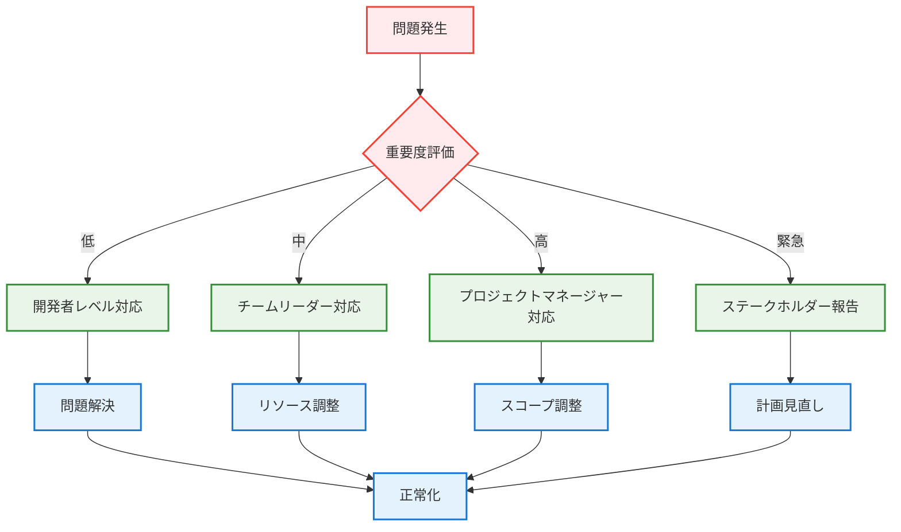

# W65C02S Pythonエミュレータ 実装計画書

## 文書管理

| 項目 | 内容 |
| :--- | :--- |
| **バージョン** | 1.0 |
| **関連文書** | デバイスIF API要件定義書、W65C02Sソフトウェア詳細設計書、要件定義書、ソフトウェア要求仕様書、ソフトウェア・アーキテクチャ設計書 |

## 目次

1. [実装計画概要](#10-実装計画概要)
2. [実装フェーズ定義](#20-実装フェーズ定義)
3. [フェーズ別実装計画](#30-フェーズ別実装計画)
4. [実装スケジュール](#40-実装スケジュール)
5. [成果物定義](#50-成果物定義)
6. [品質管理計画](#60-品質管理計画)
7. [リスク管理](#70-リスク管理)
8. [リソース計画](#80-リソース計画)

---

## 1.0 実装計画概要

### 1.1 実装戦略

本実装計画は、W65C02S Pythonエミュレータの段階的な開発を通じて、高品質で保守性の高いソフトウェアの構築を目指す。

#### 1.1.1 基本方針

| 方針 | 内容 | 根拠 |
| :--- | :--- | :--- |
| **段階的実装** | コア機能から周辺機能への段階的な実装 | リスク軽減と早期検証 |
| **テスト駆動開発** | 各プログラムユニットの単体テスト先行実装 | 品質確保と回帰防止 |
| **継続的統合** | フェーズごとの統合テストとデバッグ | 問題の早期発見 |
| **文書化重視** | 実装と並行した技術文書の更新 | 保守性の確保 |

#### 1.1.2 実装アプローチ



### 1.2 実装目標

#### 1.2.1 品質目標

| 品質項目 | 目標値 | 測定方法 |
| :--- | :--- | :--- |
| **コードカバレッジ** | 90%以上 | pytest-cov |
| **単体テスト成功率** | 100% | 自動テスト |
| **統合テスト成功率** | 95%以上 | 自動テスト |
| **性能目標** | 実機の10%以上 | ベンチマーク |
| **メモリ使用量** | 660KB以下 | プロファイリング |

#### 1.2.2 技術目標

| 技術項目 | 目標 | 検証方法 |
| :--- | :--- | :--- |
| **サイクル精度** | W65C02S仕様準拠 | 命令レベルテスト |
| **決定論的実行** | 完全再現可能 | 状態比較テスト |
| **API準拠** | デバイスIF API完全実装 | プロトコル検証 |
| **拡張性** | 新デバイス追加容易 | 実装例による検証 |

---

## 2.0 実装フェーズ定義

### 2.1 フェーズ構成

実装を5つの主要フェーズに分割し、各フェーズで明確な成果物を定義する。

#### 2.1.1 フェーズ概要

| フェーズ | 名称 | 期間 | 主要成果物 | 依存関係 |
| :--- | :--- | :--- | :--- | :--- |
| **Phase 1** | Foundation | 2週間 | コアインフラ、プロトコル | なし |
| **Phase 2** | CPU Core | 3週間 | CPUコア、命令セット | Phase 1 |
| **Phase 3** | Memory & I/O | 2週間 | メモリ管理、割り込み | Phase 2 |
| **Phase 4** | System Integration | 2週間 | システム統合、制御 | Phase 3 |
| **Phase 5** | Debug & Tools | 2週間 | デバッガ、解析ツール | Phase 4 |

#### 2.1.2 フェーズ間の依存関係



### 2.2 各フェーズの詳細目標

#### 2.2.1 Phase 1: Foundation (基盤)

**目標**: エミュレータの基盤となるインフラストラクチャの構築

**主要コンポーネント**:
- PU019: DeviceProtocol (デバイスプロトコル)
- PU020: SystemBus (システムバス)
- PU022: ConfigurationManager (設定管理)

**成功基準**:
- [ ] Device プロトコルの完全実装
- [ ] SystemBus の基本機能実装
- [ ] 設定管理システムの構築
- [ ] 単体テストカバレッジ 90%以上

#### 2.2.2 Phase 2: CPU Core (CPUコア)

**目標**: W65C02S CPUコアの完全実装

**主要コンポーネント**:
- PU001: CPURegisters (CPUレジスタ)
- PU002: ProcessorFlags (プロセッサフラグ)
- PU003: InstructionDecoder (命令デコーダ)
- PU004: InstructionExecutor (命令実行器)
- PU005: AddressingModes (アドレッシングモード)

**成功基準**:
- [ ] 212個の命令セット完全実装
- [ ] 16種類のアドレッシングモード実装
- [ ] サイクル精度の実現
- [ ] 命令レベルテスト 100%通過

#### 2.2.3 Phase 3: Memory & I/O (メモリ・I/O)

**目標**: メモリ管理と割り込み処理の実装

**主要コンポーネント**:
- PU007: AddressSpace (アドレス空間)
- PU008: DeviceMapper (デバイスマッパー)
- PU009: MemoryController (メモリコントローラ)
- PU021: InterruptController (割り込みコントローラ)

**成功基準**:
- [ ] 64KBアドレス空間の完全管理
- [ ] デバイスマッピング機能
- [ ] 割り込み処理の実装
- [ ] メモリアクセステスト 100%通過

#### 2.2.4 Phase 4: System Integration (システム統合)

**目標**: システム全体の統合と制御機能の実装

**主要コンポーネント**:
- PU010: SystemClock (システムクロック)
- PU011: DeviceScheduler (デバイススケジューラ)
- PU012: SystemOrchestrator (システムオーケストレータ)
- PU006: InterruptHandler (割り込みハンドラ)

**成功基準**:
- [ ] Tick駆動実行モデルの実装
- [ ] デバイス間同期の実現
- [ ] システム制御機能の完成
- [ ] 統合テスト 95%以上通過

#### 2.2.5 Phase 5: Debug & Tools (デバッグ・ツール)

**目標**: デバッグ機能と解析ツールの実装

**主要コンポーネント**:
- PU013: BreakpointManager (ブレークポイント管理)
- PU014: StepController (ステップ制御)
- PU015: StateInspector (状態検査)
- PU016: Disassembler (逆アセンブラ)
- PU017: StateSerializer (状態シリアライザ)
- PU018: StateValidator (状態検証)

**成功基準**:
- [ ] 完全なデバッグ機能の実装
- [ ] 状態保存・復元機能
- [ ] 解析ツールの完成
- [ ] エンドツーエンドテスト 100%通過

---

## 3.0 フェーズ別実装計画

### 3.1 Phase 1: Foundation (基盤) - 詳細計画

#### 3.1.1 実装スケジュール

| 週 | 作業項目 | 担当PU | 成果物 | 検証方法 |
| :--- | :--- | :--- | :--- | :--- |
| **Week 1** | コアインフラ構築 | PU019, PU022 | プロトコル定義、設定管理 | 単体テスト |
| **Week 2** | システムバス実装 | PU020 | バス機能、デバイスマッピング | 統合テスト |

#### 3.1.2 実装詳細

**PU019: DeviceProtocol**
```python
# 実装優先順位
1. Device プロトコル基底クラス
2. CPUDevice プロトコル拡張
3. VideoDevice プロトコル拡張
4. AudioDevice プロトコル拡張
5. プロトコル検証機能
```

**PU020: SystemBus**
```python
# 実装優先順位
1. 基本的な read/write 機能
2. デバイスマッピング管理
3. バスマスタシップ制御
4. アクセスログ機能
5. デバッグ支援機能
```

**PU022: ConfigurationManager**
```python
# 実装優先順位
1. 設定ファイル読み込み
2. デバイス設定管理
3. 実行時設定変更
4. 設定検証機能
```

#### 3.1.3 テスト計画

| テスト種別 | 対象 | テストケース数 | 実行タイミング |
| :--- | :--- | :--- | :--- |
| **単体テスト** | 各PU | 50+ | 実装完了時 |
| **統合テスト** | PU間連携 | 20+ | フェーズ完了時 |
| **性能テスト** | バス性能 | 10+ | フェーズ完了時 |

### 3.2 Phase 2: CPU Core (CPUコア) - 詳細計画

#### 3.2.1 実装スケジュール

| 週 | 作業項目 | 担当PU | 成果物 | 検証方法 |
| :--- | :--- | :--- | :--- | :--- |
| **Week 1** | レジスタ・フラグ | PU001, PU002 | レジスタ管理、フラグ処理 | 単体テスト |
| **Week 2** | 命令デコード | PU003, PU005 | デコーダ、アドレッシング | 命令テスト |
| **Week 3** | 命令実行 | PU004 | 実行エンジン | 統合テスト |

#### 3.2.2 命令セット実装優先順位



#### 3.2.3 アドレッシングモード実装順序

| 優先度 | アドレッシングモード | 実装理由 |
| :--- | :--- | :--- |
| **1** | Immediate (imm) | 最も単純、テスト容易 |
| **2** | Zero Page (zp) | 基本的なメモリアクセス |
| **3** | Absolute (abs) | 16ビットアドレッシング |
| **4** | Zero Page,X (zp,x) | インデックス付きアクセス |
| **5** | Absolute,X (abs,x) | ページクロス処理 |
| **6** | Absolute,Y (abs,y) | Y インデックス |
| **7** | (Zero Page,X) (zp,x) | 間接アドレッシング |
| **8** | (Zero Page),Y (zp),y | 間接インデックス |
| **9** | (Zero Page) (zp) | W65C02S 拡張 |
| **10** | Relative (rel) | 分岐命令用 |

### 3.3 Phase 3: Memory & I/O (メモリ・I/O) - 詳細計画

#### 3.3.1 実装スケジュール

| 週 | 作業項目 | 担当PU | 成果物 | 検証方法 |
| :--- | :--- | :--- | :--- | :--- |
| **Week 1** | メモリ管理 | PU007, PU008, PU009 | アドレス空間、マッピング | メモリテスト |
| **Week 2** | 割り込み制御 | PU021 | 割り込みコントローラ | 割り込みテスト |

#### 3.3.2 メモリ管理実装詳細

**アドレス空間レイアウト**:
```
$0000-$00FF: Zero Page (ゼロページ)
$0100-$01FF: Stack (スタック)
$0200-$7FFF: RAM (一般RAM)
$8000-$FFFF: ROM/Device (ROM・デバイス領域)
```

**デバイスマッピング例**:
```python
# 標準的なマッピング構成
memory_map = {
    (0x0000, 0x7FFF): ram_device,      # 32KB RAM
    (0x8000, 0xBFFF): rom_device,      # 16KB ROM
    (0xC000, 0xC0FF): via_device,      # VIA (I/O)
    (0xFFFA, 0xFFFF): vector_rom        # 割り込みベクタ
}
```

### 3.4 Phase 4: System Integration (システム統合) - 詳細計画

#### 3.4.1 実装スケジュール

| 週 | 作業項目 | 担当PU | 成果物 | 検証方法 |
| :--- | :--- | :--- | :--- | :--- |
| **Week 1** | システム制御 | PU010, PU012 | クロック、オーケストレータ | システムテスト |
| **Week 2** | デバイス調整 | PU011, PU006 | スケジューラ、割り込み | 統合テスト |

#### 3.4.2 Tick駆動実行モデル



### 3.5 Phase 5: Debug & Tools (デバッグ・ツール) - 詳細計画

#### 3.5.1 実装スケジュール

| 週 | 作業項目 | 担当PU | 成果物 | 検証方法 |
| :--- | :--- | :--- | :--- | :--- |
| **Week 1** | デバッガコア | PU013, PU014, PU015 | BP管理、ステップ実行、状態検査 | デバッグテスト |
| **Week 2** | 解析ツール | PU016, PU017, PU018 | 逆アセンブラ、状態管理 | ツールテスト |

#### 3.5.2 デバッグ機能実装優先順位

| 優先度 | 機能 | 実装理由 |
| :--- | :--- | :--- |
| **1** | ブレークポイント | 基本的なデバッグ機能 |
| **2** | ステップ実行 | 命令レベルデバッグ |
| **3** | 状態検査 | レジスタ・メモリ確認 |
| **4** | 逆アセンブル | コード解析支援 |
| **5** | 状態保存・復元 | デバッグセッション管理 |

---

## 4.0 実装スケジュール

### 4.1 全体スケジュール

#### 4.1.1 マイルストーン

```mermaid
timeline
    title W65C02S エミュレータ実装スケジュール
    
    section Phase 1: Foundation
        Week 1-2 : コアインフラ構築
                 : デバイスプロトコル実装
                 : システムバス基盤
    
    section Phase 2: CPU Core
        Week 3-5 : CPUレジスタ・フラグ
                 : 命令デコーダ
                 : 命令実行器
                 : 212命令セット実装
    
    section Phase 3: Memory & I/O
        Week 6-7 : メモリ管理システム
                 : アドレス空間管理
                 : 割り込みコントローラ
    
    section Phase 4: System Integration
        Week 8-9 : システム統合
                 : Tick駆動モデル
                 : デバイス同期
    
    section Phase 5: Debug & Tools
        Week 10-11 : デバッガ実装
                   : 解析ツール
                   : 最終統合テスト
```

#### 4.1.2 重要な日程

| マイルストーン | 予定日 | 成果物 | 検証基準 |
| :--- | :--- | :--- | :--- |
| **M1: Foundation Complete** | Week 2 | コアインフラ | 単体テスト 90%+ |
| **M2: CPU Core Complete** | Week 5 | CPUコア | 命令テスト 100% |
| **M3: Memory & I/O Complete** | Week 7 | メモリ・I/O | 統合テスト 95%+ |
| **M4: System Integration Complete** | Week 9 | システム統合 | 性能テスト達成 |
| **M5: Final Release** | Week 11 | 完成版 | 全テスト通過 |

### 4.2 週次スケジュール詳細

#### 4.2.1 Week 1-2: Foundation Phase

| 日 | 作業内容 | 担当者 | 成果物 | 時間 |
| :--- | :--- | :--- | :--- | :--- |
| **Day 1-2** | プロジェクト環境構築 | 全員 | 開発環境 | 16h |
| **Day 3-5** | Device プロトコル実装 | Dev1 | PU019 | 24h |
| **Day 6-8** | SystemBus 基盤実装 | Dev2 | PU020 | 24h |
| **Day 9-10** | 設定管理システム | Dev3 | PU022 | 16h |

#### 4.2.2 Week 3-5: CPU Core Phase

| 日 | 作業内容 | 担当者 | 成果物 | 時間 |
| :--- | :--- | :--- | :--- | :--- |
| **Day 11-13** | CPUレジスタ実装 | Dev1 | PU001 | 24h |
| **Day 14-16** | プロセッサフラグ | Dev2 | PU002 | 24h |
| **Day 17-21** | 命令デコーダ | Dev1,2 | PU003 | 40h |
| **Day 22-26** | アドレッシングモード | Dev3 | PU005 | 40h |
| **Day 27-35** | 命令実行器 | 全員 | PU004 | 72h |

### 4.3 リソース配分

#### 4.3.1 開発者配置

| 開発者 | 専門分野 | 主担当PU | 工数配分 |
| :--- | :--- | :--- | :--- |
| **Dev1** | CPUアーキテクチャ | PU001,003,004 | 40% |
| **Dev2** | システム設計 | PU002,020,021 | 35% |
| **Dev3** | ツール・デバッグ | PU005,013-018,022 | 25% |

#### 4.3.2 工数見積もり

| フェーズ | 総工数 | Dev1 | Dev2 | Dev3 | 期間 |
| :--- | :--- | :--- | :--- | :--- | :--- |
| **Phase 1** | 80h | 24h | 32h | 24h | 2週間 |
| **Phase 2** | 200h | 96h | 64h | 40h | 3週間 |
| **Phase 3** | 112h | 32h | 56h | 24h | 2週間 |
| **Phase 4** | 112h | 40h | 48h | 24h | 2週間 |
| **Phase 5** | 120h | 24h | 32h | 64h | 2週間 |
| **合計** | 624h | 216h | 232h | 176h | 11週間 |

---

## 5.0 成果物定義

### 5.1 成果物一覧

#### 5.1.1 ソフトウェア成果物

| カテゴリ | 成果物名 | ファイル/ディレクトリ | 説明 |
| :--- | :--- | :--- | :--- |
| **コアライブラリ** | py6502emu | `py6502emu/` | メインライブラリパッケージ |
| **CPUコア** | W65C02S実装 | `py6502emu/cpu/` | CPUコア実装 |
| **メモリ管理** | MMU実装 | `py6502emu/memory/` | メモリ管理システム |
| **システムコア** | コアサービス | `py6502emu/core/` | システムサービス |
| **テストスイート** | 自動テスト | `tests/` | 単体・統合テスト |
| **サンプル** | 使用例 | `examples/` | 実装例・デモ |

#### 5.1.2 文書成果物

| カテゴリ | 文書名 | ファイル名 | 説明 |
| :--- | :--- | :--- | :--- |
| **API文書** | API リファレンス | `docs/api/` | 自動生成API文書 |
| **ユーザーガイド** | 使用方法 | `docs/user_guide.md` | エンドユーザー向け |
| **開発者ガイド** | 開発手順 | `docs/developer_guide.md` | 開発者向け |
| **実装ノート** | 技術詳細 | `docs/implementation/` | 実装詳細記録 |

### 5.2 品質基準

#### 5.2.1 コード品質基準

| 項目 | 基準 | 測定方法 | ツール |
| :--- | :--- | :--- | :--- |
| **コードカバレッジ** | 90%以上 | 自動測定 | pytest-cov |
| **型チェック** | エラー0件 | 静的解析 | mypy |
| **コード品質** | A評価以上 | 静的解析 | pylint |
| **フォーマット** | 統一形式 | 自動フォーマット | black |
| **ドキュメント** | 全公開API | docstring | sphinx |

#### 5.2.2 テスト品質基準

| テスト種別 | カバレッジ目標 | 成功率目標 | 実行頻度 |
| :--- | :--- | :--- | :--- |
| **単体テスト** | 95%以上 | 100% | 毎コミット |
| **統合テスト** | 85%以上 | 95%以上 | 毎日 |
| **性能テスト** | 主要機能 | 目標値達成 | 毎週 |
| **回帰テスト** | 全機能 | 100% | 毎リリース |

### 5.3 配布形式

#### 5.3.1 パッケージ構成

```
py6502emu/
├── py6502emu/           # メインパッケージ
│   ├── __init__.py
│   ├── core/            # コアサービス
│   ├── cpu/             # CPUコア
│   ├── memory/          # メモリ管理
│   └── debug/           # デバッグ機能
├── tests/               # テストスイート
├── examples/            # 使用例
├── docs/                # ドキュメント
├── pyproject.toml       # プロジェクト設定
├── README.md            # プロジェクト概要
└── LICENSE              # ライセンス
```

#### 5.3.2 配布チャネル

| チャネル | 形式 | 対象者 | 更新頻度 |
| :--- | :--- | :--- | :--- |
| **PyPI** | wheel/sdist | 一般ユーザー | 安定版リリース時 |
| **GitHub** | ソースコード | 開発者 | 毎コミット |
| **Docker Hub** | コンテナ | 統合環境 | 毎リリース |
| **Documentation** | HTML | 全ユーザー | 毎更新 |

---

## 6.0 品質管理計画

### 6.1 品質管理体制

#### 6.1.1 品質管理プロセス



#### 6.1.2 品質ゲート

| ゲート | 基準 | 責任者 | 承認条件 |
| :--- | :--- | :--- | :--- |
| **コード品質** | 静的解析通過 | 開発者 | pylint A評価以上 |
| **単体テスト** | カバレッジ90%+ | 開発者 | 全テスト通過 |
| **コードレビュー** | 2名以上承認 | シニア開発者 | 設計・実装妥当性 |
| **統合テスト** | 成功率95%+ | テストリーダー | システム動作確認 |
| **性能テスト** | 目標値達成 | アーキテクト | 性能要件満足 |

### 6.2 テスト戦略

#### 6.2.1 テストピラミッド



#### 6.2.2 テストケース設計

**単体テスト**:
- 各PUの全パブリックメソッド
- 境界値・異常値テスト
- エラーハンドリング検証

**統合テスト**:
- PU間インタフェース検証
- システムバス動作確認
- 割り込み処理検証

**性能テスト**:
- 命令実行速度測定
- メモリ使用量監視
- システム応答時間測定

### 6.3 継続的品質改善

#### 6.3.1 品質メトリクス

| メトリクス | 目標値 | 測定頻度 | 改善アクション |
| :--- | :--- | :--- | :--- |
| **バグ密度** | <0.1 bugs/KLOC | 毎週 | コードレビュー強化 |
| **テストカバレッジ** | >90% | 毎日 | テストケース追加 |
| **コード複雑度** | <10 (McCabe) | 毎コミット | リファクタリング |
| **技術的負債** | <8h/週 | 毎週 | 計画的改善 |

#### 6.3.2 品質改善サイクル



---

## 7.0 リスク管理

### 7.1 リスク識別・評価

#### 7.1.1 技術リスク

| リスクID | リスク内容 | 影響度 | 発生確率 | リスクレベル | 対策 |
| :--- | :--- | :--- | :--- | :--- | :--- |
| **R001** | 命令セット実装の複雑性 | 高 | 中 | 高 | 段階的実装、詳細テスト |
| **R002** | サイクル精度の実現困難 | 高 | 中 | 高 | プロトタイプ検証 |
| **R003** | 性能目標未達 | 中 | 中 | 中 | 早期性能測定 |
| **R004** | メモリ使用量超過 | 中 | 低 | 低 | 継続的監視 |
| **R005** | デバッグ機能の複雑化 | 中 | 中 | 中 | 段階的実装 |

#### 7.1.2 プロジェクトリスク

| リスクID | リスク内容 | 影響度 | 発生確率 | リスクレベル | 対策 |
| :--- | :--- | :--- | :--- | :--- | :--- |
| **R006** | スケジュール遅延 | 高 | 中 | 高 | バッファ確保、優先度調整 |
| **R007** | 要件変更 | 中 | 中 | 中 | 変更管理プロセス |
| **R008** | 開発者リソース不足 | 高 | 低 | 中 | クロストレーニング |
| **R009** | 品質基準未達 | 中 | 低 | 低 | 継続的品質管理 |

### 7.2 リスク対応戦略

#### 7.2.1 高リスク項目の対応

**R001: 命令セット実装の複雑性**
- **予防策**: 命令を優先度別に分類し、段階的実装
- **軽減策**: 詳細な単体テストとペアプログラミング
- **代替案**: 複雑な命令の簡易実装版を先行開発

**R002: サイクル精度の実現困難**
- **予防策**: 早期プロトタイプでの実現可能性検証
- **軽減策**: 段階的精度向上アプローチ
- **代替案**: 近似的サイクル計算の許容

**R006: スケジュール遅延**
- **予防策**: 各フェーズに20%のバッファを確保
- **軽減策**: 機能優先度の動的調整
- **代替案**: MVP（最小実行可能製品）での先行リリース

#### 7.2.2 リスク監視指標

| リスク | 監視指標 | 閾値 | 監視頻度 |
| :--- | :--- | :--- | :--- |
| **実装遅延** | 進捗率 | <80% | 毎週 |
| **品質低下** | テスト成功率 | <95% | 毎日 |
| **性能問題** | 実行速度 | <目標の50% | 毎週 |
| **メモリ超過** | 使用量 | >500KB | 毎日 |

### 7.3 緊急時対応計画

#### 7.3.1 エスカレーション手順



---

## 8.0 リソース計画

### 8.1 人的リソース

#### 8.1.1 チーム構成

| 役割 | 人数 | 主な責任 | 必要スキル |
| :--- | :--- | :--- | :--- |
| **プロジェクトマネージャー** | 1 | 全体管理、進捗管理 | プロジェクト管理、技術理解 |
| **シニア開発者** | 1 | アーキテクチャ設計、技術指導 | CPU設計、エミュレータ開発 |
| **開発者** | 2 | 実装、テスト | Python、システムプログラミング |
| **QAエンジニア** | 1 | 品質保証、テスト設計 | テスト設計、自動化 |

#### 8.1.2 スキルマトリックス

| スキル | PM | シニア | Dev1 | Dev2 | QA |
| :--- | :--- | :--- | :--- | :--- | :--- |
| **プロジェクト管理** | ★★★ | ★★ | ★ | ★ | ★ |
| **CPU アーキテクチャ** | ★ | ★★★ | ★★ | ★ | ★ |
| **Python 開発** | ★ | ★★★ | ★★★ | ★★★ | ★★ |
| **システム設計** | ★★ | ★★★ | ★★ | ★★ | ★ |
| **テスト設計** | ★ | ★★ | ★★ | ★★ | ★★★ |
| **デバッグ・解析** | ★ | ★★★ | ★★ | ★★ | ★★★ |

### 8.2 技術リソース

#### 8.2.1 開発環境

| 項目 | 仕様 | 数量 | 用途 |
| :--- | :--- | :--- | :--- |
| **開発マシン** | CPU: 8コア以上, RAM: 16GB以上 | 5台 | 開発・テスト |
| **CI/CDサーバー** | CPU: 4コア, RAM: 8GB | 1台 | 自動ビルド・テスト |
| **テストマシン** | 各種OS環境 | 3台 | クロスプラットフォームテスト |

#### 8.2.2 ソフトウェアツール

| カテゴリ | ツール | ライセンス | 用途 |
| :--- | :--- | :--- | :--- |
| **開発環境** | VS Code, PyCharm | 無料/商用 | コード編集・デバッグ |
| **バージョン管理** | Git, GitHub | 無料 | ソースコード管理 |
| **CI/CD** | GitHub Actions | 無料 | 自動化 |
| **品質管理** | pytest, mypy, pylint | 無料 | テスト・静的解析 |
| **文書化** | Sphinx, MkDocs | 無料 | ドキュメント生成 |

### 8.3 予算計画

#### 8.3.1 人件費

| 役割 | 月単価 | 期間 | 工数 | 小計 |
| :--- | :--- | :--- | :--- | :--- |
| **プロジェクトマネージャー** | ¥800,000 | 3ヶ月 | 0.5人月 | ¥1,200,000 |
| **シニア開発者** | ¥1,000,000 | 3ヶ月 | 1.0人月 | ¥3,000,000 |
| **開発者** | ¥700,000 | 3ヶ月 | 2.0人月 | ¥4,200,000 |
| **QAエンジニア** | ¥600,000 | 3ヶ月 | 0.5人月 | ¥900,000 |
| **小計** | | | | **¥9,300,000** |

#### 8.3.2 その他費用

| 項目 | 金額 | 備考 |
| :--- | :--- | :--- |
| **ソフトウェアライセンス** | ¥200,000 | 開発ツール等 |
| **ハードウェア** | ¥500,000 | 開発・テスト環境 |
| **外部サービス** | ¥100,000 | CI/CD、ホスティング |
| **その他** | ¥200,000 | 予備費 |
| **小計** | **¥1,000,000** | |

#### 8.3.3 総予算

| カテゴリ | 金額 | 割合 |
| :--- | :--- | :--- |
| **人件費** | ¥9,300,000 | 90.3% |
| **その他費用** | ¥1,000,000 | 9.7% |
| **総計** | **¥10,300,000** | 100.0% |

---

## まとめ

本実装計画書は、W65C02S Pythonエミュレータの段階的な開発を通じて、以下の成果を実現することを目標としている：

### 主要成果目標

1. **高品質なエミュレータ**: サイクル精度でのW65C02S完全実装
2. **拡張可能なアーキテクチャ**: 統一デバイスAPIによるモジュール設計
3. **包括的なデバッグ機能**: 開発支援のための強力なツール群
4. **優れた保守性**: 文書化とテストによる長期保守性

### 実装の特徴

- **段階的アプローチ**: 5フェーズによるリスク軽減
- **品質重視**: 90%以上のテストカバレッジ
- **性能目標**: 実機の10%以上の実行速度
- **クロスプラットフォーム**: Python標準ライブラリ活用

この計画に従って実装を進めることで、教育・研究・開発の各分野で活用できる高品質なW65C02Sエミュレータの実現が期待される。
