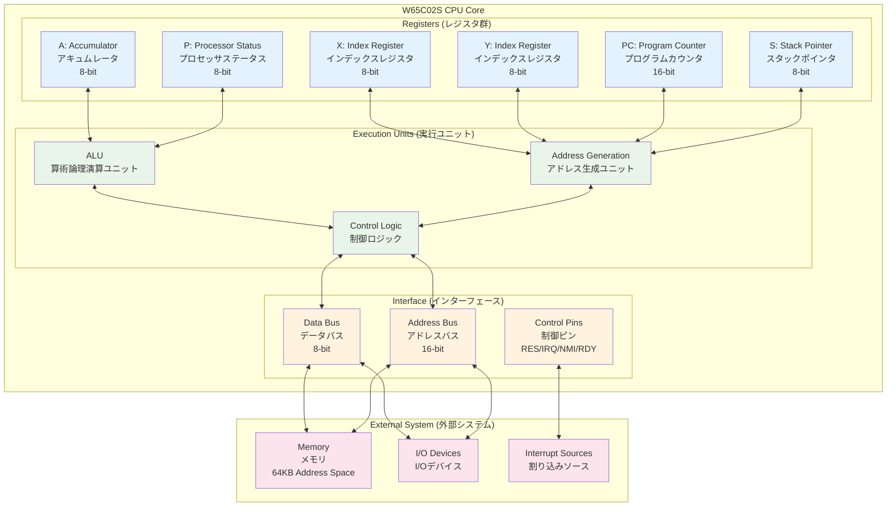
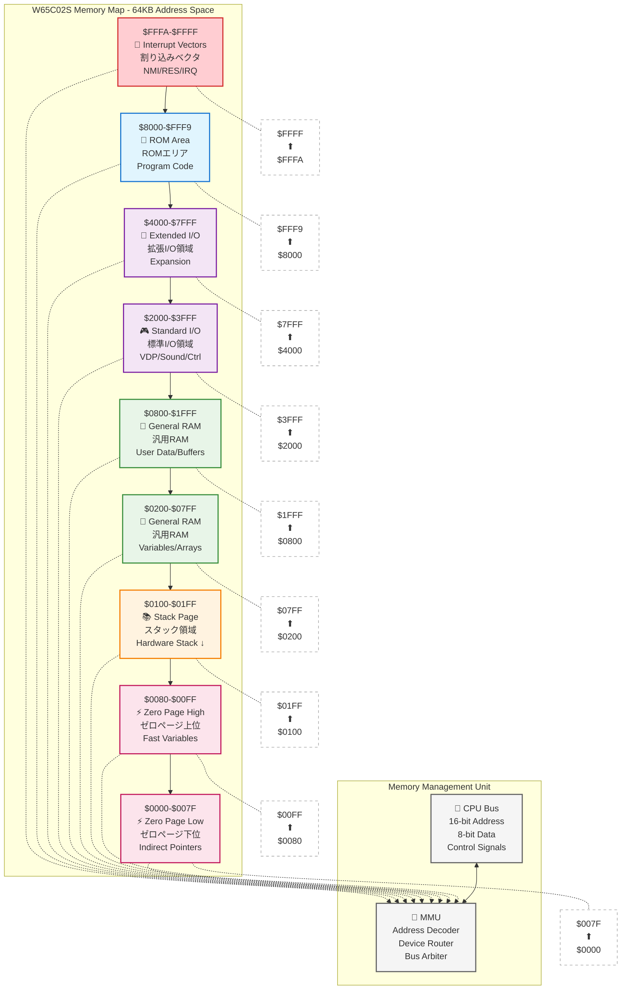
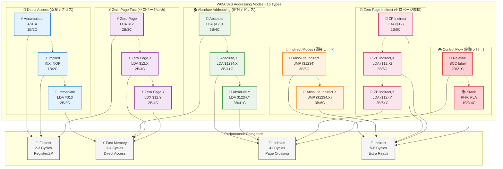
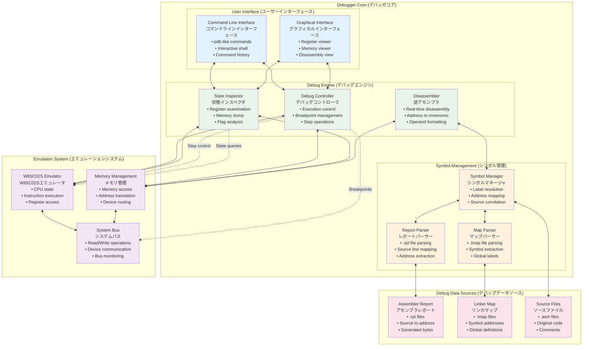
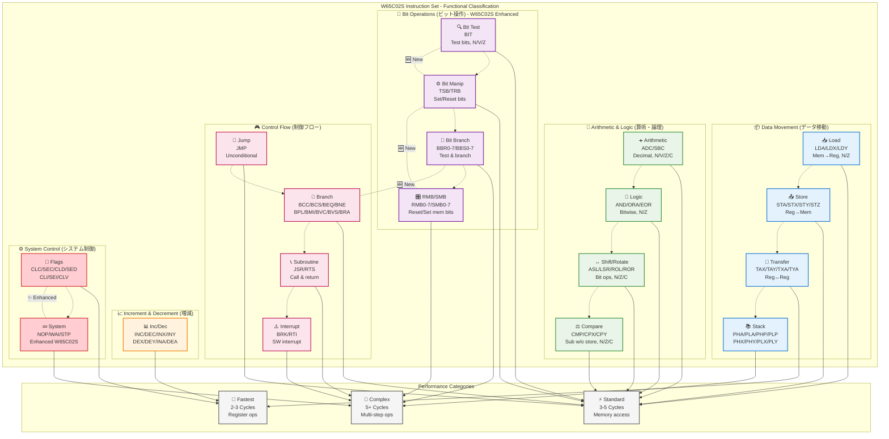

# W65C02S Pythonエミュレータ 要件定義書

## 目次

1. [W65C02S CPUコアエミュレーション要件](#10-w65c02s-cpuコアエミュレーション要件)
   - 1.1 コアアーキテクチャとプログラミングモデル *(アーキテクチャ図)*
   - 1.2 メモリアーキテクチャ *(メモリレイアウト図)*
   - 1.3 アドレッシングモード *(分類図)*
   - 1.4 割り込みおよびシステム制御ロジック *(シーケンス図)*
   - 1.5 NMOS 6502からの主要な動作上の差異

2. [システムアーキテクチャとシミュレーションモデル](#20-システムアーキテクチャとシミュレーションモデル)
   - 2.1 Tick駆動実行モデル *(実行フロー図)*
   - 2.2 統一デバイスAPI
   - 2.3 割り込み管理

3. [統合デバッガ機能要件](#30-統合デバッガ機能要件)
   - 3.1 コアデバッガインターフェースと状態
   - 3.2 実行制御
   - 3.3 状態検査
   - 3.4 コード解析
   - 3.5 ソースレベルデバッグ用データフック

4. [付録A: W65C02S 命令セット仕様](#付録a-w65c02s-命令セット仕様) *(命令分類図)*

---

## 文書管理

| 項目 | 内容 |
| :--- | :--- |
| **バージョン** | 1.0 |

---

## 1.0 W65C02S CPUコアエミュレーション要件

本セクションでは、Western Design Center (WDC) 製 W65C02S 8ビットマイクロプロセッサコアのサイクル精度でのエミュレーションに関する要件を定義する。主要目的は、物理ハードウェアと機能的・動作的に区別がつかないソフトウェアモデルを構築することであり、特にオリジナルのNMOS 6502からの文書化された差異点に注意を払うものとする。

### 1.1 コアアーキテクチャとプログラミングモデル

エミュレートされるCPUは、8ビットのデータバスと16ビットのアドレスバスを特徴とするW65C02Sのコアアーキテクチャをモデル化するものとする [1, 2]。実装は、後述する状態と動作をカプセル化するクラス（仮称 `W65C02S`）として行う。

#### 1.1.0 W65C02S アーキテクチャ概要

以下の図は、W65C02S CPUコアの全体的なアーキテクチャと主要コンポーネントの関係を示している。

#### 1.1.1 レジスタ

CPUクラスは、完全なレジスタセットを表現するメンバー変数を含まなければならない。これらのレジスタはCPUの基本状態を構成する。

*   **アキュムレータ (A):** 算術論理演算に使用される8ビットの汎用レジスタ [1, 3]。
*   **インデックスレジスタ (X, Y):** 主にインデックスアドレッシングモードで使用される2つの8ビットレジスタ [1, 3]。
*   **プログラムカウンタ (PC):** 次にフェッチされる命令を指す16ビットのレジスタ。命令フェッチ中のインクリメントを正しく処理し、ジャンプ、分岐、サブルーチン命令によって変更可能でなければならない [1, 3]。
*   **スタックポインタ (S):** スタック上の次に利用可能な場所の下位バイトを示す8ビットのレジスタ。スタックはメモリのページ1（`$0100`〜`$01FF`）に固定されており、下位アドレス方向（下方）に伸長する [1, 3]。リセット後の初期状態は設定可能であるべきだが、通常は`$FD`にデフォルト設定される [4]。
*   **プロセッサステータス (P):** CPUの状態フラグを保持する8ビットのレジスタ。詳細は1.1.2項で後述する。

**表1.1: W65C02S レジスタセット**

| レジスタ | サイズ（ビット） | 機能 |
| :--- | :--- | :--- |
| `A` | 8 | アキュムレータ。算術論理演算の結果を保持する。 |
| `X` | 8 | インデックスレジスタ。アドレッシングモードで使用される。 |
| `Y` | 8 | インデックスレジスタ。アドレッシングモードで使用される。 |
| `PC` | 16 | プログラムカウンタ。次に実行する命令のアドレスを指す。 |
| `S` | 8 | スタックポインタ。`$0100`を基底とするスタック位置を指す。 |
| `P` | 8 | プロセッサステータスレジスタ。各種演算結果の状態フラグを保持する。 |

#### 1.1.2 プロセッサステータス (P) レジスタフラグ

CPUクラスは、ステータスレジスタ用に8ビットのメンバー変数を維持するものとする。個々のフラグは、`PHP`や`PLP`、割り込み時のスタック操作のためにバイト単位でアクセス・変更可能であると同時に、関連する命令によって個別にアクセス・変更可能でなければならない。各フラグの挙動は正確にエミュレートされなければならない [1, 3, 5]。

**表1.2: プロセッサステータス (P) レジスタフラグ詳細**

| ビット | 記号 | 名称 | 機能 |
| :--- | :--- | :--- | :--- |
| 7 | `N` | ネガティブ | 演算結果の最上位ビットが1の場合にセットされる。 |
| 6 | `V` | オーバーフロー | 2の補数演算で符号付きオーバーフローが発生した場合にセットされる。 |
| 5 | `-` | 未使用 | 常に1として読み出される。 |
| 4 | `B` | ブレーク | `BRK`命令による割り込み時にセットされる。スタックにプッシュされるPの値でのみ意味を持つ。 |
| 3 | `D` | デシマル | `ADC`および`SBC`命令のBCD（二進化十進数）演算モードを有効化する。 |
| 2 | `I` | 割り込み禁止 | セットされるとIRQ割り込みを無効化する。 |
| 1 | `Z` | ゼロ | 演算結果が0の場合にセットされる。 |
| 0 | `C` | キャリー | 多バイト演算やシフト/ローテート命令で使用される。 |

### 1.2 メモリアーキテクチャ

#### 1.2.0 メモリマップ概要

以下の図は、W65C02Sの64KBアドレス空間の典型的なメモリレイアウトと特別な領域を示している。

#### 1.2.1 64KBアドレス空間

エミュレータは、65,536バイトのメモリにアクセス可能なフラットな16ビットアドレス空間を提供するものとする [2, 6]。これは専用のメモリ管理ユニット（MMU）クラスによって管理され、CPUクラスはすべての読み書き操作においてこのMMUと対話する。

#### 1.2.2 ゼロページとスタックページ

MMUとCPUのロジックは、ゼロページ（`$0000`〜`$00FF`）とスタックページ（`$0100`〜`$01FF`）の特別な特性を認識しなければならない。ゼロページアドレッシングモードを使用する命令は通常、より少ないサイクル数で実行されるため、これをタイミングモデルに反映させる必要がある [1, 3]。スタックポインタ（`S`）は暗黙的にスタックページをアドレッシングする。

#### 1.2.3 エンディアン

6502アーキテクチャにおけるすべての16ビット値（アドレス、オペランド）はリトルエンディアン形式で格納される。メモリアクセスおよび命令デコードのロジックは、この規約に準拠しなければならない [3, 4]。

### 1.3 アドレッシングモード

CPUは、W65C02Sの全16種類のアドレッシングモードを実装しなければならない。各モードの実効アドレス計算ロジックは、機能とサイクルタイミングの両方に影響するため、それぞれ個別に正確に実装する必要がある。実装すべきアドレッシングモードには、アキュムレータ、インプライド、イミディエイト、アブソリュート、ゼロページ、リラティブ、アブソリュート間接、アブソリュートインデックス（X/Y）、ゼロページインデックス（X/Y）、ゼロページ間接、ゼロページインデックス間接、ゼロページ間接インデックスが含まれる [3, 7]。

#### 1.3.0 アドレッシングモード分類

以下の図は、W65C02Sのアドレッシングモードを機能的に分類し、それぞれの特徴と使用パターンを示している。

**表1.3: アドレッシングモード詳細**

| モード | ニーモニック例 | 実効アドレス計算ロジック |
| :--- | :--- | :--- |
| Accumulator | `ASL A` | オペランドはアキュムレータ。メモリアクセスなし。 |
| Implied | `INX` | オペランドは命令に暗黙的に含まれる。メモリアクセスなし。 |
| Immediate | `LDA #$10` | オペランドは命令の直後にあるバイト。 |
| Absolute | `LDA $1234` | 16ビットアドレスを直接指定。 |
| Zero Page | `LDA $12` | 8ビットアドレスでゼロページ（`$0000`〜`$00FF`）を指定。 |
| Relative | `BCC label` | 符号付き8ビットオフセットを現在のPCに加算。 |
| Absolute,X | `LDA $1234,X` | 16ビットアドレスにXレジスタの値を加算。 |
| Absolute,Y | `LDA $1234,Y` | 16ビットアドレスにYレジスタの値を加算。 |
| Zero Page,X | `LDA $12,X` | 8ビットゼロページアドレスにXレジスタの値を加算（ラップアラウンド）。 |
| Zero Page,Y | `LDX $12,Y` | 8ビットゼロページアドレスにYレジスタの値を加算（ラップアラウンド）。 |
| (Absolute) | `JMP ($1234)` | 指定した16ビットアドレスからジャンプ先アドレスをフェッチ。 |
| (Absolute,X) | `JMP ($1234,X)` | 16ビットアドレスにXレジスタの値を加算し、そのアドレスからジャンプ先をフェッチ。 |
| (Zero Page,X) | `LDA ($12,X)` | 8ビットゼロページアドレスにXレジスタの値を加算し、そのアドレスから16ビットの実効アドレスをフェッチ。 |
| (Zero Page),Y | `LDA ($12),Y` | 8ビットゼロページアドレスから16ビットのベースアドレスをフェッチし、それにYレジスタの値を加算。 |
| (Zero Page) | `LDA ($12)` | 8ビットゼロページアドレスから16ビットの実効アドレスをフェッチ。 |
| STZ, TRB, TSB | `STZ $1234` | `STZ`, `TRB`, `TSB`命令固有のモード。 |

### 1.4 割り込みおよびシステム制御ロジック

エミュレータは、外部および内部の割り込み信号に対するCPUの動作を正しくモデル化しなければならない。これには、プロセッサの状態保存と適切なベクタアドレスへのジャンプが含まれる。

#### 1.4.0 割り込み処理シーケンス

以下のシーケンス図は、W65C02Sにおける各種割り込みの処理フローと、それらの相互作用を詳細に示している。

```mermaid
sequenceDiagram
    participant EXT as External Source<br/>外部ソース
    participant CPU as W65C02S CPU
    participant MEM as Memory<br/>メモリ
    participant STACK as Stack<br/>スタック
    
    Note over EXT,STACK: 1. リセット (RES) シーケンス - 7サイクル
    EXT->>CPU: RES signal LOW
    Note right of CPU: RES has highest priority<br/>最高優先度
    
    CPU->>CPU: Internal reset sequence<br/>内部リセットシーケンス
    Note right of CPU: • I flag = 1 (IRQ disabled)<br/>• D flag = 0 (Decimal cleared)<br/>• PC undefined until vector load
    
    CPU->>MEM: Read vector LSB from $FFFC
    MEM-->>CPU: Vector low byte
    CPU->>MEM: Read vector MSB from $FFFD  
    MEM-->>CPU: Vector high byte
    CPU->>CPU: PC = vector address<br/>Jump to reset handler
    
    Note over EXT,STACK: 2. マスク不能割り込み (NMI) シーケンス - 7サイクル
    EXT->>CPU: NMI negative edge
    Note right of CPU: NMI cannot be masked<br/>マスク不可
    
    CPU->>CPU: Complete current instruction<br/>現在の命令を完了
    CPU->>STACK: Push PCH (Program Counter High)
    CPU->>STACK: Push PCL (Program Counter Low)  
    CPU->>STACK: Push P (Status Register)
    
    CPU->>CPU: Set I=1, Clear D=0<br/>I フラグセット、D フラグクリア
    CPU->>MEM: Read vector LSB from $FFFA
    MEM-->>CPU: NMI vector low
    CPU->>MEM: Read vector MSB from $FFFB
    MEM-->>CPU: NMI vector high
    CPU->>CPU: PC = NMI vector<br/>Jump to NMI handler
    
    Note over EXT,STACK: 3. 割り込み要求 (IRQ) シーケンス - 7サイクル
    EXT->>CPU: IRQ signal LOW
    
    alt I flag = 0 (Interrupts enabled)
        CPU->>CPU: Complete current instruction<br/>現在の命令を完了
        CPU->>STACK: Push PCH
        CPU->>STACK: Push PCL
        CPU->>STACK: Push P (with B=0)
        
        CPU->>CPU: Set I=1, Clear D=0<br/>I フラグセット、D フラグクリア
        CPU->>MEM: Read vector LSB from $FFFE
        MEM-->>CPU: IRQ vector low
        CPU->>MEM: Read vector MSB from $FFFF
        MEM-->>CPU: IRQ vector high
        CPU->>CPU: PC = IRQ vector<br/>Jump to IRQ handler
    else I flag = 1 (Interrupts disabled)
        Note right of CPU: IRQ ignored<br/>IRQ は無視される
    end
    
    Note over EXT,STACK: 4. ブレーク (BRK) 命令シーケンス - 7サイクル
    CPU->>CPU: Execute BRK instruction<br/>BRK 命令実行
    CPU->>CPU: PC = PC + 2<br/>Skip BRK operand byte
    
    CPU->>STACK: Push PCH
    CPU->>STACK: Push PCL
    CPU->>STACK: Push P (with B=1)
    Note right of CPU: B flag distinguishes BRK from IRQ<br/>B フラグで BRK と IRQ を区別
    
    CPU->>CPU: Set I=1, Clear D=0<br/>I フラグセット、D フラグクリア
    CPU->>MEM: Read vector LSB from $FFFE
    MEM-->>CPU: BRK vector low (same as IRQ)
    CPU->>MEM: Read vector MSB from $FFFF
    MEM-->>CPU: BRK vector high (same as IRQ)
    CPU->>CPU: PC = BRK vector<br/>Jump to BRK handler
    
    Note over EXT,STACK: 5. 割り込みからの復帰 (RTI) シーケンス
    CPU->>CPU: Execute RTI instruction<br/>RTI 命令実行
    CPU->>STACK: Pull P (Status Register)
    CPU->>STACK: Pull PCL
    CPU->>STACK: Pull PCH
    CPU->>CPU: Resume execution at restored PC<br/>復帰したPCで実行再開
    
    %% Styling
    Note over EXT,STACK: 優先順位: RES > NMI > IRQ/BRK<br/>Priority: RES > NMI > IRQ/BRK
```

#### 1.4.1 リセット (RES) シーケンス

リセット時、CPUは7サイクルのリセットシーケンスを実行し、`$FFFC`（LSB）と`$FFFD`（MSB）のベクタから新しいプログラムカウンタ値をフェッチする。`I`フラグはセットされ、`D`フラグはクリアされる（これはNMOS 6502との重要な違いである） [8]。

#### 1.4.2 マスク不能割り込み (NMI) シーケンス

NMI信号は7サイクルのシーケンスをトリガする。現在のPCとPレジスタがスタックにプッシュされ、`I`フラグがセットされ、`D`フラグがクリアされ、PCは`$FFFA`（LSB）と`$FFFB`（MSB）のベクタからロードされる。

#### 1.4.3 割り込み要求 (IRQ) シーケンス

`I`フラグがクリアされている場合、IRQ信号はNMIと同一の7サイクルシーケンスをトリガするが、ベクタとして`$FFFE`（LSB）と`$FFFF`（MSB）を使用する。

#### 1.4.4 ブレーク (BRK) 命令シーケンス

`BRK`命令は7サイクルのソフトウェア割り込みシーケンスをトリガする。PC+2とPレジスタ（`B`フラグを1にセットした状態）をスタックにプッシュし、`I`フラグをセットし、`D`フラグをクリアし、PCをIRQベクタ（`$FFFE`/`$FFFF`）からロードする。

**表1.4: 割り込みベクタアドレスと優先順位**

| 割り込み種別 | ベクタアドレス | トリガ条件 | 優先順位 |
| :--- | :--- | :--- | :--- |
| RES | `$FFFC`, `$FFFD` | `RES`ピンのLow信号 | 1 (最高) |
| NMI | `$FFFA`, `$FFFB` | `NMI`ピンのネガティブエッジ | 2 |
| IRQ / BRK | `$FFFE`, `$FFFF` | `IRQ`ピンのLow信号（`I`フラグ=0）または`BRK`命令 | 3 |

### 1.5 NMOS 6502からの主要な動作上の差異

W65C02Sは単なる6502のCMOS版ではなく、多くのバグ修正と動作改善が含まれている。これらの差異を正確にエミュレートすることは、W65C02Sをターゲットとするソフトウェアの互換性を確保するために極めて重要である。したがって、これらの差異点の実装は、単なる実装詳細ではなく、最上位の要件として扱われるべきである [8, 9, 10]。

*   **未定義オペコード:** NMOS 6502のすべての「不正（illegal）」オペコードは、マルチバイトのNOPとして、あるいはそれらのオペコードスロットを占有する新しい公式のW65C02S命令として実装されなければならない。エミュレータは、NMOSチップ上でのこれらのオペコードの不安定または特異な動作を再現してはならない [8, 10]。
*   **`JMP ($xxFF)` バグ:** 間接JMP命令における悪名高いページ境界バグは修正されなければならない。エミュレータは、ジャンプベクタの上位バイトを次のページから正しくフェッチしなければならない（例: `JMP ($12FF)`の場合、上位バイトは`$1200`ではなく`$1300`からフェッチされる） [1, 8]。
*   **デシマル (D) フラグの動作:** `D`フラグは、任意の割り込みハンドラ（IRQ, NMI, RES, BRK）に入る際に自動的にクリアされなければならない。さらに、デシマルモードの算術演算（`ADC`, `SBC`）の後、`N`、`V`、`Z`フラグは有効な値を持たなければならない。この処理のために、これらの命令はデシマルモードで追加の1クロックサイクルを消費する [1, 7, 8]。
*   **Read-Modify-Write (RMW) 命令:** `ASL`, `ROR`, `INC`などのRMW命令は、対象のメモリ位置に対して2回の読み取りと1回の書き込みを実行しなければならない。これは、NMOSチップの1回の読み取りと2回の書き込みとは異なり、特定のI/Oハードウェアとの互換性のために重要である [8, 11]。

---

## 2.0 システムアーキテクチャとシミュレーションモデル

本セクションでは、エミュレータシステムの高レベルアーキテクチャを定義し、特にユーザー指定の設計パターンに焦点を当てる。これらのパターンは、CPUコアが周辺デバイスやメインシミュレーションループとどのように相互作用するかを規定する。

### 2.1 Tick駆動実行モデル

シミュレーションの実行モデルは、単純な命令単位のループではなく、より制御された離散時間シミュレーションである「Tick駆動」モデルを採用する。このアーキテクチャは、W65C02Sが完全に静的なコアであり、クロックを停止しても状態を失わないという特性と親和性が高い [1, 8]。また、`STP`や`WAI`といった省電力命令の正確なモデリングや、異なる実効クロック速度で動作するコンポーネント間の同期を可能にする。

#### 2.1.0 Tick駆動実行フロー

以下のフローチャートは、Tick駆動エミュレーションモデルの詳細な実行フローを示している。

```mermaid
flowchart TD
    A[エミュレーション開始<br/>Emulation Start] --> B[システム初期化<br/>System Initialization]
    
    B --> C[タイムスライス設定<br/>Set Time Slice<br/>remaining_ticks = SLICE_SIZE]
    
    C --> D{remaining_ticks > 0?}
    
    D -->|No| M[フレーム完了処理<br/>Frame Completion<br/>• Video output<br/>• Audio output<br/>• Input processing]
    
    D -->|Yes| E[CPU Tick実行<br/>Execute CPU Tick]
    
    E --> F[CPU.tick&#40;remaining_ticks&#41;<br/>CPUに残りティック数を渡す]
    
    F --> G[consumed_ticks = CPU戻り値<br/>CPUが消費したティック数を取得]
    
    G --> H[remaining_ticks -= consumed_ticks<br/>残りティック数を更新]
    
    H --> I[システム時間更新<br/>Update System Time<br/>master_clock += consumed_ticks]
    
    I --> J[ペリフェラル処理開始<br/>Start Peripheral Processing]
    
    J --> K[各デバイス.tick&#40;consumed_ticks&#41;<br/>全ペリフェラルに消費ティック数を渡す]
    
    K --> L[割り込み処理<br/>Interrupt Processing]
    
    L --> N{CPU割り込み許可?<br/>CPU interrupts enabled?}
    
    N -->|No| D
    N -->|Yes| O[InterruptController.is_pending&#40;&#41;<br/>保留中の割り込みをチェック]
    
    O --> P{割り込み保留中?<br/>Interrupt pending?}
    
    P -->|No| D
    P -->|Yes| Q[InterruptController.acknowledge&#40;&#41;<br/>割り込みを承認]
    
    Q --> R[CPUに割り込みベクタ設定<br/>Set interrupt vector in CPU]
    
    R --> S[次回CPU.tick時にISR実行<br/>ISR execution on next CPU tick]
    
    S --> D
    
    M --> T[ホスト同期<br/>Host Synchronization<br/>• Frame rate control<br/>• Real-time adjustment]
    
    T --> U{エミュレーション継続?<br/>Continue emulation?}
    
    U -->|Yes| C
    U -->|No| V[エミュレーション終了<br/>Emulation End]
    
    %% Special CPU states
    subgraph "CPU Special States"
        W[WAI状態<br/>Wait for Interrupt<br/>• CPU halted<br/>• Waiting for IRQ/NMI<br/>• Low power mode]
        
        X[STP状態<br/>Stop Mode<br/>• CPU stopped<br/>• Only RES can wake<br/>• Lowest power mode]
    end
    
    F -.->|WAI命令実行時| W
    F -.->|STP命令実行時| X
    W -.->|割り込み発生時| F
    X -.->|リセット時| F
    
    %% Styling
    classDef start fill:#e8f5e8
    classDef process fill:#e3f2fd
    classDef decision fill:#fff3e0
    classDef interrupt fill:#f3e5f5
    classDef host fill:#fce4ec
    classDef special fill:#ffcdd2
    
    class A,B,V start
    class C,E,F,G,H,I,J,K,T process
    class D,N,P,U decision
    class L,O,Q,R,S interrupt
    class M host
    class W,X special
```

#### 2.1.1 システムクロックTick

中央のシミュレーションループが実装される。このループの各イテレーションは、マスターシステムクロックの1「Tick」を表す（例: エミュレートされたCPUの`PHI2`クロックの1サイクルに相当）。

#### 2.1.2 CPUとデバイスの同期

CPUのメイン実行メソッドは、1つの完全な命令を実行する単純な`step()`メソッドではない。代わりに、1クロックサイクル分だけ実行する`tick()`メソッドとなる。CPUは、現在の命令の実行に必要なサイクル数を内部的に追跡するカウンタを保持する。このカウンタがゼロになったときにのみ、CPUは次の命令をフェッチしデコードする。これにより、CPUの実行が他のデバイスのTickと正しくインターリーブされることが保証される。

### 2.2 統一デバイスAPI

周辺機器（VIA、PIA、サウンドチップ、ビデオコントローラなど）をモジュール式で拡張可能な設計を実現するため、統一されたデバイスAPIを定義する。これにより、各デバイスエミュレータを独立して開発し、コアエミュレータを変更することなくメインシミュレーションバスに「接続」することが可能になる。

#### 2.2.1 デバイスインターフェース契約 (`Device` 抽象基底クラス)

Pythonの抽象基底クラス `Device` が定義される。このクラスは、すべての周辺デバイスが実装しなければならないメソッドを規定する。

*   `read(address: int) -> int`: MMUが、このデバイスにマップされたアドレスからCPUが読み取りを行う際に呼び出す。
*   `write(address: int, value: int)`: MMUが、このデバイスにマップされたアドレスにCPUが書き込みを行う際に呼び出す。
*   `tick()`: メインシミュレーションループによって毎システムTick呼び出され、デバイスが内部状態を更新することを可能にする。
*   `reset()`: システムリセット時に呼び出され、デバイスを初期状態に戻す。

#### 2.2.2 メモリ管理ユニット (MMU) との連携

MMUはメモリマップの管理を担当する。

*   **デバイス登録:** MMUは、特定のアドレス範囲を `Device` インスタンスにマッピングするためのメソッド（例: `map_device(device, start_address, end_address)`）を提供する。
*   **メモリアクセス委譲:** CPUからのメモリアクセス要求があった際、MMUはアドレスが登録されたデバイスの範囲内にあるか判断する。もし範囲内であれば、読み書きの呼び出しをそのデバイスインスタンスの `read` または `write` メソッドに委譲する。範囲外の場合は、RAMなどデフォルトのメモリ領域にアクセスする。

### 2.3 割り込み管理

複数のデバイスがCPUの割り込みラインを直接操作しようとする無秩序な状況を避けるため、割り込みロジックを抽象化する。専用の `InterruptController` オブジェクトがメディエータとして機能する。

#### 2.3.1 割り込みソース管理

`InterruptController` クラスが実装される。このクラスは、デバイスが割り込みソースとして登録・解除するためのメソッドを提供する。

*   `assert_irq(source_id: int)`: 指定されたソースIDからのIRQをアサートする。
*   `deassert_irq(source_id: int)`: 指定されたソースIDからのIRQをデアサートする。
*   `assert_nmi()`: NMIをアサートする（通常はエッジトリガ）。

#### 2.3.2 IRQおよびNMIのアサートロジック

コントローラは、アサートされているすべてのIRQソースの状態を追跡する。

*   単一の `irq_line` プロパティを公開し、1つ以上のソースがアサートされていればこのプロパティは `True` となり、そうでなければ `False` となる。
*   メインシミュレーションループは毎サイクルこのプロパティをチェックし、CPUコアにIRQを通知する。
*   NMIについても同様のメカニズムが存在する。

---

## 3.0 統合デバッガ機能要件

本セクションでは、開発と分析に不可欠なツールである対話型デバッガの要件を定義する。デバッガは、エミュレートされたシステムの内部状態への深い洞察を提供し、それを元のソースコードに結びつける機能を持たなければならない。

### 3.0.0 デバッガアーキテクチャ概要

以下の図は、統合デバッガシステムの全体的なアーキテクチャと各コンポーネントの関係を示している。

### 3.1 コアデバッガインターフェースと状態

デバッガは、メインシミュレーションループ内で動作し、ステップ実行モード時やブレークポイントにヒットした際に、CPUのTickの前に制御を得る。CPU、MMU、その他のシステムコンポーネントにアクセス可能なクラスとして実装される。ユーザーインターフェースは、Pythonの`pdb`に類似したコマンドラインインターフェース（CLI）となる [12, 13]。

### 3.2 実行制御

#### 3.2.1 ブレークポイント管理

*   ユーザーは特定のメモリアドレスにブレークポイントを設定できなければならない。
*   デバッガは、与えられたPython式が`True`と評価された場合にのみ実行を停止する条件付きブレークポイントをサポートしなければならない（例: `b $EFEA if cpu.a == 0x10`）。
*   実装は、CPUの実行ループにフックし、各命令をフェッチする前にPCをアクティブなブレークポイントのリストと照合することで行われる [12, 14]。

#### 3.2.2 ステップ実行

*   **ステップイン (`s`):** 次の単一命令を実行する。命令がサブルーチンコール（`JSR`）の場合、実行はサブルーチンの最初の命令で停止する。
*   **ステップオーバー (`n`):** 次の単一命令を実行する。命令が`JSR`の場合、デバッガは`RTS`が実行されるまで自動的に実行を継続し、`JSR`の直後の命令で停止する。これは、リターンアドレスに一時的なブレークポイントを設定することで実現される。
*   **ステップアウト (`o`):** 現在のサブルーチンの`RTS`が実行されるまで実行を継続し、元の`JSR`の後の命令で停止する。

### 3.3 状態検査

#### 3.3.1 レジスタ表示

すべてのCPUレジスタ（A, X, Y, S, PC）の現在状態と、Pレジスタをニーモニック表現（例: `N V - B D I Z C`）にデコードして表示するコマンドを提供する。

#### 3.3.2 メモリ表示

指定されたメモリ範囲の内容を、ASCII表現を含む16進ダンプ形式で表示するコマンドを提供する。「VRAM表示」という要件は、このコマンドが特別な意味を持つメモリ領域にも柔軟に対応できるべきであることを示唆している。

### 3.4 コード解析

#### 3.4.1 リアルタイム逆アセンブル

デバッガは、メモリの範囲を逆アセンブルし、マシンオペコードをW65C02Sのアセンブリニーモニックとオペランドに変換する能力を持たなければならない。

#### 3.4.2 ソースコードとラベルの統合

実行が停止した際、デバッガのデフォルト表示は現在の実行行を示すものとする。ソースレベルのデバッグ情報がロードされている場合、この表示には以下を含まなければならない。
*   メモリアドレスと命令の生バイト。
*   逆アセンブルされた命令。
*   現在のアドレスに対応するシンボリックラベル。
*   `.rpt`ファイルからの元のソースコード行。

### 3.5 ソースレベルデバッグ用データフック

これは要求された機能の中で最も高度なものであり、単純なマシンレベルデバッガをソースレベルの統合開発環境へと昇華させるものである。この機能を実現するには、アセンブラのリストファイル（`.rpt`）とリンカのマップファイル（`.lmap`）を解釈する必要がある。`ca65`ツールチェインの文脈では、リストファイルはソースコードと生成されたアドレス・バイトの行ごとのマッピングを含み、マップファイルはすべてのエクスポートされたラベルの最終的な絶対アドレスを含む [15, 16, 17]。

この機能の実装には、「デバッグシンボルマネージャ」コンポーネントが必要となる。このコンポーネントは、デバッグセッションの開始時にこれらのファイルを解析し、デバッガUIが必要とするアドレスからソースへの、またアドレスからラベルへのルックアップを実行するためのデータ構造を構築する責務を負う。

#### 3.5.1 `.rpt` アセンブラレポートファイルの解析

エミュレータは、テキストベースのアセンブラリストファイルを解析するモジュールを含まなければならない。生成されたコードの各行について、絶対メモリアドレス、生のバイト値、および元のソースコード行を抽出しなければならない。このデータは、アドレスをソース情報にマッピングするデータ構造に格納される。

#### 3.5.2 `.lmap` リンカマップファイルの解析

エミュレータは、リンカマップファイルを解析するモジュールを含まなければならない。すべてのグローバルシンボル定義とその最終的に解決されたメモリアドレスを抽出しなければならない。このデータは、アドレスをラベル名にマッピングするデータ構造に格納される。

---

## 付録A: W65C02S 命令セット仕様

本付録は、W65C02Sの全212個の有効なオペコードの実装に関する、唯一の規範的リファレンスとして機能する。

### A.0 命令セット分類概要

以下の図は、W65C02Sの命令セットを機能的に分類し、各カテゴリの特徴と相互関係を示している。

### A.1 命令フォーマットと凡例

マスターテーブルで使用される列の簡単な説明。

*   **Op:** 16進数のオペコード。
*   **Mnemonic:** 命令のニーモニック。
*   **Mode:** アドレッシングモード。
*   **Bytes:** 命令のバイト長。
*   **Cycles:** 実行に必要なクロックサイクル数。条件付きサイクルは `*` や `+` で注釈される。
*   **Flags:** 影響を受けるステータスフラグ (`N V - B D I Z C` の順）。

### A.2 オペコードマトリクスとサイクル数

**表A.1: W65C02S 命令セットマスターテーブル**

この包括的なテーブルは、命令ディスパッチャの実装における「信頼できる唯一の情報源（Single Source of Truth）」となる。サイクル数は、ページ境界のクロスや分岐の成否などの条件を考慮して正確に記載される [7, 18]。

| Op | Mnemonic | Mode | Bytes | Cycles | Flags | Notes |
| :--- | :--- | :--- | :--- | :--- | :--- | :--- |
| `00` | `BRK` | Implied | 1 | 7 | `- - - 1 - 1 - -` | Bフラグはスタック上でセット |
| `01` | `ORA` | (Zero Page,X) | 2 | 6 | `N - - - - - Z -` | |
| `04` | `TSB` | Zero Page | 2 | 5 | `- - - - - - Z -` | |
| `05` | `ORA` | Zero Page | 2 | 3 | `N - - - - - Z -` | |
| `06` | `ASL` | Zero Page | 2 | 5 | `N - - - - - Z C` | |
| `07` | `RMB0` | Zero Page | 2 | 5 | `- - - - - - - -` | |
| `08` | `PHP` | Implied | 1 | 3 | `- - - - - - - -` | |
| `09` | `ORA` | Immediate | 2 | 2 | `N - - - - - Z -` | |
| `0A` | `ASL` | Accumulator | 1 | 2 | `N - - - - - Z C` | |
| `0C` | `TSB` | Absolute | 3 | 6 | `- - - - - - Z -` | |
| `0D` | `ORA` | Absolute | 3 | 4 | `N - - - - - Z -` | |
| `0E` | `ASL` | Absolute | 3 | 6 | `N - - - - - Z C` | |
| `0F` | `BBR0` | Zero Page, Relative | 3 | 5* | `- - - - - - - -` | *分岐成功で+1/+2サイクル [12] |
| `10` | `BPL` | Relative | 2 | 2* | `- - - - - - - -` | *分岐成功で+1/+2サイクル |
| `11` | `ORA` | (Zero Page),Y | 2 | 5* | `N - - - - - Z -` | *ページクロスで+1サイクル |
| `12` | `ORA` | (Zero Page) | 2 | 5 | `N - - - - - Z -` | |
| `14` | `TRB` | Zero Page | 2 | 5 | `- - - - - - Z -` | |
| `15` | `ORA` | Zero Page,X | 2 | 4 | `N - - - - - Z -` | |
| `16` | `ASL` | Zero Page,X | 2 | 6 | `N - - - - - Z C` | |
| `17` | `RMB1` | Zero Page | 2 | 5 | `- - - - - - - -` | |
| `18` | `CLC` | Implied | 1 | 2 | `- - - - - - - 0` | |
| `19` | `ORA` | Absolute,Y | 3 | 4* | `N - - - - - Z -` | *ページクロスで+1サイクル |
| `1A` | `INC` | Accumulator | 1 | 2 | `N - - - - - Z -` | |
| `1C` | `TRB` | Absolute | 3 | 6 | `- - - - - - Z -` | |
| `1D` | `ORA` | Absolute,X | 3 | 4* | `N - - - - - Z -` | *ページクロスで+1サイクル |
| `1E` | `ASL` | Absolute,X | 3 | 7 | `N - - - - - Z C` | |
| `1F` | `BBR1` | Zero Page, Relative | 3 | 5* | `- - - - - - - -` | *分岐成功で+1/+2サイクル [12] |
| `20` | `JSR` | Absolute | 3 | 6 | `- - - - - - - -` | |
| `21` | `AND` | (Zero Page,X) | 2 | 6 | `N - - - - - Z -` | |
| `24` | `BIT` | Zero Page | 2 | 3 | `N V - - - - Z -` | |
| `25` | `AND` | Zero Page | 2 | 3 | `N - - - - - Z -` | |
| `26` | `ROL` | Zero Page | 2 | 5 | `N - - - - - Z C` | |
| `27` | `RMB2` | Zero Page | 2 | 5 | `- - - - - - - -` | |
| `28` | `PLP` | Implied | 1 | 4 | `N V - B D I Z C` | |
| `29` | `AND` | Immediate | 2 | 2 | `N - - - - - Z -` | |
| `2A` | `ROL` | Accumulator | 1 | 2 | `N - - - - - Z C` | |
| `2C` | `BIT` | Absolute | 3 | 4 | `N V - - - - Z -` | |
| `2D` | `AND` | Absolute | 3 | 4 | `N - - - - - Z -` | |
| `2E` | `ROL` | Absolute | 3 | 6 | `N - - - - - Z C` | |
| `2F` | `BBR2` | Zero Page, Relative | 3 | 5* | `- - - - - - - -` | *分岐成功で+1/+2サイクル [12] |
| `30` | `BMI` | Relative | 2 | 2* | `- - - - - - - -` | *分岐成功で+1/+2サイクル |
| `31` | `AND` | (Zero Page),Y | 2 | 5* | `N - - - - - Z -` | *ページクロスで+1サイクル |
| `32` | `AND` | (Zero Page) | 2 | 5 | `N - - - - - Z -` | |
| `34` | `BIT` | Zero Page,X | 2 | 4 | `N V - - - - Z -` | |
| `35` | `AND` | Zero Page,X | 2 | 4 | `N - - - - - Z -` | |
| `36` | `ROL` | Zero Page,X | 2 | 6 | `N - - - - - Z C` | |
| `37` | `RMB3` | Zero Page | 2 | 5 | `- - - - - - - -` | |
| `38` | `SEC` | Implied | 1 | 2 | `- - - - - - - 1` | |
| `39` | `AND` | Absolute,Y | 3 | 4* | `N - - - - - Z -` | *ページクロスで+1サイクル |
| `3A` | `DEC` | Accumulator | 1 | 2 | `N - - - - - Z -` | |
| `3C` | `BIT` | Absolute,X | 3 | 4* | `N V - - - - Z -` | *ページクロスで+1サイクル |
| `3D` | `AND` | Absolute,X | 3 | 4* | `N - - - - - Z -` | *ページクロスで+1サイクル |
| `3E` | `ROL` | Absolute,X | 3 | 7 | `N - - - - - Z C` | |
| `3F` | `BBR3` | Zero Page, Relative | 3 | 5* | `- - - - - - - -` | *分岐成功で+1/+2サイクル [12] |
| `40` | `RTI` | Implied | 1 | 6 | `N V - B D I Z C` | |
| `41` | `EOR` | (Zero Page,X) | 2 | 6 | `N - - - - - Z -` | |
| `45` | `EOR` | Zero Page | 2 | 3 | `N - - - - - Z -` | |
| `46` | `LSR` | Zero Page | 2 | 5 | `0 - - - - - Z C` | |
| `47` | `RMB4` | Zero Page | 2 | 5 | `- - - - - - - -` | |
| `48` | `PHA` | Implied | 1 | 3 | `- - - - - - - -` | |
| `49` | `EOR` | Immediate | 2 | 2 | `N - - - - - Z -` | |
| `4A` | `LSR` | Accumulator | 1 | 2 | `0 - - - - - Z C` | |
| `4C` | `JMP` | Absolute | 3 | 3 | `- - - - - - - -` | |
| `4D` | `EOR` | Absolute | 3 | 4 | `N - - - - - Z -` | |
| `4E` | `LSR` | Absolute | 3 | 6 | `0 - - - - - Z C` | |
| `4F` | `BBR4` | Zero Page, Relative | 3 | 5* | `- - - - - - - -` | *分岐成功で+1/+2サイクル [12] |
| `50` | `BVC` | Relative | 2 | 2* | `- - - - - - - -` | *分岐成功で+1/+2サイクル |
| `51` | `EOR` | (Zero Page),Y | 2 | 5* | `N - - - - - Z -` | *ページクロスで+1サイクル |
| `52` | `EOR` | (Zero Page) | 2 | 5 | `N - - - - - Z -` | |
| `55` | `EOR` | Zero Page,X | 2 | 4 | `N - - - - - Z -` | |
| `56` | `LSR` | Zero Page,X | 2 | 6 | `0 - - - - - Z C` | |
| `57` | `RMB5` | Zero Page | 2 | 5 | `- - - - - - - -` | |
| `58` | `CLI` | Implied | 1 | 2 | `- - - - - 0 - -` | |
| `59` | `EOR` | Absolute,Y | 3 | 4* | `N - - - - - Z -` | *ページクロスで+1サイクル |
| `5A` | `PHY` | Implied | 1 | 3 | `- - - - - - - -` | |
| `5D` | `EOR` | Absolute,X | 3 | 4* | `N - - - - - Z -` | *ページクロスで+1サイクル |
| `5E` | `LSR` | Absolute,X | 3 | 7 | `0 - - - - - Z C` | |
| `5F` | `BBR5` | Zero Page, Relative | 3 | 5* | `- - - - - - - -` | *分岐成功で+1/+2サイクル [12] |
| `60` | `RTS` | Implied | 1 | 6 | `- - - - - - - -` | |
| `61` | `ADC` | (Zero Page,X) | 2 | 6+ | `N V - - - - Z C` | +デシマルモードで+1サイクル |
| `64` | `STZ` | Zero Page | 2 | 3 | `- - - - - - - -` | |
| `65` | `ADC` | Zero Page | 2 | 3+ | `N V - - - - Z C` | +デシマルモードで+1サイクル |
| `66` | `ROR` | Zero Page | 2 | 5 | `N - - - - - Z C` | |
| `67` | `RMB6` | Zero Page | 2 | 5 | `- - - - - - - -` | |
| `68` | `PLA` | Implied | 1 | 4 | `N - - - - - Z -` | |
| `69` | `ADC` | Immediate | 2 | 2+ | `N V - - - - Z C` | +デシマルモードで+1サイクル |
| `6A` | `ROR` | Accumulator | 1 | 2 | `N - - - - - Z C` | |
| `6C` | `JMP` | (Absolute) | 3 | 5 | `- - - - - - - -` | |
| `6D` | `ADC` | Absolute | 3 | 4+ | `N V - - - - Z C` | +デシマルモードで+1サイクル |
| `6E` | `ROR` | Absolute | 3 | 6 | `N - - - - - Z C` | |
| `6F` | `BBR6` | Zero Page, Relative | 3 | 5* | `- - - - - - - -` | *分岐成功で+1/+2サイクル [12] |
| `70` | `BVS` | Relative | 2 | 2* | `- - - - - - - -` | *分岐成功で+1/+2サイクル |
| `71` | `ADC` | (Zero Page),Y | 2 | 5*+ | `N V - - - - Z C` | *ページクロスで+1サイクル, +デシマルモードで+1サイクル |
| `72` | `ADC` | (Zero Page) | 2 | 5+ | `N V - - - - Z C` | +デシマルモードで+1サイクル |
| `74` | `STZ` | Zero Page,X | 2 | 4 | `- - - - - - - -` | |
| `75` | `ADC` | Zero Page,X | 2 | 4+ | `N V - - - - Z C` | +デシマルモードで+1サイクル |
| `76` | `ROR` | Zero Page,X | 2 | 6 | `N - - - - - Z C` | |
| `77` | `RMB7` | Zero Page | 2 | 5 | `- - - - - - - -` | |
| `78` | `SEI` | Implied | 1 | 2 | `- - - - - 1 - -` | |
| `79` | `ADC` | Absolute,Y | 3 | 4*+ | `N V - - - - Z C` | *ページクロスで+1サイクル, +デシマルモードで+1サイクル |
| `7A` | `PLY` | Implied | 1 | 4 | `N - - - - - Z -` | |
| `7C` | `JMP` | (Absolute,X) | 3 | 6 | `- - - - - - - -` | |
| `7D` | `ADC` | Absolute,X | 3 | 4*+ | `N V - - - - Z C` | *ページクロスで+1サイクル, +デシマルモードで+1サイクル |
| `7E` | `ROR` | Absolute,X | 3 | 7 | `N - - - - - Z C` | |
| `7F` | `BBR7` | Zero Page, Relative | 3 | 5* | `- - - - - - - -` | *分岐成功で+1/+2サイクル [12] |
| `80` | `BRA` | Relative | 2 | 3* | `- - - - - - - -` | *ページクロスで+1サイクル |
| `81` | `STA` | (Zero Page,X) | 2 | 6 | `- - - - - - - -` | |
| `84` | `STY` | Zero Page | 2 | 3 | `- - - - - - - -` | |
| `85` | `STA` | Zero Page | 2 | 3 | `- - - - - - - -` | |
| `86` | `STX` | Zero Page | 2 | 3 | `- - - - - - - -` | |
| `87` | `SMB0` | Zero Page | 2 | 5 | `- - - - - - - -` | |
| `88` | `DEY` | Implied | 1 | 2 | `N - - - - - Z -` | |
| `89` | `BIT` | Immediate | 2 | 2 | `- - - - - - Z -` | |
| `8A` | `TXA` | Implied | 1 | 2 | `N - - - - - Z -` | |
| `8C` | `STY` | Absolute | 3 | 4 | `- - - - - - - -` | |
| `8D` | `STA` | Absolute | 3 | 4 | `- - - - - - - -` | |
| `8E` | `STX` | Absolute | 3 | 4 | `- - - - - - - -` | |
| `8F` | `BBS0` | Zero Page, Relative | 3 | 5* | `- - - - - - - -` | *分岐成功で+1/+2サイクル [12] |
| `90` | `BCC` | Relative | 2 | 2* | `- - - - - - - -` | *分岐成功で+1/+2サイクル |
| `91` | `STA` | (Zero Page),Y | 2 | 6 | `- - - - - - - -` | |
| `92` | `STA` | (Zero Page) | 2 | 5 | `- - - - - - - -` | |
| `94` | `STY` | Zero Page,X | 2 | 4 | `- - - - - - - -` | |
| `95` | `STA` | Zero Page,X | 2 | 4 | `- - - - - - - -` | |
| `96` | `STX` | Zero Page,Y | 2 | 4 | `- - - - - - - -` | |
| `97` | `SMB1` | Zero Page | 2 | 5 | `- - - - - - - -` | |
| `98` | `TYA` | Implied | 1 | 2 | `N - - - - - Z -` | |
| `99` | `STA` | Absolute,Y | 3 | 5 | `- - - - - - - -` | |
| `9A` | `TXS` | Implied | 1 | 2 | `- - - - - - - -` | |
| `9C` | `STZ` | Absolute | 3 | 4 | `- - - - - - - -` | |
| `9D` | `STA` | Absolute,X | 3 | 5 | `- - - - - - - -` | |
| `9E` | `STZ` | Absolute,X | 3 | 5 | `- - - - - - - -` | |
| `9F` | `BBS1` | Zero Page, Relative | 3 | 5* | `- - - - - - - -` | *分岐成功で+1/+2サイクル [12] |
| `A0` | `LDY` | Immediate | 2 | 2 | `N - - - - - Z -` | |
| `A1` | `LDA` | (Zero Page,X) | 2 | 6 | `N - - - - - Z -` | |
| `A2` | `LDX` | Immediate | 2 | 2 | `N - - - - - Z -` | |
| `A4` | `LDY` | Zero Page | 2 | 3 | `N - - - - - Z -` | |
| `A5` | `LDA` | Zero Page | 2 | 3 | `N - - - - - Z -` | |
| `A6` | `LDX` | Zero Page | 2 | 3 | `N - - - - - Z -` | |
| `A7` | `SMB2` | Zero Page | 2 | 5 | `- - - - - - - -` | |
| `A8` | `TAY` | Implied | 1 | 2 | `N - - - - - Z -` | |
| `A9` | `LDA` | Immediate | 2 | 2 | `N - - - - - Z -` | |
| `AA` | `TAX` | Implied | 1 | 2 | `N - - - - - Z -` | |
| `AC` | `LDY` | Absolute | 3 | 4 | `N - - - - - Z -` | |
| `AD` | `LDA` | Absolute | 3 | 4 | `N - - - - - Z -` | |
| `AE` | `LDX` | Absolute | 3 | 4 | `N - - - - - Z -` | |
| `AF` | `BBS2` | Zero Page, Relative | 3 | 5* | `- - - - - - - -` | *分岐成功で+1/+2サイクル [12] |
| `B0` | `BCS` | Relative | 2 | 2* | `- - - - - - - -` | *分岐成功で+1/+2サイクル |
| `B1` | `LDA` | (Zero Page),Y | 2 | 5* | `N - - - - - Z -` | *ページクロスで+1サイクル |
| `B2` | `LDA` | (Zero Page) | 2 | 5 | `N - - - - - Z -` | |
| `B4` | `LDY` | Zero Page,X | 2 | 4 | `N - - - - - Z -` | |
| `B5` | `LDA` | Zero Page,X | 2 | 4 | `N - - - - - Z -` | |
| `B6` | `LDX` | Zero Page,Y | 2 | 4 | `N - - - - - Z -` | |
| `B7` | `SMB3` | Zero Page | 2 | 5 | `- - - - - - - -` | |
| `B8` | `CLV` | Implied | 1 | 2 | `- 0 - - - - - -` | |
| `B9` | `LDA` | Absolute,Y | 3 | 4* | `N - - - - - Z -` | *ページクロスで+1サイクル |
| `BA` | `TSX` | Implied | 1 | 2 | `N - - - - - Z -` | |
| `BC` | `LDY` | Absolute,X | 3 | 4* | `N - - - - - Z -` | *ページクロスで+1サイクル |
| `BD` | `LDA` | Absolute,X | 3 | 4* | `N - - - - - Z -` | *ページクロスで+1サイクル |
| `BE` | `LDX` | Absolute,Y | 3 | 4* | `N - - - - - Z -` | *ページクロスで+1サイクル |
| `BF` | `BBS3` | Zero Page, Relative | 3 | 5* | `- - - - - - - -` | *分岐成功で+1/+2サイクル [12] |
| `C0` | `CPY` | Immediate | 2 | 2 | `N - - - - - Z C` | |
| `C1` | `CMP` | (Zero Page,X) | 2 | 6 | `N - - - - - Z C` | |
| `C4` | `CPY` | Zero Page | 2 | 3 | `N - - - - - Z C` | |
| `C5` | `CMP` | Zero Page | 2 | 3 | `N - - - - - Z C` | |
| `C6` | `DEC` | Zero Page | 2 | 5 | `N - - - - - Z -` | |
| `C7` | `SMB4` | Zero Page | 2 | 5 | `- - - - - - - -` | |
| `C8` | `INY` | Implied | 1 | 2 | `N - - - - - Z -` | |
| `C9` | `CMP` | Immediate | 2 | 2 | `N - - - - - Z C` | |
| `CA` | `DEX` | Implied | 1 | 2 | `N - - - - - Z -` | |
| `CB` | `WAI` | Implied | 1 | 3 | `- - - - - - - -` | |
| `CC` | `CPY` | Absolute | 3 | 4 | `N - - - - - Z C` | |
| `CD` | `CMP` | Absolute | 3 | 4 | `N - - - - - Z C` | |
| `CE` | `DEC` | Absolute | 3 | 6 | `N - - - - - Z -` | |
| `CF` | `BBS4` | Zero Page, Relative | 3 | 5* | `- - - - - - - -` | *分岐成功で+1/+2サイクル [12] |
| `D0` | `BNE` | Relative | 2 | 2* | `- - - - - - - -` | *分岐成功で+1/+2サイクル |
| `D1` | `CMP` | (Zero Page),Y | 2 | 5* | `N - - - - - Z C` | *ページクロスで+1サイクル |
| `D2` | `CMP` | (Zero Page) | 2 | 5 | `N - - - - - Z C` | |
| `D5` | `CMP` | Zero Page,X | 2 | 4 | `N - - - - - Z C` | |
| `D6` | `DEC` | Zero Page,X | 2 | 6 | `N - - - - - Z -` | |
| `D7` | `SMB5` | Zero Page | 2 | 5 | `- - - - - - - -` | |
| `D8` | `CLD` | Implied | 1 | 2 | `- - - - 0 - - -` | |
| `D9` | `CMP` | Absolute,Y | 3 | 4* | `N - - - - - Z C` | *ページクロスで+1サイクル |
| `DA` | `PHX` | Implied | 1 | 3 | `- - - - - - - -` | |
| `DB` | `STP` | Implied | 1 | 3 | `- - - - - - - -` | |
| `DD` | `CMP` | Absolute,X | 3 | 4* | `N - - - - - Z C` | *ページクロスで+1サイクル |
| `DE` | `DEC` | Absolute,X | 3 | 7 | `N - - - - - Z -` | |
| `DF` | `BBS5` | Zero Page, Relative | 3 | 5* | `- - - - - - - -` | *分岐成功で+1/+2サイクル [12] |
| `E0` | `CPX` | Immediate | 2 | 2 | `N - - - - - Z C` | |
| `E1` | `SBC` | (Zero Page,X) | 2 | 6+ | `N V - - - - Z C` | +デシマルモードで+1サイクル |
| `E4` | `CPX` | Zero Page | 2 | 3 | `N - - - - - Z C` | |
| `E5` | `SBC` | Zero Page | 2 | 3+ | `N V - - - - Z C` | +デシマルモードで+1サイクル |
| `E6` | `INC` | Zero Page | 2 | 5 | `N - - - - - Z -` | |
| `E7` | `SMB6` | Zero Page | 2 | 5 | `- - - - - - - -` | |
| `E8` | `INX` | Implied | 1 | 2 | `N - - - - - Z -` | |
| `E9` | `SBC` | Immediate | 2 | 2+ | `N V - - - - Z C` | +デシマルモードで+1サイクル |
| `EA` | `NOP` | Implied | 1 | 2 | `- - - - - - - -` | |
| `EC` | `CPX` | Absolute | 3 | 4 | `N - - - - - Z C` | |
| `ED` | `SBC` | Absolute | 3 | 4+ | `N V - - - - Z C` | +デシマルモードで+1サイクル |
| `EE` | `INC` | Absolute | 3 | 6 | `N - - - - - Z -` | |
| `EF` | `BBS6` | Zero Page, Relative | 3 | 5* | `- - - - - - - -` | *分岐成功で+1/+2サイクル [12] |
| `F0` | `BEQ` | Relative | 2 | 2* | `- - - - - - - -` | *分岐成功で+1/+2サイクル |
| `F1` | `SBC` | (Zero Page),Y | 2 | 5*+ | `N V - - - - Z C` | *ページクロスで+1サイクル, +デシマルモードで+1サイクル |
| `F2` | `SBC` | (Zero Page) | 2 | 5+ | `N V - - - - Z C` | +デシマルモードで+1サイクル |
| `F5` | `SBC` | Zero Page,X | 2 | 4+ | `N V - - - - Z C` | +デシマルモードで+1サイクル |
| `F6` | `INC` | Zero Page,X | 2 | 6 | `N - - - - - Z -` | |
| `F7` | `SMB7` | Zero Page | 2 | 5 | `- - - - - - - -` | |
| `F8` | `SED` | Implied | 1 | 2 | `- - - - 1 - - -` | |
| `F9` | `SBC` | Absolute,Y | 3 | 4*+ | `N V - - - - Z C` | *ページクロスで+1サイクル, +デシマルモードで+1サイクル |
| `FA` | `PLX` | Implied | 1 | 4 | `N - - - - - Z -` | |
| `FD` | `SBC` | Absolute,X | 3 | 4*+ | `N V - - - - Z C` | *ページクロスで+1サイクル, +デシマルモードで+1サイクル |
| `FE` | `INC` | Absolute,X | 3 | 7 | `N - - - - - Z -` | |
| `FF` | `BBS7` | Zero Page, Relative | 3 | 5* | `- - - - - - - -` | *分岐成功で+1/+2サイクル [12] |
