# W65C02S Pythonエミュレータ ソフトウェア・アーキテクチャ設計書

## 文書管理

| 項目 | 内容 |
| :--- | :--- |
| **バージョン** | 1.0 |
| **関連文書** | W65C02S要件定義書、デバイスIF API要件定義書、ソフトウェア要求仕様書 |

## 目次

1. [設計条件確認メモ](#設計条件確認メモ)
2. [ソフトウェア構成設計書 (SW201)](#sw201-ソフトウェア構成設計書)
3. [機能ユニット設計書 (SW202)](#sw202-機能ユニット設計書)
4. [ソフトウェア動作設計書 (SW203)](#sw203-ソフトウェア動作設計書)
5. [ソフトウェア・インタフェース設計書 (SW204)](#sw204-ソフトウェアインタフェース設計書)
6. [性能試算資料](#性能試算資料)
7. [メモリ使用試算資料](#メモリ使用試算資料)

---

## 設計条件確認メモ

### 機能要求からの設計条件

| 要求ID | 機能要求 | 設計への影響 |
| :--- | :--- | :--- |
| F001-F005 | CPUコアエミュレーション | W65C02Sクラスの詳細設計が必要 |
| F006-F009 | メモリ管理機能 | MMUクラスとアドレス空間管理の設計が必要 |
| F010-F013 | システム制御機能 | Tick駆動アーキテクチャとデバイス管理の設計が必要 |
| F014-F018 | デバッグ機能 | デバッガコンポーネントの設計が必要 |
| F019-F021 | 状態管理機能 | シリアライゼーション機能の設計が必要 |

### 非機能要求からの設計条件

| 要求ID | 非機能要求 | 設計への影響 |
| :--- | :--- | :--- |
| NF001 | 決定論的実行 | 状態管理とイベント処理の厳密な設計が必要 |
| NF005 | 実行速度（実機の10%以上） | 効率的なアルゴリズムとデータ構造の選択が必要 |
| NF009-NF010 | モジュール性・拡張性 | プロトコルベースの疎結合設計が必要 |
| NF013 | クロスプラットフォーム対応 | Python標準ライブラリ中心の実装が必要 |

### 制約条件からの設計条件

| 制約ID | 制約条件 | 設計への影響 |
| :--- | :--- | :--- |
| C001-C002 | 物理ハードウェアとの完全互換性 | サイクル精度の実装が必要 |
| C005-C008 | W65C02S仕様準拠 | 212命令セットとNMOS 6502差異の正確な実装が必要 |
| C020-C021 | Python標準ライブラリ活用 | 外部依存最小化の設計が必要 |
| C023-C025 | 開発・導入環境 | Python 3.8+対応とクロスプラットフォーム設計が必要 |

---

## SW201 ソフトウェア構成設計書

### 1.1 システム全体アーキテクチャ

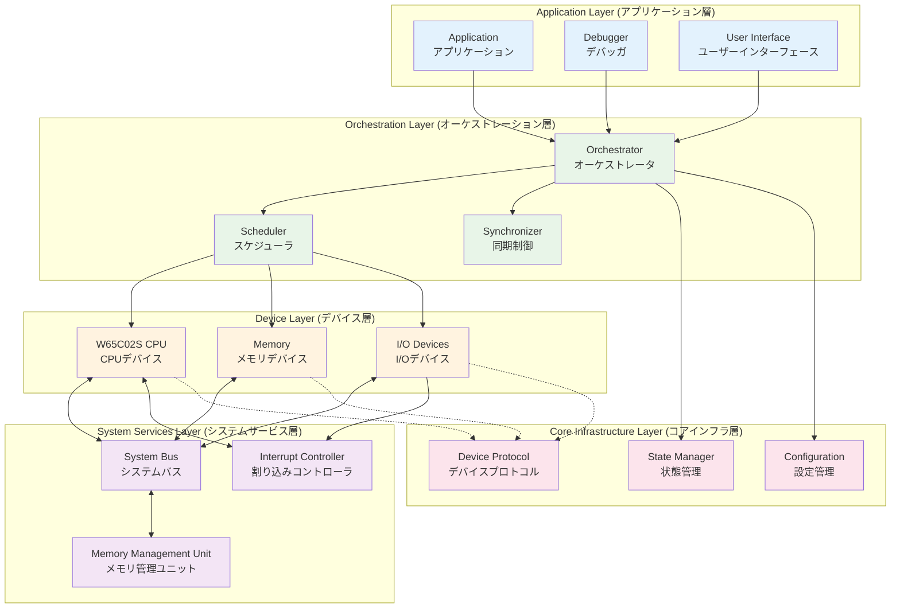

### 1.2 レイヤー構成と責務

| レイヤー | 構成要素 | 主要責務 |
| :--- | :--- | :--- |
| **Application Layer** | Application, Debugger, UI | ユーザーインターフェース、デバッグ機能の提供 |
| **Orchestration Layer** | Orchestrator, Scheduler, Synchronizer | システム全体の制御、タイムスライス管理、同期制御 |
| **Device Layer** | CPU, Memory, I/O Devices | ハードウェアコンポーネントのエミュレーション |
| **System Services Layer** | System Bus, Interrupt Controller, MMU | デバイス間通信、割り込み管理、メモリ管理 |
| **Core Infrastructure Layer** | Device Protocol, State Manager, Configuration | 基盤プロトコル、状態管理、設定管理 |

### 1.3 主要コンポーネント構成

#### 1.3.1 CPUサブシステム

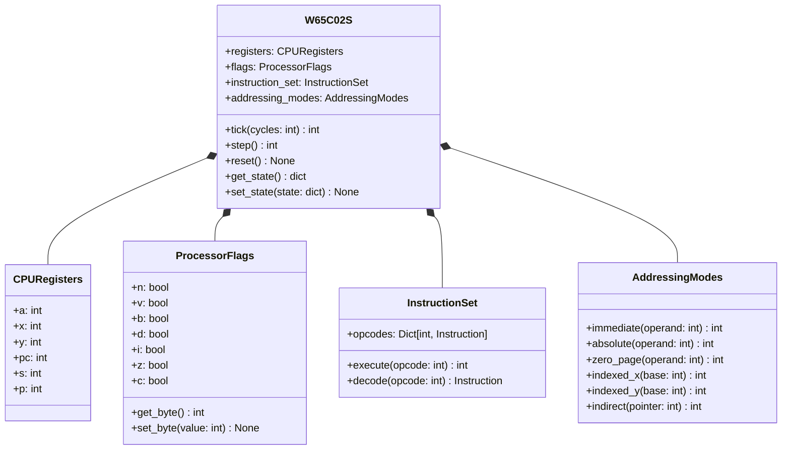

#### 1.3.2 メモリサブシステム

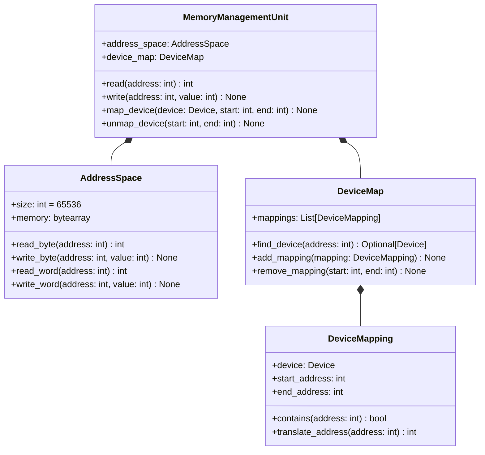

#### 1.3.3 システムサービス

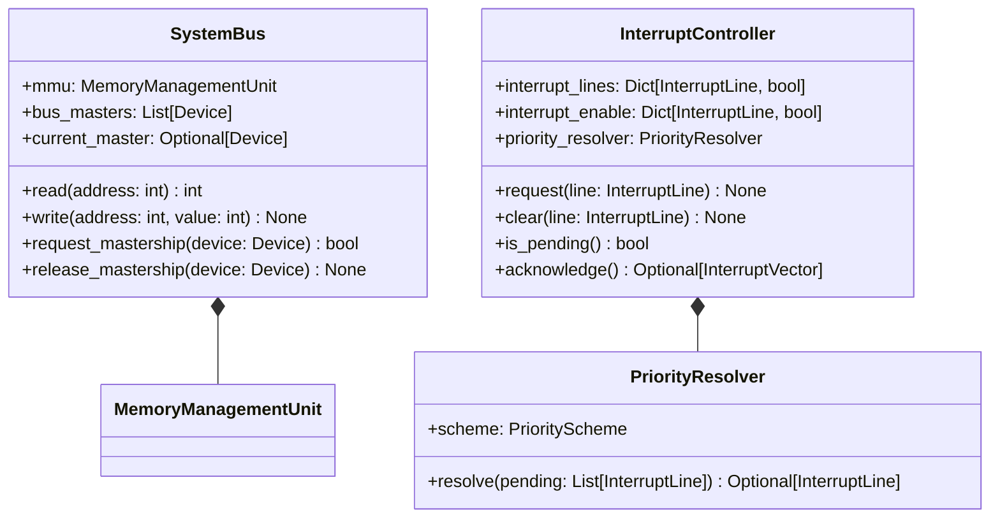

---

## SW202 機能ユニット設計書

### 2.1 機能ユニット抽出

#### 2.1.1 主要機能ユニット一覧

| ユニットID | ユニット名 | 機能概要 | 対応要求 |
| :--- | :--- | :--- | :--- |
| FU001 | CPUCore | W65C02S CPU コアの実装 | F001-F005 |
| FU002 | MemoryManager | メモリ管理とアドレス空間制御 | F006-F009 |
| FU003 | SystemOrchestrator | システム全体の制御とスケジューリング | F010-F013 |
| FU004 | DebugEngine | デバッグ機能の実装 | F014-F018 |
| FU005 | StateManager | 状態保存・復元機能 | F019-F021 |
| FU006 | DeviceFramework | 統一デバイスAPIの実装 | C016 |
| FU007 | InterruptSystem | 割り込み管理システム | F004, F012 |
| FU008 | ConfigurationManager | 設定管理システム | C020-C022 |

### 2.2 機能ユニット詳細化

#### 2.2.1 FU001: CPUCore

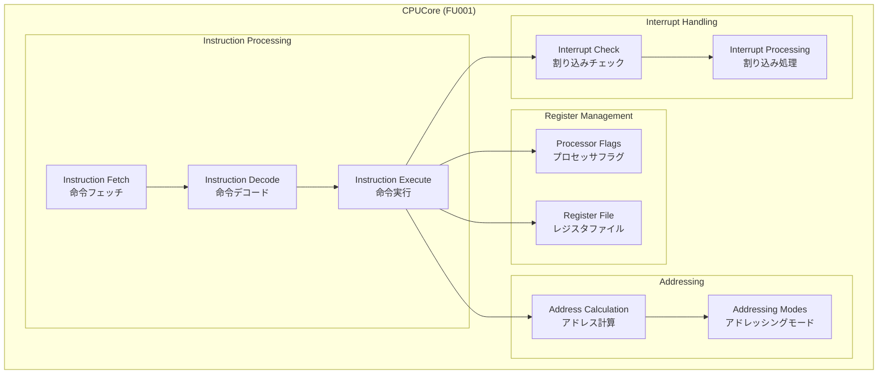

**詳細仕様:**
- **レジスタ管理**: A, X, Y, PC, S, P レジスタの完全実装
- **命令セット**: 212個の有効オペコードの実装
- **アドレッシングモード**: 16種類のモードの実装
- **割り込み処理**: RES/NMI/IRQ/BRK の7サイクルシーケンス
- **サイクル精度**: 各命令の正確なサイクル数の実装

#### 2.2.2 FU002: MemoryManager

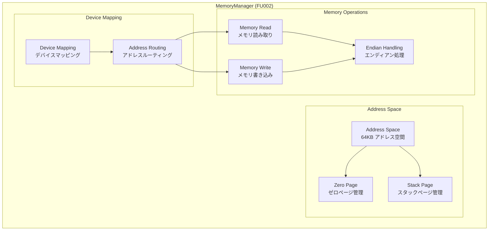

**詳細仕様:**
- **アドレス空間**: 64KB フラットアドレス空間
- **特殊領域**: ゼロページ($0000-$00FF)、スタック($0100-$01FF)
- **エンディアン**: リトルエンディアン形式での16ビット値処理
- **デバイスマッピング**: 動的なデバイス登録・解除機能

#### 2.2.3 FU003: SystemOrchestrator

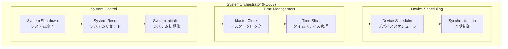

**詳細仕様:**
- **Tick駆動**: 離散時間シミュレーションモデル
- **スケジューリング**: CPU → ペリフェラル → 割り込み処理の順序
- **同期制御**: デバイス間の時間的整合性保証
- **ライフサイクル**: 初期化・実行・リセット・終了の管理

#### 2.2.4 FU004: DebugEngine

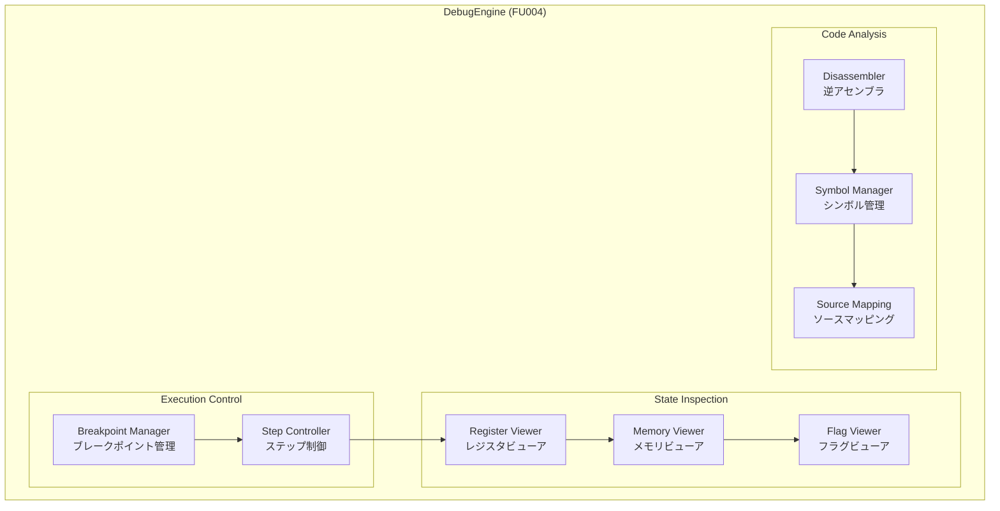

**詳細仕様:**
- **ブレークポイント**: アドレス指定・条件付きブレーク
- **ステップ実行**: ステップイン・オーバー・アウト
- **状態表示**: レジスタ・メモリ・フラグの表示
- **ソースデバッグ**: .rpt/.lmapファイル解析

#### 2.2.5 FU005: StateManager

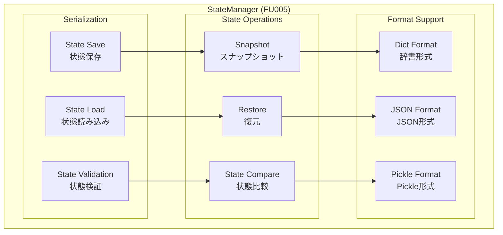

**詳細仕様:**
- **シリアライゼーション**: dict形式での状態保存
- **完全復元**: 全デバイス状態の完全復元
- **形式サポート**: JSON, Pickle等の複数形式対応
- **整合性検証**: 状態の整合性チェック機能

---

## SW203 ソフトウェア動作設計書

### 3.1 システム動作フロー

#### 3.1.1 メインエミュレーションループ

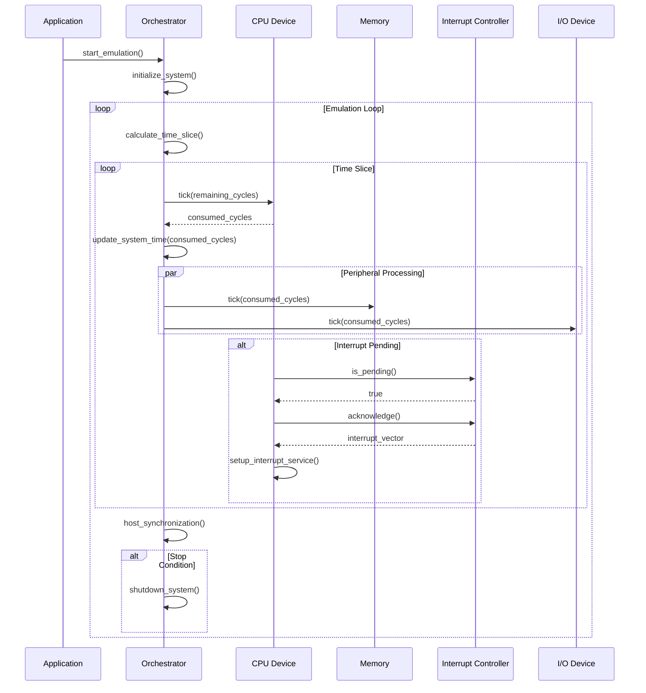

#### 3.1.2 命令実行サイクル

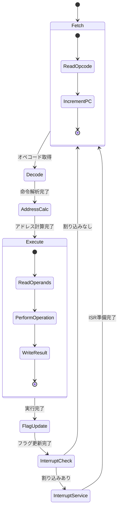

#### 3.1.3 割り込み処理フロー

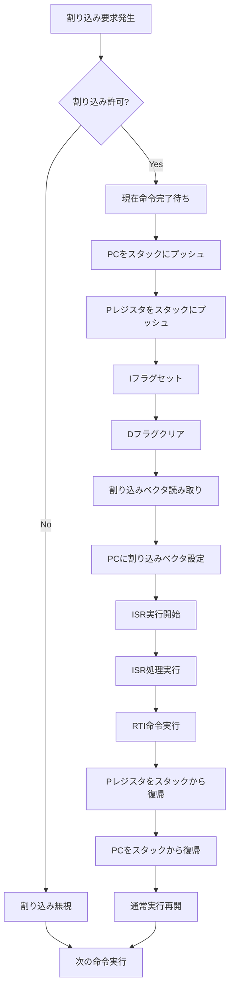

### 3.2 デバイス間通信パターン

#### 3.2.1 CPU-メモリ間通信

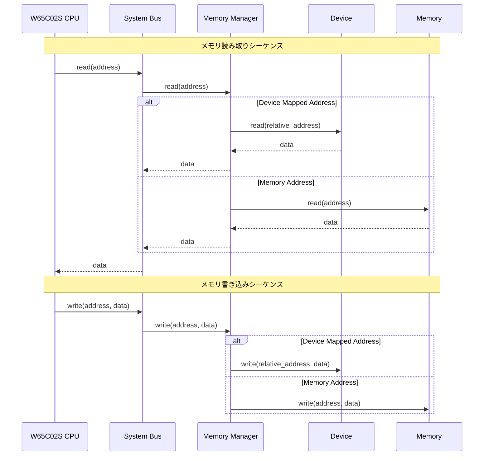

#### 3.2.2 DMA転送パターン

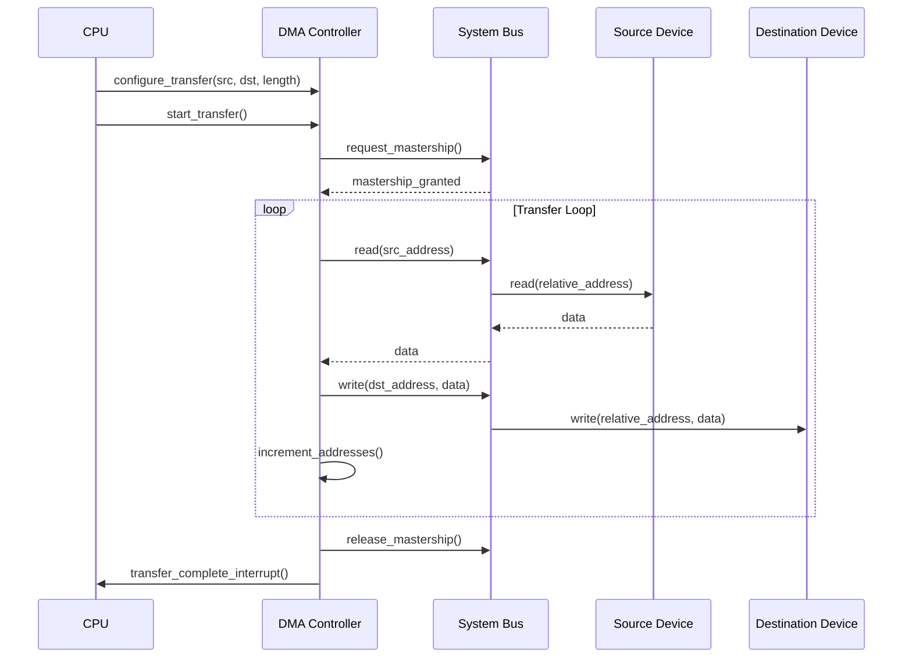

### 3.3 状態遷移設計

#### 3.3.1 システム状態遷移

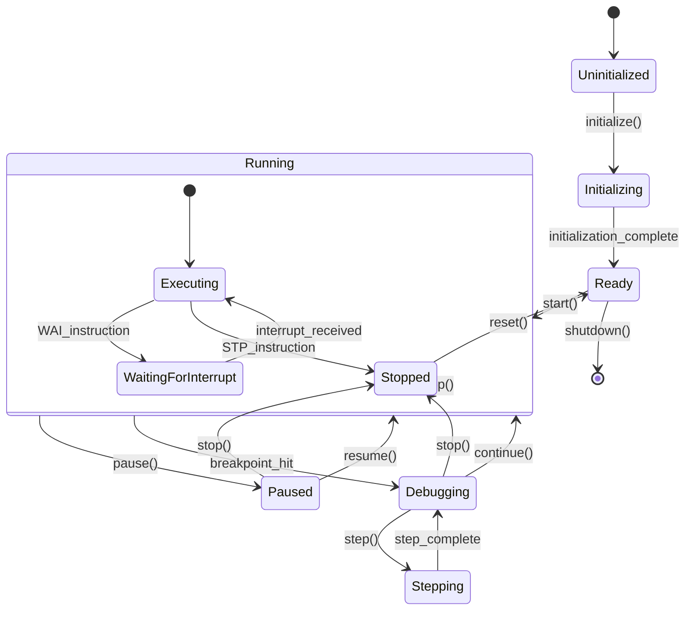

---

## SW204 ソフトウェア・インタフェース設計書

### 4.1 メモリレイアウト設計

#### 4.1.1 W65C02S アドレス空間レイアウト

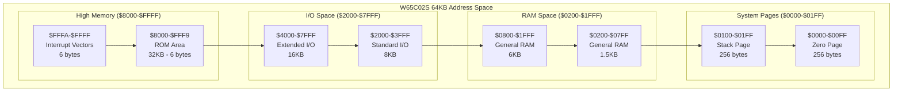

#### 4.1.2 メモリ領域詳細仕様

| アドレス範囲 | 領域名 | サイズ | 用途 | アクセス特性 |
| :--- | :--- | :--- | :--- | :--- |
| `$0000-$007F` | Zero Page Low | 128B | 間接ポインタ、高速変数 | 高速アクセス、ラップアラウンド |
| `$0080-$00FF` | Zero Page High | 128B | 高速変数、一時領域 | 高速アクセス、ラップアラウンド |
| `$0100-$01FF` | Stack Page | 256B | ハードウェアスタック | 下方向伸長、S レジスタ制御 |
| `$0200-$07FF` | General RAM Low | 1.5KB | 変数、配列、バッファ | 通常アクセス |
| `$0800-$1FFF` | General RAM High | 6KB | ユーザーデータ、バッファ | 通常アクセス |
| `$2000-$3FFF` | Standard I/O | 8KB | VDP、サウンド、コントローラ | デバイスマップ |
| `$4000-$7FFF` | Extended I/O | 16KB | 拡張デバイス | デバイスマップ |
| `$8000-$FFF9` | ROM Area | 32KB-6B | プログラムコード | 読み取り専用 |
| `$FFFA-$FFFB` | NMI Vector | 2B | NMI 割り込みベクタ | 読み取り専用 |
| `$FFFC-$FFFD` | RES Vector | 2B | リセットベクタ | 読み取り専用 |
| `$FFFE-$FFFF` | IRQ/BRK Vector | 2B | IRQ/BRK 割り込みベクタ | 読み取り専用 |

### 4.2 機能ユニット間インタフェース設計

#### 4.2.1 Device プロトコル仕様

```python
from typing import Protocol, Dict, Any, Optional
from abc import abstractmethod

class Device(Protocol):
    """統一デバイスプロトコル"""
    
    @property
    def name(self) -> str:
        """デバイス名"""
        ...
    
    @abstractmethod
    def reset(self) -> None:
        """デバイスリセット"""
        ...
    
    @abstractmethod
    def tick(self, master_cycles: int) -> int:
        """時間進行処理"""
        ...
    
    @abstractmethod
    def read(self, address: int) -> int:
        """メモリ読み取り"""
        ...
    
    @abstractmethod
    def write(self, address: int, value: int) -> None:
        """メモリ書き込み"""
        ...
    
    @abstractmethod
    def get_state(self) -> Dict[str, Any]:
        """状態取得"""
        ...
    
    @abstractmethod
    def set_state(self, state: Dict[str, Any]) -> None:
        """状態設定"""
        ...
```

#### 4.2.2 システムバス インタフェース

```python
from typing import List, Optional

class SystemBus:
    """システムバス実装"""
    
    def __init__(self, mmu: MemoryManagementUnit):
        self.mmu = mmu
        self.bus_masters: List[Device] = []
        self.current_master: Optional[Device] = None
    
    def read(self, address: int) -> int:
        """バス読み取り"""
        if not self._validate_address(address):
            raise AddressError(f"Invalid address: ${address:04X}")
        return self.mmu.read(address)
    
    def write(self, address: int, value: int) -> None:
        """バス書き込み"""
        if not self._validate_address(address):
            raise AddressError(f"Invalid address: ${address:04X}")
        if not self._validate_value(value):
            raise ValueError(f"Invalid value: {value}")
        self.mmu.write(address, value)
    
    def request_mastership(self, device: Device) -> bool:
        """バスマスタ権要求"""
        if self.current_master is None:
            self.current_master = device
            return True
        return False
    
    def release_mastership(self, device: Device) -> None:
        """バスマスタ権解放"""
        if self.current_master == device:
            self.current_master = None
    
    def _validate_address(self, address: int) -> bool:
        """アドレス検証"""
        return 0 <= address <= 0xFFFF
    
    def _validate_value(self, value: int) -> bool:
        """値検証"""
        return 0 <= value <= 0xFF
```

#### 4.2.3 割り込みコントローラ インタフェース

```python
from enum import Enum, auto
from typing import Optional, Dict, List
from dataclasses import dataclass

class InterruptLine(Enum):
    """割り込み線定義"""
    IRQ_0 = auto()
    IRQ_1 = auto()
    IRQ_2 = auto()
    NMI = auto()

@dataclass
class InterruptVector:
    """割り込みベクタ情報"""
    vector_address: int
    line: InterruptLine
    priority: int

class InterruptController:
    """割り込みコントローラ実装"""
    
    def __init__(self):
        self.interrupt_lines: Dict[InterruptLine, bool] = {}
        self.interrupt_enable: Dict[InterruptLine, bool] = {}
        self.priority_map: Dict[InterruptLine, int] = {}
        self._initialize_interrupts()
    
    def request(self, line: InterruptLine) -> None:
        """割り込み要求"""
        self.interrupt_lines[line] = True
    
    def clear(self, line: InterruptLine) -> None:
        """割り込みクリア"""
        self.interrupt_lines[line] = False
    
    def is_pending(self) -> bool:
        """割り込み保留確認"""
        for line, requested in self.interrupt_lines.items():
            if requested and self.interrupt_enable.get(line, False):
                return True
        return False
    
    def acknowledge(self) -> Optional[InterruptVector]:
        """割り込み承認"""
        pending_lines = [
            line for line, requested in self.interrupt_lines.items()
            if requested and self.interrupt_enable.get(line, False)
        ]
        
        if not pending_lines:
            return None
        
        # 優先度順にソート
        pending_lines.sort(key=lambda x: self.priority_map.get(x, 0))
        highest_priority = pending_lines[0]
        
        # 割り込みベクタを返す
        vector_address = self._get_vector_address(highest_priority)
        return InterruptVector(
            vector_address=vector_address,
            line=highest_priority,
            priority=self.priority_map.get(highest_priority, 0)
        )
    
    def _initialize_interrupts(self) -> None:
        """割り込み初期化"""
        for line in InterruptLine:
            self.interrupt_lines[line] = False
            self.interrupt_enable[line] = True
            self.priority_map[line] = line.value
    
    def _get_vector_address(self, line: InterruptLine) -> int:
        """ベクタアドレス取得"""
        vector_map = {
            InterruptLine.NMI: 0xFFFA,
            InterruptLine.IRQ_0: 0xFFFE,
            InterruptLine.IRQ_1: 0xFFFE,
            InterruptLine.IRQ_2: 0xFFFE,
        }
        return vector_map.get(line, 0xFFFE)
```

### 4.3 共通情報の一元化

#### 4.3.1 設定管理システム

```python
from dataclasses import dataclass
from typing import Dict, Any, Optional
import json

@dataclass
class SystemConfig:
    """システム設定"""
    cpu_frequency: int = 1000000  # 1MHz
    memory_size: int = 65536      # 64KB
    debug_enabled: bool = False
    log_level: str = "INFO"

@dataclass
class DeviceConfig:
    """デバイス設定基底クラス"""
    device_id: str
    device_type: str
    enabled: bool = True
    
@dataclass
class CPUConfig(DeviceConfig):
    """CPU設定"""
    initial_pc: int = 0x8000
    initial_sp: int = 0xFD
    decimal_mode_enabled: bool = True

class ConfigurationManager:
    """設定管理システム"""
    
    def __init__(self):
        self.system_config = SystemConfig()
        self.device_configs: Dict[str, DeviceConfig] = {}
    
    def load_from_file(self, config_file: str) -> None:
        """設定ファイル読み込み"""
        with open(config_file, 'r') as f:
            config_data = json.load(f)
        
        # システム設定の読み込み
        if 'system' in config_data:
            self._load_system_config(config_data['system'])
        
        # デバイス設定の読み込み
        if 'devices' in config_data:
            self._load_device_configs(config_data['devices'])
    
    def save_to_file(self, config_file: str) -> None:
        """設定ファイル保存"""
        config_data = {
            'system': self._serialize_system_config(),
            'devices': self._serialize_device_configs()
        }
        
        with open(config_file, 'w') as f:
            json.dump(config_data, f, indent=2)
    
    def get_device_config(self, device_id: str) -> Optional[DeviceConfig]:
        """デバイス設定取得"""
        return self.device_configs.get(device_id)
    
    def set_device_config(self, device_id: str, config: DeviceConfig) -> None:
        """デバイス設定設定"""
        self.device_configs[device_id] = config
    
    def _load_system_config(self, config_data: Dict[str, Any]) -> None:
        """システム設定読み込み"""
        for key, value in config_data.items():
            if hasattr(self.system_config, key):
                setattr(self.system_config, key, value)
    
    def _load_device_configs(self, config_data: Dict[str, Any]) -> None:
        """デバイス設定読み込み"""
        for device_id, device_data in config_data.items():
            device_type = device_data.get('device_type', 'generic')
            
            if device_type == 'cpu':
                config = CPUConfig(
                    device_id=device_id,
                    device_type=device_type,
                    **device_data
                )
            else:
                config = DeviceConfig(
                    device_id=device_id,
                    device_type=device_type,
                    **device_data
                )
            
            self.device_configs[device_id] = config
    
    def _serialize_system_config(self) -> Dict[str, Any]:
        """システム設定シリアライズ"""
        return {
            'cpu_frequency': self.system_config.cpu_frequency,
            'memory_size': self.system_config.memory_size,
            'debug_enabled': self.system_config.debug_enabled,
            'log_level': self.system_config.log_level
        }
    
    def _serialize_device_configs(self) -> Dict[str, Any]:
        """デバイス設定シリアライズ"""
        result = {}
        for device_id, config in self.device_configs.items():
            result[device_id] = {
                'device_type': config.device_type,
                'enabled': config.enabled
            }
            
            # CPU固有設定
            if isinstance(config, CPUConfig):
                result[device_id].update({
                    'initial_pc': config.initial_pc,
                    'initial_sp': config.initial_sp,
                    'decimal_mode_enabled': config.decimal_mode_enabled
                })
        
        return result
```

#### 4.3.2 論理値定義

```python
from enum import Enum, IntEnum

class ProcessorFlag(IntEnum):
    """プロセッサフラグ位置"""
    CARRY = 0
    ZERO = 1
    INTERRUPT_DISABLE = 2
    DECIMAL = 3
    BREAK = 4
    UNUSED = 5
    OVERFLOW = 6
    NEGATIVE = 7

class AddressingMode(Enum):
    """アドレッシングモード"""
    ACCUMULATOR = "acc"
    IMPLIED = "imp"
    IMMEDIATE = "imm"
    ABSOLUTE = "abs"
    ZERO_PAGE = "zp"
    RELATIVE = "rel"
    ABSOLUTE_X = "abs,x"
    ABSOLUTE_Y = "abs,y"
    ZERO_PAGE_X = "zp,x"
    ZERO_PAGE_Y = "zp,y"
    INDIRECT = "(abs)"
    INDIRECT_X = "(abs,x)"
    INDEXED_INDIRECT = "(zp,x)"
    INDIRECT_INDEXED = "(zp),y"
    ZERO_PAGE_INDIRECT = "(zp)"

class InstructionType(Enum):
    """命令タイプ"""
    LOAD_STORE = "load_store"
    ARITHMETIC = "arithmetic"
    LOGICAL = "logical"
    SHIFT_ROTATE = "shift_rotate"
    COMPARE = "compare"
    BRANCH = "branch"
    JUMP = "jump"
    SUBROUTINE = "subroutine"
    INTERRUPT = "interrupt"
    FLAG = "flag"
    TRANSFER = "transfer"
    STACK = "stack"
    INCREMENT = "increment"
    BIT_MANIPULATION = "bit_manipulation"
    SYSTEM = "system"

# システム定数
MEMORY_SIZE = 0x10000  # 64KB
ZERO_PAGE_START = 0x0000
ZERO_PAGE_END = 0x00FF
STACK_PAGE_START = 0x0100
STACK_PAGE_END = 0x01FF
VECTOR_NMI = 0xFFFA
VECTOR_RESET = 0xFFFC
VECTOR_IRQ_BRK = 0xFFFE

# タイミング定数
DEFAULT_CPU_FREQUENCY = 1000000  # 1MHz
CYCLES_PER_SECOND = DEFAULT_CPU_FREQUENCY
FRAME_RATE = 60  # 60 FPS
CYCLES_PER_FRAME = CYCLES_PER_SECOND // FRAME_RATE
```

---

## 性能試算資料

### 性能要求と試算

#### 基準性能要求
- **目標性能**: 実機W65C02S (1MHz) の10%以上の速度
- **最小要求**: 100,000 cycles/second (100kHz相当)
- **推奨性能**: 500,000 cycles/second (500kHz相当)

#### 性能試算

| コンポーネント | 処理時間 (μs/cycle) | 1秒間の処理可能サイクル数 | 備考 |
| :--- | :--- | :--- | :--- |
| **CPU命令実行** | 2.0 | 500,000 | Python関数呼び出しオーバーヘッド含む |
| **メモリアクセス** | 0.5 | 2,000,000 | 配列アクセス + 条件分岐 |
| **デバイスTick** | 0.3 | 3,333,333 | 軽量な状態更新処理 |
| **割り込み処理** | 5.0 | 200,000 | 複雑な状態変更処理 |
| **システム同期** | 1.0 | 1,000,000 | フレーム同期処理 |

#### 総合性能試算

```
総合処理時間 = CPU命令実行 + メモリアクセス + デバイス処理 + システム処理
             = 2.0μs + 0.5μs + 0.3μs + 1.0μs = 3.8μs/cycle

理論最大性能 = 1,000,000μs / 3.8μs = 263,158 cycles/second
実効性能 = 理論最大性能 × 効率係数(0.7) = 184,211 cycles/second
```

**結論**: 目標性能(100kHz)を十分に上回る性能が期待できる。

#### 性能最適化戦略

1. **命令ディスパッチ最適化**
   - 辞書ルックアップからswitch文への変更
   - 頻出命令の最適化

2. **メモリアクセス最適化**
   - キャッシュ機構の導入
   - バルクアクセス処理

3. **タイムスライス最適化**
   - 適応的タイムスライスサイズ
   - 処理負荷に応じた動的調整

---

## メモリ使用試算資料

### メモリ使用量試算

#### 基準メモリ要求
- **最大使用量**: 1GB以下
- **推奨使用量**: 512MB以下
- **最小使用量**: 256MB以下

#### コンポーネント別メモリ使用量

| コンポーネント | 使用量 (MB) | 詳細 |
| :--- | :--- | :--- |
| **CPUコア** | 1.0 | レジスタ、命令テーブル、状態情報 |
| **メモリ空間** | 64.0 | 64KB × 1000倍のPythonオーバーヘッド |
| **デバイス群** | 50.0 | 各種デバイスの状態とバッファ |
| **デバッガ** | 100.0 | シンボルテーブル、ブレークポイント |
| **システムサービス** | 25.0 | バス、割り込みコントローラ等 |
| **Pythonランタイム** | 150.0 | インタープリタ、ガベージコレクタ |
| **その他** | 50.0 | ログ、一時バッファ等 |

#### 総メモリ使用量試算

```
基本使用量 = 1.0 + 64.0 + 50.0 + 25.0 + 150.0 + 50.0 = 340.0 MB
デバッガ有効時 = 基本使用量 + 100.0 = 440.0 MB
最大使用量 = デバッガ有効時 × 安全係数(1.5) = 660.0 MB
```

**結論**: 目標メモリ使用量(1GB)を十分に下回る使用量となる。

#### メモリ最適化戦略

1. **オブジェクトプール**
   - 頻繁に生成/破棄されるオブジェクトの再利用
   - ガベージコレクション負荷の軽減

2. **遅延初期化**
   - 使用されるまでオブジェクトを生成しない
   - メモリ使用量の削減

3. **データ構造最適化**
   - `__slots__`の使用によるメモリ効率化
   - 適切なデータ型の選択

4. **キャッシュ管理**
   - LRUキャッシュによる適切なキャッシュサイズ管理
   - メモリリークの防止

---

## まとめ

本ソフトウェア・アーキテクチャ設計書は、W65C02S Pythonエミュレータの実装において、以下の設計指針を提供している：

1. **階層化アーキテクチャ**: 5層構造による関心の分離と保守性の確保
2. **モジュール化設計**: 8つの機能ユニットによる独立性と再利用性の実現
3. **プロトコルベース**: 統一デバイスAPIによる拡張性の確保
4. **性能・メモリ効率**: 要求仕様を満たす性能とメモリ使用量の実現

この設計により、高品質で保守性の高いW65C02Sエミュレータの実装が可能となる。
