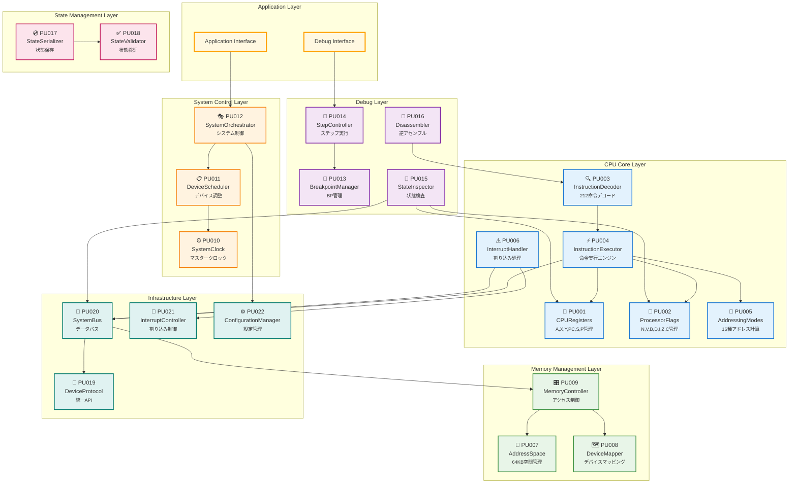
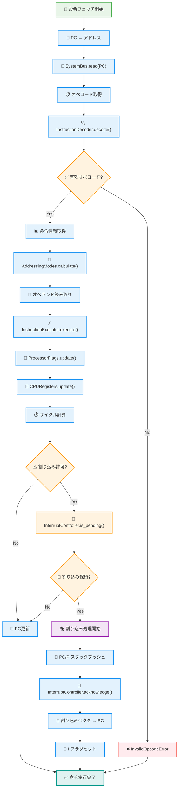
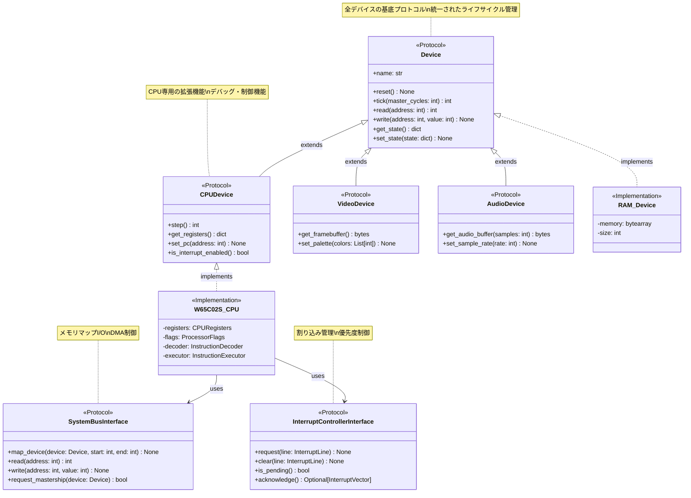
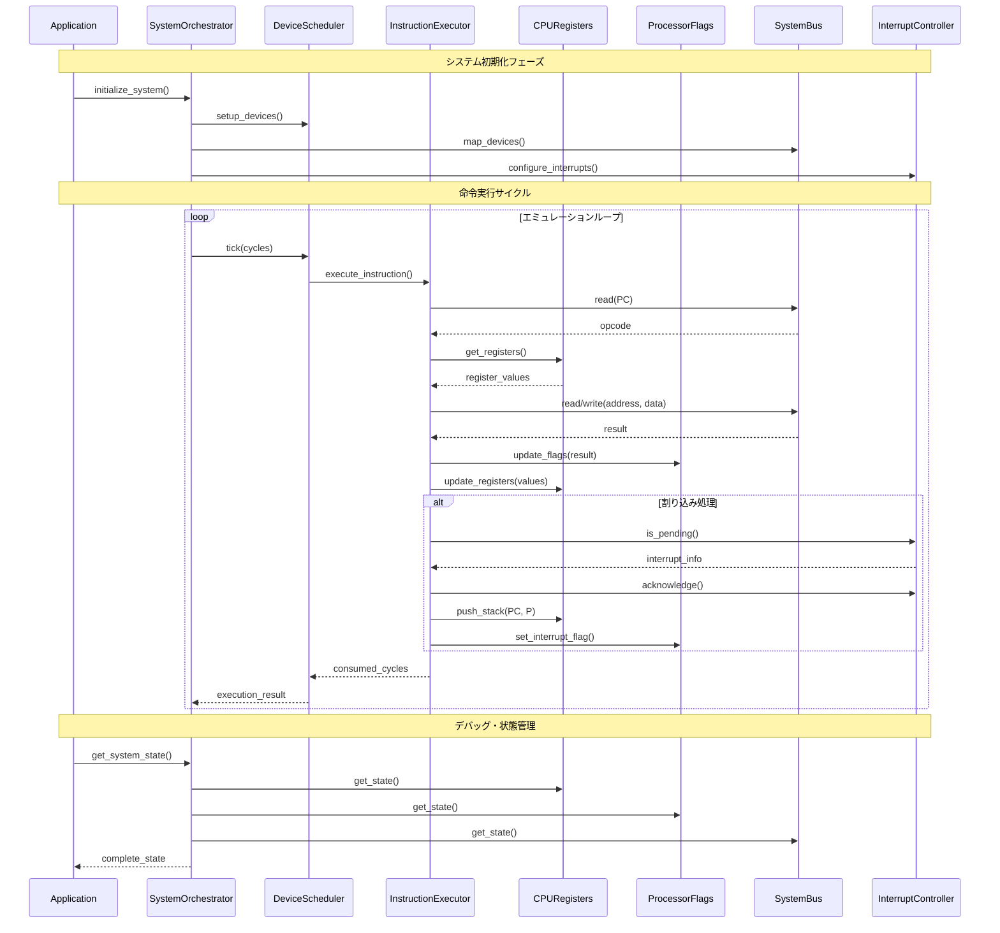
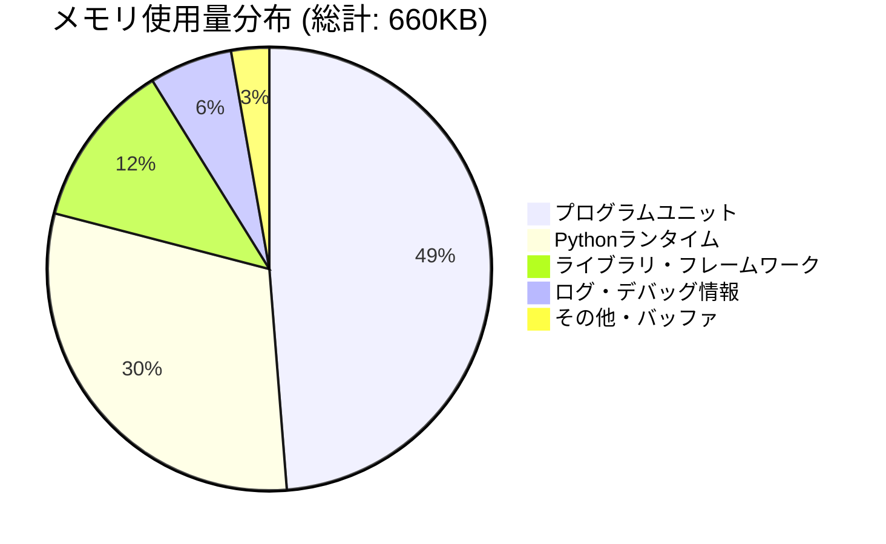
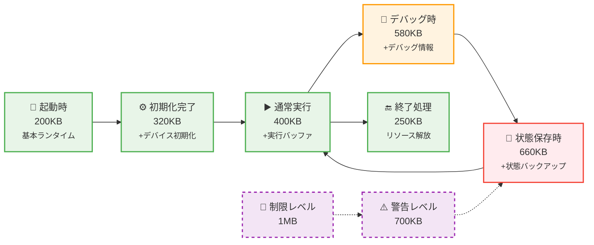

# W65C02S Pythonエミュレータ ソフトウェア詳細設計書

## 文書管理

| 項目 | 内容 |
| :--- | :--- |
| **バージョン** | 1.0 |
| **関連文書** | W65C02Sソフトウェア・アーキテクチャ設計書、ソフトウェア要求仕様書、デバイスIF API要件定義書 |

## 目次

1. [SW301 プログラムユニット機能/構成設計書](#sw301-プログラムユニット機能構成設計書)
2. [SW302 プログラムユニット設計書](#sw302-プログラムユニット設計書)
3. [SW303 プログラムユニット・インタフェース設計書](#sw303-プログラムユニットインタフェース設計書)
4. [SW304 メモリ使用量（メモ）](#sw304-メモリ使用量メモ)

---

## SW301 プログラムユニット機能/構成設計書

### 1.1 機能ユニットからプログラムユニットへの分割

アーキテクチャ設計書で定義された8つの機能ユニットを、実装可能なプログラムユニットに分割する。

#### 1.1.1 プログラムユニット分割方針

| 分割方針 | 内容 |
| :--- | :--- |
| **単一責任原則** | 各プログラムユニットは単一の明確な責任を持つ |
| **疎結合** | プログラムユニット間の依存関係を最小化 |
| **高凝集** | 関連する機能を同一ユニット内に集約 |
| **テスト容易性** | 独立してテスト可能な単位に分割 |

#### 1.1.2 プログラムユニット一覧

| PU ID | プログラムユニット名 | 対応機能ユニット | 主要責務 |
| :--- | :--- | :--- | :--- |
| **PU001** | CPURegisters | FU001 | レジスタ状態管理 |
| **PU002** | ProcessorFlags | FU001 | プロセッサフラグ管理 |
| **PU003** | InstructionDecoder | FU001 | 命令デコード処理 |
| **PU004** | InstructionExecutor | FU001 | 命令実行処理 |
| **PU005** | AddressingModes | FU001 | アドレッシングモード計算 |
| **PU006** | InterruptHandler | FU001, FU007 | 割り込み処理 |
| **PU007** | AddressSpace | FU002 | アドレス空間管理 |
| **PU008** | DeviceMapper | FU002 | デバイスマッピング管理 |
| **PU009** | MemoryController | FU002 | メモリアクセス制御 |
| **PU010** | SystemClock | FU003 | システムクロック管理 |
| **PU011** | DeviceScheduler | FU003 | デバイススケジューリング |
| **PU012** | SystemOrchestrator | FU003 | システム全体制御 |
| **PU013** | BreakpointManager | FU004 | ブレークポイント管理 |
| **PU014** | StepController | FU004 | ステップ実行制御 |
| **PU015** | StateInspector | FU004 | 状態検査機能 |
| **PU016** | Disassembler | FU004 | 逆アセンブル機能 |
| **PU017** | StateSerializer | FU005 | 状態シリアライズ |
| **PU018** | StateValidator | FU005 | 状態検証 |
| **PU019** | DeviceProtocol | FU006 | デバイスプロトコル実装 |
| **PU020** | SystemBus | FU006 | システムバス実装 |
| **PU021** | InterruptController | FU007 | 割り込みコントローラ |
| **PU022** | ConfigurationManager | FU008 | 設定管理 |

### 1.2 プログラムユニット構成図



### 1.3 プログラムユニット機能詳細

#### 1.3.1 CPU Core Layer

| PU ID | 機能概要 | 入力 | 出力 | 主要処理 |
| :--- | :--- | :--- | :--- | :--- |
| PU001 | A,X,Y,PC,S,Pレジスタの管理 | レジスタ操作要求 | レジスタ値 | 読み書き、状態保存・復元 |
| PU002 | N,V,B,D,I,Z,Cフラグの管理 | フラグ操作要求 | フラグ状態 | フラグ設定・クリア、条件判定 |
| PU003 | オペコードの解析 | オペコード | 命令情報 | 命令テーブル参照、パラメータ抽出 |
| PU004 | 命令の実行 | 命令情報 | 実行結果 | ALU演算、メモリアクセス、制御転送 |
| PU005 | 実効アドレス計算 | アドレッシング情報 | 実効アドレス | 各種モードの計算、サイクル数算出 |
| PU006 | 割り込み処理 | 割り込み要求 | 割り込み応答 | 割り込み検出、ベクタ処理、状態保存 |

#### 1.3.2 Memory Management Layer

| PU ID | 機能概要 | 入力 | 出力 | 主要処理 |
| :--- | :--- | :--- | :--- | :--- |
| PU007 | 64KBアドレス空間管理 | アドレス | メモリ内容 | アドレス範囲チェック、エンディアン処理 |
| PU008 | デバイスマッピング管理 | マッピング要求 | マッピング情報 | デバイス登録・解除、アドレス変換 |
| PU009 | メモリアクセス制御 | アクセス要求 | アクセス結果 | ルーティング、アクセス権限チェック |

#### 1.3.3 System Control Layer

| PU ID | 機能概要 | 入力 | 出力 | 主要処理 |
| :--- | :--- | :--- | :--- | :--- |
| PU010 | マスタークロック管理 | クロック要求 | クロック信号 | 時間進行、同期制御 |
| PU011 | デバイススケジューリング | スケジュール要求 | 実行順序 | 優先度管理、タイムスライス分配 |
| PU012 | システム全体制御 | 制御要求 | システム状態 | 初期化、リセット、終了処理 |

---

## SW302 プログラムユニット設計書

### 2.1 PU001: CPURegisters

#### 2.1.1 機能詳細

```python
class CPURegisters:
    """W65C02S CPUレジスタ管理クラス"""
    
    def __init__(self):
        self._a: int = 0x00      # アキュムレータ (8bit)
        self._x: int = 0x00      # Xインデックスレジスタ (8bit)
        self._y: int = 0x00      # Yインデックスレジスタ (8bit)
        self._pc: int = 0x0000   # プログラムカウンタ (16bit)
        self._s: int = 0xFD      # スタックポインタ (8bit)
        self._p: int = 0x34      # プロセッサステータス (8bit)
    
    def get_a(self) -> int:
        """アキュムレータ取得"""
        return self._a
    
    def set_a(self, value: int) -> None:
        """アキュムレータ設定"""
        self._validate_8bit(value)
        self._a = value
    
    def get_x(self) -> int:
        """Xレジスタ取得"""
        return self._x
    
    def set_x(self, value: int) -> None:
        """Xレジスタ設定"""
        self._validate_8bit(value)
        self._x = value
    
    def get_y(self) -> int:
        """Yレジスタ取得"""
        return self._y
    
    def set_y(self, value: int) -> None:
        """Yレジスタ設定"""
        self._validate_8bit(value)
        self._y = value
    
    def get_pc(self) -> int:
        """プログラムカウンタ取得"""
        return self._pc
    
    def set_pc(self, value: int) -> None:
        """プログラムカウンタ設定"""
        self._validate_16bit(value)
        self._pc = value
    
    def increment_pc(self, offset: int = 1) -> None:
        """プログラムカウンタインクリメント"""
        self._pc = (self._pc + offset) & 0xFFFF
    
    def get_s(self) -> int:
        """スタックポインタ取得"""
        return self._s
    
    def set_s(self, value: int) -> None:
        """スタックポインタ設定"""
        self._validate_8bit(value)
        self._s = value
    
    def push_stack(self) -> int:
        """スタックプッシュ用アドレス取得"""
        addr = 0x0100 + self._s
        self._s = (self._s - 1) & 0xFF
        return addr
    
    def pop_stack(self) -> int:
        """スタックポップ用アドレス取得"""
        self._s = (self._s + 1) & 0xFF
        return 0x0100 + self._s
    
    def get_p(self) -> int:
        """プロセッサステータス取得"""
        return self._p
    
    def set_p(self, value: int) -> None:
        """プロセッサステータス設定"""
        self._validate_8bit(value)
        self._p = value
    
    def reset(self) -> None:
        """レジスタリセット"""
        self._a = 0x00
        self._x = 0x00
        self._y = 0x00
        self._pc = 0x0000
        self._s = 0xFD
        self._p = 0x34
    
    def get_state(self) -> Dict[str, int]:
        """状態取得"""
        return {
            'a': self._a,
            'x': self._x,
            'y': self._y,
            'pc': self._pc,
            's': self._s,
            'p': self._p
        }
    
    def set_state(self, state: Dict[str, int]) -> None:
        """状態設定"""
        self._a = state['a']
        self._x = state['x']
        self._y = state['y']
        self._pc = state['pc']
        self._s = state['s']
        self._p = state['p']
    
    def _validate_8bit(self, value: int) -> None:
        """8ビット値検証"""
        if not (0 <= value <= 0xFF):
            raise ValueError(f"8-bit value out of range: {value}")
    
    def _validate_16bit(self, value: int) -> None:
        """16ビット値検証"""
        if not (0 <= value <= 0xFFFF):
            raise ValueError(f"16-bit value out of range: {value}")
```

#### 2.1.2 エラー処理・デバッグ機能

```python
    def validate_consistency(self) -> List[str]:
        """レジスタ整合性チェック"""
        errors = []
        
        # スタックポインタ範囲チェック
        if not (0x00 <= self._s <= 0xFF):
            errors.append(f"Stack pointer out of range: {self._s:02X}")
        
        # プロセッサステータス予約ビットチェック
        if (self._p & 0x20) == 0:  # bit 5 は常に1
            errors.append(f"Processor status bit 5 should be 1: {self._p:02X}")
        
        return errors
    
    def get_debug_info(self) -> Dict[str, str]:
        """デバッグ情報取得"""
        return {
            'A': f"${self._a:02X}",
            'X': f"${self._x:02X}",
            'Y': f"${self._y:02X}",
            'PC': f"${self._pc:04X}",
            'S': f"${self._s:02X}",
            'P': f"${self._p:02X} ({self._format_flags()})"
        }
    
    def _format_flags(self) -> str:
        """フラグ表示用フォーマット"""
        flags = []
        if self._p & 0x80: flags.append('N')
        if self._p & 0x40: flags.append('V')
        if self._p & 0x10: flags.append('B')
        if self._p & 0x08: flags.append('D')
        if self._p & 0x04: flags.append('I')
        if self._p & 0x02: flags.append('Z')
        if self._p & 0x01: flags.append('C')
        return ''.join(flags) if flags else 'none'
```

#### 2.1.3 CPU命令実行フロー



### 2.2 PU002: ProcessorFlags

#### 2.2.1 機能詳細

```python
from enum import IntEnum

class ProcessorFlag(IntEnum):
    """プロセッサフラグ定義"""
    CARRY = 0
    ZERO = 1
    INTERRUPT_DISABLE = 2
    DECIMAL = 3
    BREAK = 4
    UNUSED = 5
    OVERFLOW = 6
    NEGATIVE = 7

class ProcessorFlags:
    """プロセッサフラグ管理クラス"""
    
    def __init__(self, registers: CPURegisters):
        self._registers = registers
    
    def get_flag(self, flag: ProcessorFlag) -> bool:
        """フラグ取得"""
        return bool(self._registers.get_p() & (1 << flag))
    
    def set_flag(self, flag: ProcessorFlag, value: bool) -> None:
        """フラグ設定"""
        p = self._registers.get_p()
        if value:
            p |= (1 << flag)
        else:
            p &= ~(1 << flag)
        self._registers.set_p(p)
    
    def update_nz_flags(self, value: int) -> None:
        """N,Zフラグ更新"""
        self.set_flag(ProcessorFlag.NEGATIVE, (value & 0x80) != 0)
        self.set_flag(ProcessorFlag.ZERO, value == 0)
    
    def update_carry_flag(self, result: int) -> None:
        """キャリーフラグ更新"""
        self.set_flag(ProcessorFlag.CARRY, result > 0xFF)
    
    def update_overflow_flag(self, operand1: int, operand2: int, result: int) -> None:
        """オーバーフローフラグ更新（加算用）"""
        # 同符号の加算で異符号になった場合
        overflow = ((operand1 ^ result) & (operand2 ^ result) & 0x80) != 0
        self.set_flag(ProcessorFlag.OVERFLOW, overflow)
    
    def update_overflow_flag_sub(self, operand1: int, operand2: int, result: int) -> None:
        """オーバーフローフラグ更新（減算用）"""
        # 異符号の減算で符号が変わった場合
        overflow = ((operand1 ^ operand2) & (operand1 ^ result) & 0x80) != 0
        self.set_flag(ProcessorFlag.OVERFLOW, overflow)
    
    def get_byte(self) -> int:
        """フラグバイト取得"""
        return self._registers.get_p()
    
    def set_byte(self, value: int) -> None:
        """フラグバイト設定"""
        # bit 5は常に1、bit 4はソフトウェア割り込み時のみ設定
        value |= 0x20  # bit 5を強制的に1に設定
        self._registers.set_p(value)
    
    def push_to_stack(self, is_brk: bool = False) -> int:
        """スタックプッシュ用フラグ値取得"""
        flags = self.get_byte()
        if is_brk:
            flags |= 0x10  # BRK命令の場合はBフラグを設定
        return flags
    
    def pop_from_stack(self, value: int) -> None:
        """スタックからのフラグ復帰"""
        # RTI命令では bit 4,5 は無視される
        current = self.get_byte()
        value = (value & 0xCF) | (current & 0x30)
        self.set_byte(value)
```

#### 2.2.2 条件分岐判定機能

```python
    def check_branch_condition(self, opcode: int) -> bool:
        """分岐条件チェック"""
        branch_conditions = {
            0x10: not self.get_flag(ProcessorFlag.NEGATIVE),      # BPL
            0x30: self.get_flag(ProcessorFlag.NEGATIVE),          # BMI
            0x50: not self.get_flag(ProcessorFlag.OVERFLOW),     # BVC
            0x70: self.get_flag(ProcessorFlag.OVERFLOW),          # BVS
            0x90: not self.get_flag(ProcessorFlag.CARRY),        # BCC
            0xB0: self.get_flag(ProcessorFlag.CARRY),             # BCS
            0xD0: not self.get_flag(ProcessorFlag.ZERO),         # BNE
            0xF0: self.get_flag(ProcessorFlag.ZERO),              # BEQ
        }
        return branch_conditions.get(opcode, False)
    
    def get_debug_info(self) -> Dict[str, Any]:
        """デバッグ情報取得"""
        return {
            'flags_byte': f"${self.get_byte():02X}",
            'N': self.get_flag(ProcessorFlag.NEGATIVE),
            'V': self.get_flag(ProcessorFlag.OVERFLOW),
            'B': self.get_flag(ProcessorFlag.BREAK),
            'D': self.get_flag(ProcessorFlag.DECIMAL),
            'I': self.get_flag(ProcessorFlag.INTERRUPT_DISABLE),
            'Z': self.get_flag(ProcessorFlag.ZERO),
            'C': self.get_flag(ProcessorFlag.CARRY),
        }
```

### 2.3 PU003: InstructionDecoder

#### 2.3.1 機能詳細

```python
from dataclasses import dataclass
from typing import Optional, Callable

@dataclass
class InstructionInfo:
    """命令情報"""
    opcode: int
    mnemonic: str
    addressing_mode: str
    bytes: int
    cycles: int
    page_cross_penalty: bool
    execute_func: Callable

class InstructionDecoder:
    """命令デコーダクラス"""
    
    def __init__(self):
        self._instruction_table = self._build_instruction_table()
    
    def decode(self, opcode: int) -> Optional[InstructionInfo]:
        """命令デコード"""
        if opcode in self._instruction_table:
            return self._instruction_table[opcode]
        return None
    
    def is_valid_opcode(self, opcode: int) -> bool:
        """有効オペコード判定"""
        return opcode in self._instruction_table
    
    def get_instruction_bytes(self, opcode: int) -> int:
        """命令バイト数取得"""
        info = self.decode(opcode)
        return info.bytes if info else 1
    
    def get_base_cycles(self, opcode: int) -> int:
        """基本サイクル数取得"""
        info = self.decode(opcode)
        return info.cycles if info else 2
    
    def has_page_cross_penalty(self, opcode: int) -> bool:
        """ページクロスペナルティ有無"""
        info = self.decode(opcode)
        return info.page_cross_penalty if info else False
    
    def _build_instruction_table(self) -> Dict[int, InstructionInfo]:
        """命令テーブル構築"""
        table = {}
        
        # ADC命令群
        table[0x69] = InstructionInfo(0x69, "ADC", "imm", 2, 2, False, self._adc_imm)
        table[0x65] = InstructionInfo(0x65, "ADC", "zp", 2, 3, False, self._adc_zp)
        table[0x75] = InstructionInfo(0x75, "ADC", "zp,x", 2, 4, False, self._adc_zpx)
        table[0x6D] = InstructionInfo(0x6D, "ADC", "abs", 3, 4, False, self._adc_abs)
        table[0x7D] = InstructionInfo(0x7D, "ADC", "abs,x", 3, 4, True, self._adc_absx)
        table[0x79] = InstructionInfo(0x79, "ADC", "abs,y", 3, 4, True, self._adc_absy)
        table[0x61] = InstructionInfo(0x61, "ADC", "(zp,x)", 2, 6, False, self._adc_indx)
        table[0x71] = InstructionInfo(0x71, "ADC", "(zp),y", 2, 5, True, self._adc_indy)
        table[0x72] = InstructionInfo(0x72, "ADC", "(zp)", 2, 5, False, self._adc_ind)
        
        # LDA命令群
        table[0xA9] = InstructionInfo(0xA9, "LDA", "imm", 2, 2, False, self._lda_imm)
        table[0xA5] = InstructionInfo(0xA5, "LDA", "zp", 2, 3, False, self._lda_zp)
        table[0xB5] = InstructionInfo(0xB5, "LDA", "zp,x", 2, 4, False, self._lda_zpx)
        table[0xAD] = InstructionInfo(0xAD, "LDA", "abs", 3, 4, False, self._lda_abs)
        table[0xBD] = InstructionInfo(0xBD, "LDA", "abs,x", 3, 4, True, self._lda_absx)
        table[0xB9] = InstructionInfo(0xB9, "LDA", "abs,y", 3, 4, True, self._lda_absy)
        table[0xA1] = InstructionInfo(0xA1, "LDA", "(zp,x)", 2, 6, False, self._lda_indx)
        table[0xB1] = InstructionInfo(0xB1, "LDA", "(zp),y", 2, 5, True, self._lda_indy)
        table[0xB2] = InstructionInfo(0xB2, "LDA", "(zp)", 2, 5, False, self._lda_ind)
        
        # 制御転送命令
        table[0x4C] = InstructionInfo(0x4C, "JMP", "abs", 3, 3, False, self._jmp_abs)
        table[0x6C] = InstructionInfo(0x6C, "JMP", "(abs)", 3, 5, False, self._jmp_ind)
        table[0x7C] = InstructionInfo(0x7C, "JMP", "(abs,x)", 3, 6, False, self._jmp_indx)
        table[0x20] = InstructionInfo(0x20, "JSR", "abs", 3, 6, False, self._jsr_abs)
        table[0x60] = InstructionInfo(0x60, "RTS", "imp", 1, 6, False, self._rts_imp)
        table[0x40] = InstructionInfo(0x40, "RTI", "imp", 1, 6, False, self._rti_imp)
        
        # 分岐命令
        table[0x10] = InstructionInfo(0x10, "BPL", "rel", 2, 2, False, self._bpl_rel)
        table[0x30] = InstructionInfo(0x30, "BMI", "rel", 2, 2, False, self._bmi_rel)
        table[0x50] = InstructionInfo(0x50, "BVC", "rel", 2, 2, False, self._bvc_rel)
        table[0x70] = InstructionInfo(0x70, "BVS", "rel", 2, 2, False, self._bvs_rel)
        table[0x90] = InstructionInfo(0x90, "BCC", "rel", 2, 2, False, self._bcc_rel)
        table[0xB0] = InstructionInfo(0xB0, "BCS", "rel", 2, 2, False, self._bcs_rel)
        table[0xD0] = InstructionInfo(0xD0, "BNE", "rel", 2, 2, False, self._bne_rel)
        table[0xF0] = InstructionInfo(0xF0, "BEQ", "rel", 2, 2, False, self._beq_rel)
        table[0x80] = InstructionInfo(0x80, "BRA", "rel", 2, 3, False, self._bra_rel)
        
        # システム命令
        table[0x00] = InstructionInfo(0x00, "BRK", "imp", 1, 7, False, self._brk_imp)
        table[0xEA] = InstructionInfo(0xEA, "NOP", "imp", 1, 2, False, self._nop_imp)
        table[0xCB] = InstructionInfo(0xCB, "WAI", "imp", 1, 3, False, self._wai_imp)
        table[0xDB] = InstructionInfo(0xDB, "STP", "imp", 1, 3, False, self._stp_imp)
        
        # 残りの命令も同様に定義...
        
        return table
    
    def get_mnemonic(self, opcode: int) -> str:
        """ニーモニック取得"""
        info = self.decode(opcode)
        return info.mnemonic if info else "???"
    
    def get_addressing_mode(self, opcode: int) -> str:
        """アドレッシングモード取得"""
        info = self.decode(opcode)
        return info.addressing_mode if info else "???"
    
    def get_debug_info(self, opcode: int) -> Dict[str, Any]:
        """デバッグ情報取得"""
        info = self.decode(opcode)
        if info:
            return {
                'opcode': f"${opcode:02X}",
                'mnemonic': info.mnemonic,
                'addressing': info.addressing_mode,
                'bytes': info.bytes,
                'cycles': info.cycles,
                'page_cross': info.page_cross_penalty
            }
        else:
            return {
                'opcode': f"${opcode:02X}",
                'mnemonic': "INVALID",
                'addressing': "unknown",
                'bytes': 1,
                'cycles': 2,
                'page_cross': False
            }
```

### 2.4 PU020: SystemBus

#### 2.4.1 機能詳細

```python
from typing import List, Optional, Dict, Any
from dataclasses import dataclass

@dataclass
class DeviceMapping:
    """デバイスマッピング情報"""
    device: 'Device'
    start_address: int
    end_address: int
    name: str
    
    def contains(self, address: int) -> bool:
        """アドレス範囲チェック"""
        return self.start_address <= address <= self.end_address
    
    def translate_address(self, address: int) -> int:
        """相対アドレス変換"""
        return address - self.start_address

class SystemBus:
    """システムバス実装"""
    
    def __init__(self):
        self._mappings: List[DeviceMapping] = []
        self._bus_masters: List['Device'] = []
        self._current_master: Optional['Device'] = None
        self._access_log: List[Dict[str, Any]] = []
        self._debug_enabled = False
    
    def map_device(self, device: 'Device', start: int, end: int, name: str = "") -> None:
        """デバイスマッピング"""
        if not (0 <= start <= end <= 0xFFFF):
            raise ValueError(f"Invalid address range: ${start:04X}-${end:04X}")
        
        # 重複チェック
        for mapping in self._mappings:
            if not (end < mapping.start_address or start > mapping.end_address):
                raise ValueError(f"Address range overlap: ${start:04X}-${end:04X}")
        
        mapping = DeviceMapping(device, start, end, name or device.name)
        self._mappings.append(mapping)
        self._mappings.sort(key=lambda m: m.start_address)
    
    def unmap_device(self, start: int, end: int) -> None:
        """デバイスマッピング解除"""
        self._mappings = [m for m in self._mappings 
                         if not (m.start_address == start and m.end_address == end)]
    
    def read(self, address: int) -> int:
        """バス読み取り"""
        if not self._validate_address(address):
            raise ValueError(f"Invalid address: ${address:04X}")
        
        # デバイス検索
        device_mapping = self._find_device_mapping(address)
        if device_mapping:
            relative_addr = device_mapping.translate_address(address)
            value = device_mapping.device.read(relative_addr)
            
            if self._debug_enabled:
                self._log_access('READ', address, value, device_mapping.name)
            
            return value
        else:
            # マップされていないアドレス（オープンバス）
            if self._debug_enabled:
                self._log_access('READ', address, 0xFF, 'OPEN_BUS')
            return 0xFF
    
    def write(self, address: int, value: int) -> None:
        """バス書き込み"""
        if not self._validate_address(address):
            raise ValueError(f"Invalid address: ${address:04X}")
        
        if not self._validate_value(value):
            raise ValueError(f"Invalid value: {value}")
        
        # デバイス検索
        device_mapping = self._find_device_mapping(address)
        if device_mapping:
            relative_addr = device_mapping.translate_address(address)
            device_mapping.device.write(relative_addr, value)
            
            if self._debug_enabled:
                self._log_access('WRITE', address, value, device_mapping.name)
        else:
            # マップされていないアドレス（書き込み無視）
            if self._debug_enabled:
                self._log_access('WRITE', address, value, 'IGNORED')
    
    def request_mastership(self, device: 'Device') -> bool:
        """バスマスタ権要求"""
        if self._current_master is None:
            self._current_master = device
            if device not in self._bus_masters:
                self._bus_masters.append(device)
            return True
        return False
    
    def release_mastership(self, device: 'Device') -> None:
        """バスマスタ権解放"""
        if self._current_master == device:
            self._current_master = None
    
    def get_current_master(self) -> Optional['Device']:
        """現在のバスマスタ取得"""
        return self._current_master
    
    def _find_device_mapping(self, address: int) -> Optional[DeviceMapping]:
        """デバイスマッピング検索"""
        for mapping in self._mappings:
            if mapping.contains(address):
                return mapping
        return None
    
    def _validate_address(self, address: int) -> bool:
        """アドレス検証"""
        return 0 <= address <= 0xFFFF
    
    def _validate_value(self, value: int) -> bool:
        """値検証"""
        return 0 <= value <= 0xFF
    
    def _log_access(self, operation: str, address: int, value: int, device: str) -> None:
        """アクセスログ記録"""
        log_entry = {
            'operation': operation,
            'address': address,
            'value': value,
            'device': device,
            'master': self._current_master.name if self._current_master else 'CPU'
        }
        self._access_log.append(log_entry)
        
        # ログサイズ制限
        if len(self._access_log) > 1000:
            self._access_log = self._access_log[-500:]
    
    def enable_debug(self, enabled: bool = True) -> None:
        """デバッグモード設定"""
        self._debug_enabled = enabled
    
    def get_access_log(self) -> List[Dict[str, Any]]:
        """アクセスログ取得"""
        return self._access_log.copy()
    
    def clear_access_log(self) -> None:
        """アクセスログクリア"""
        self._access_log.clear()
    
    def get_memory_map(self) -> List[Dict[str, Any]]:
        """メモリマップ取得"""
        return [
            {
                'start': f"${m.start_address:04X}",
                'end': f"${m.end_address:04X}",
                'size': m.end_address - m.start_address + 1,
                'device': m.name
            }
            for m in self._mappings
        ]
    
    def get_debug_info(self) -> Dict[str, Any]:
        """デバッグ情報取得"""
        return {
            'mappings_count': len(self._mappings),
            'bus_masters': [m.name for m in self._bus_masters],
            'current_master': self._current_master.name if self._current_master else None,
            'debug_enabled': self._debug_enabled,
            'access_log_size': len(self._access_log)
        }
```

---

## SW303 プログラムユニット・インタフェース設計書

### 3.1 インタフェース設計原則

| 原則 | 内容 |
| :--- | :--- |
| **型安全性** | Pythonの型ヒントを活用した静的型チェック |
| **契約プログラミング** | 事前条件・事後条件・不変条件の明確化 |
| **例外安全性** | 適切な例外処理とリソース管理 |
| **テスト容易性** | モックやスタブによる単体テスト支援 |

### 3.2 主要インタフェース定義

#### 3.2.1 プロトコル階層図



#### 3.2.2 Device Protocol

```python
from typing import Protocol, Dict, Any, runtime_checkable

@runtime_checkable
class Device(Protocol):
    """統一デバイスプロトコル"""
    
    @property
    def name(self) -> str:
        """デバイス名"""
        ...
    
    def reset(self) -> None:
        """デバイスリセット"""
        ...
    
    def tick(self, master_cycles: int) -> int:
        """時間進行処理
        
        Args:
            master_cycles: マスタークロックサイクル数
            
        Returns:
            実際に消費したサイクル数
            
        Raises:
            ValueError: 無効なサイクル数
        """
        ...
    
    def read(self, address: int) -> int:
        """メモリ読み取り
        
        Args:
            address: 相対アドレス (0-0xFFFF)
            
        Returns:
            読み取り値 (0-0xFF)
            
        Raises:
            ValueError: 無効なアドレス
        """
        ...
    
    def write(self, address: int, value: int) -> None:
        """メモリ書き込み
        
        Args:
            address: 相対アドレス (0-0xFFFF)
            value: 書き込み値 (0-0xFF)
            
        Raises:
            ValueError: 無効なアドレスまたは値
        """
        ...
    
    def get_state(self) -> Dict[str, Any]:
        """状態取得
        
        Returns:
            シリアライズ可能な状態辞書
        """
        ...
    
    def set_state(self, state: Dict[str, Any]) -> None:
        """状態設定
        
        Args:
            state: get_stateで取得した状態辞書
            
        Raises:
            ValueError: 無効な状態データ
        """
        ...
```

#### 3.2.2 CPUDevice Protocol

```python
@runtime_checkable
class CPUDevice(Device, Protocol):
    """CPU専用プロトコル"""
    
    def step(self) -> int:
        """単一命令実行
        
        Returns:
            消費サイクル数
            
        Raises:
            InvalidOpcodeError: 無効なオペコード
            MemoryError: メモリアクセスエラー
        """
        ...
    
    def get_registers(self) -> Dict[str, int]:
        """レジスタ状態取得
        
        Returns:
            レジスタ辞書 {'a': int, 'x': int, 'y': int, 'pc': int, 's': int, 'p': int}
        """
        ...
    
    def set_pc(self, address: int) -> None:
        """プログラムカウンタ設定
        
        Args:
            address: 設定アドレス (0-0xFFFF)
            
        Raises:
            ValueError: 無効なアドレス
        """
        ...
    
    def is_interrupt_enabled(self) -> bool:
        """割り込み許可状態取得
        
        Returns:
            割り込み許可フラグ
        """
        ...
```

#### 3.2.3 SystemBus Interface

```python
class SystemBusInterface(Protocol):
    """システムバスインタフェース"""
    
    def map_device(self, device: Device, start: int, end: int, name: str = "") -> None:
        """デバイスマッピング
        
        Args:
            device: マップするデバイス
            start: 開始アドレス
            end: 終了アドレス
            name: デバイス名（オプション）
            
        Raises:
            ValueError: 無効なアドレス範囲
            OverlapError: アドレス重複
        """
        ...
    
    def read(self, address: int) -> int:
        """バス読み取り
        
        Args:
            address: システムアドレス
            
        Returns:
            読み取り値
            
        Raises:
            ValueError: 無効なアドレス
        """
        ...
    
    def write(self, address: int, value: int) -> None:
        """バス書き込み
        
        Args:
            address: システムアドレス
            value: 書き込み値
            
        Raises:
            ValueError: 無効なアドレスまたは値
        """
        ...
    
    def request_mastership(self, device: Device) -> bool:
        """バスマスタ権要求
        
        Args:
            device: 要求デバイス
            
        Returns:
            取得成功フラグ
        """
        ...
```

### 3.3 例外クラス定義

```python
class EmulatorError(Exception):
    """エミュレータ基底例外"""
    pass

class InvalidOpcodeError(EmulatorError):
    """無効オペコード例外"""
    def __init__(self, opcode: int, pc: int):
        self.opcode = opcode
        self.pc = pc
        super().__init__(f"Invalid opcode ${opcode:02X} at ${pc:04X}")

class MemoryError(EmulatorError):
    """メモリアクセス例外"""
    def __init__(self, address: int, operation: str):
        self.address = address
        self.operation = operation
        super().__init__(f"Memory {operation} error at ${address:04X}")

class AddressOverlapError(EmulatorError):
    """アドレス重複例外"""
    def __init__(self, start: int, end: int):
        self.start = start
        self.end = end
        super().__init__(f"Address overlap: ${start:04X}-${end:04X}")

class StateError(EmulatorError):
    """状態エラー例外"""
    pass
```

### 3.4 データ交換フォーマット

#### 3.4.1 状態データフォーマット

```python
from typing import TypedDict

class CPUState(TypedDict):
    """CPU状態データ"""
    registers: Dict[str, int]  # レジスタ値
    flags: int                 # プロセッサフラグ
    cycle_count: int          # サイクルカウンタ
    interrupt_pending: bool   # 割り込み保留フラグ

class MemoryState(TypedDict):
    """メモリ状態データ"""
    ram: bytes                # RAMデータ
    mappings: List[Dict[str, Any]]  # デバイスマッピング情報

class SystemState(TypedDict):
    """システム状態データ"""
    cpu: CPUState
    memory: MemoryState
    devices: Dict[str, Dict[str, Any]]  # デバイス別状態
    system_time: int          # システム時間
```

### 3.5 データフロー図



### 3.6 コールバックインタフェース

```python
from typing import Callable, Optional

class DebugCallback(Protocol):
    """デバッグコールバック"""
    
    def on_breakpoint(self, pc: int, opcode: int) -> None:
        """ブレークポイントヒット"""
        ...
    
    def on_memory_access(self, address: int, value: int, is_write: bool) -> None:
        """メモリアクセス"""
        ...
    
    def on_instruction_execute(self, pc: int, opcode: int, cycles: int) -> None:
        """命令実行"""
        ...

class InterruptCallback(Protocol):
    """割り込みコールバック"""
    
    def on_interrupt_request(self, line: 'InterruptLine') -> None:
        """割り込み要求"""
        ...
    
    def on_interrupt_acknowledge(self, vector: int) -> None:
        """割り込み承認"""
        ...
```

---

## SW304 メモリ使用量（メモ）

### 4.1 メモリ使用量見積もり

#### 4.1.1 プログラムユニット別メモリ使用量

| PU ID | プログラムユニット | 基本サイズ (bytes) | 動的サイズ (bytes) | 合計見積もり (KB) |
| :--- | :--- | :--- | :--- | :--- |
| PU001 | CPURegisters | 64 | 0 | 0.1 |
| PU002 | ProcessorFlags | 32 | 0 | 0.1 |
| PU003 | InstructionDecoder | 2,048 | 16,384 | 18.0 |
| PU004 | InstructionExecutor | 1,024 | 4,096 | 5.0 |
| PU005 | AddressingModes | 512 | 1,024 | 1.5 |
| PU006 | InterruptHandler | 256 | 512 | 0.8 |
| PU007 | AddressSpace | 128 | 65,536 | 64.1 |
| PU008 | DeviceMapper | 512 | 8,192 | 8.5 |
| PU009 | MemoryController | 256 | 2,048 | 2.2 |
| PU010 | SystemClock | 128 | 256 | 0.4 |
| PU011 | DeviceScheduler | 512 | 4,096 | 4.5 |
| PU012 | SystemOrchestrator | 1,024 | 8,192 | 9.0 |
| PU013 | BreakpointManager | 256 | 16,384 | 16.3 |
| PU014 | StepController | 128 | 512 | 0.6 |
| PU015 | StateInspector | 512 | 2,048 | 2.5 |
| PU016 | Disassembler | 1,024 | 32,768 | 33.0 |
| PU017 | StateSerializer | 256 | 131,072 | 128.3 |
| PU018 | StateValidator | 128 | 1,024 | 1.1 |
| PU019 | DeviceProtocol | 64 | 0 | 0.1 |
| PU020 | SystemBus | 512 | 16,384 | 16.5 |
| PU021 | InterruptController | 256 | 1,024 | 1.2 |
| PU022 | ConfigurationManager | 512 | 8,192 | 8.5 |

#### 4.1.2 総メモリ使用量



| カテゴリ | 使用量 (KB) | 割合 (%) | 詳細 |
| :--- | :--- | :--- | :--- |
| **🔧 プログラムユニット合計** | 321.7 | 48.7% | 22個のPUの合計 |
| **🐍 Pythonランタイム** | 200.0 | 30.3% | インタープリタ・GC |
| **📚 ライブラリ・フレームワーク** | 80.0 | 12.1% | 標準ライブラリ等 |
| **📝 ログ・デバッグ情報** | 40.0 | 6.1% | 実行ログ・BP情報 |
| **🔄 その他・バッファ** | 18.3 | 2.8% | 一時バッファ等 |
| **📊 総計** | 660.0 | 100.0% | |

### 4.2 メモリ領域別詳細

#### 4.2.1 ROM領域（プログラム領域）

| 項目 | サイズ (KB) | 内容 |
| :--- | :--- | :--- |
| **命令テーブル** | 16.0 | 212個のオペコード情報 |
| **実行関数** | 32.0 | 命令実行関数群 |
| **アドレッシング関数** | 8.0 | アドレス計算関数群 |
| **システム関数** | 12.0 | システム制御関数群 |
| **デバッグ関数** | 20.0 | デバッグ支援関数群 |
| **設定データ** | 4.0 | 初期設定・定数データ |
| **小計** | 92.0 | |

#### 4.2.2 RAM領域（データ領域）

| 項目 | サイズ (KB) | 内容 |
| :--- | :--- | :--- |
| **エミュレートメモリ** | 64.0 | W65C02Sの64KBアドレス空間 |
| **レジスタ・状態** | 1.0 | CPU・デバイス状態 |
| **デバイスマッピング** | 8.0 | メモリマップ情報 |
| **割り込み管理** | 2.0 | 割り込み状態・キュー |
| **デバッグ情報** | 40.0 | ブレークポイント・ログ |
| **状態バックアップ** | 128.0 | セーブステート用バッファ |
| **小計** | 243.0 | |

#### 4.2.3 スタック領域

| 項目 | サイズ (KB) | 内容 |
| :--- | :--- | :--- |
| **Pythonコールスタック** | 64.0 | 関数呼び出しスタック |
| **エミュレータスタック** | 8.0 | エミュレータ内部スタック |
| **デバッグスタック** | 16.0 | デバッグ情報スタック |
| **小計** | 88.0 | |

### 4.3 動的メモリ使用パターン

#### 4.3.1 実行時メモリ変動



#### 4.3.2 メモリ最適化戦略

| 戦略 | 効果 (KB) | 実装優先度 |
| :--- | :--- | :--- |
| **命令テーブル圧縮** | -8.0 | 中 |
| **状態データ圧縮** | -64.0 | 高 |
| **ログサイズ制限** | -20.0 | 高 |
| **遅延初期化** | -40.0 | 中 |
| **オブジェクトプール** | -32.0 | 低 |
| **合計削減効果** | -164.0 | |

### 4.4 メモリ使用量監視

#### 4.4.1 監視項目

```python
class MemoryMonitor:
    """メモリ使用量監視クラス"""
    
    def get_memory_usage(self) -> Dict[str, int]:
        """メモリ使用量取得"""
        return {
            'total_allocated': self._get_total_allocated(),
            'cpu_registers': self._get_cpu_memory(),
            'instruction_table': self._get_instruction_memory(),
            'device_mappings': self._get_mapping_memory(),
            'debug_info': self._get_debug_memory(),
            'state_backup': self._get_state_memory(),
            'python_overhead': self._get_python_overhead()
        }
    
    def check_memory_limits(self) -> List[str]:
        """メモリ制限チェック"""
        warnings = []
        usage = self.get_memory_usage()
        
        if usage['total_allocated'] > 700 * 1024:  # 700KB制限
            warnings.append("Total memory usage exceeds 700KB")
        
        if usage['debug_info'] > 50 * 1024:  # 50KB制限
            warnings.append("Debug info memory exceeds 50KB")
        
        if usage['state_backup'] > 150 * 1024:  # 150KB制限
            warnings.append("State backup memory exceeds 150KB")
        
        return warnings
```

### 4.5 メモリ効率化実装

#### 4.5.1 __slots__の活用

```python
class CPURegisters:
    """メモリ効率化されたCPUレジスタクラス"""
    __slots__ = ['_a', '_x', '_y', '_pc', '_s', '_p']
    
    def __init__(self):
        self._a: int = 0x00
        self._x: int = 0x00
        self._y: int = 0x00
        self._pc: int = 0x0000
        self._s: int = 0xFD
        self._p: int = 0x34
```

#### 4.5.2 データ圧縮

```python
class CompressedState:
    """圧縮状態管理"""
    
    def compress_state(self, state: Dict[str, Any]) -> bytes:
        """状態データ圧縮"""
        import zlib
        import pickle
        
        # pickleでシリアライズ後、zlibで圧縮
        pickled = pickle.dumps(state)
        compressed = zlib.compress(pickled, level=6)
        return compressed
    
    def decompress_state(self, compressed: bytes) -> Dict[str, Any]:
        """状態データ展開"""
        import zlib
        import pickle
        
        # zlib展開後、pickleでデシリアライズ
        decompressed = zlib.decompress(compressed)
        state = pickle.loads(decompressed)
        return state
```

---

## まとめ

本ソフトウェア詳細設計書は、W65C02S Pythonエミュレータの実装において、以下の成果を提供している：

1. **SW301**: 8つの機能ユニットを22のプログラムユニットに分割し、実装可能な単位に細分化
2. **SW302**: 各プログラムユニットの詳細な処理内容と実装レベルの仕様を定義
3. **SW303**: 型安全で拡張性の高いインタフェース設計とプロトコル定義
4. **SW304**: 総メモリ使用量660KBの詳細な見積もりと最適化戦略

この設計により、高品質で保守性の高いW65C02Sエミュレータの実装が可能となる。

