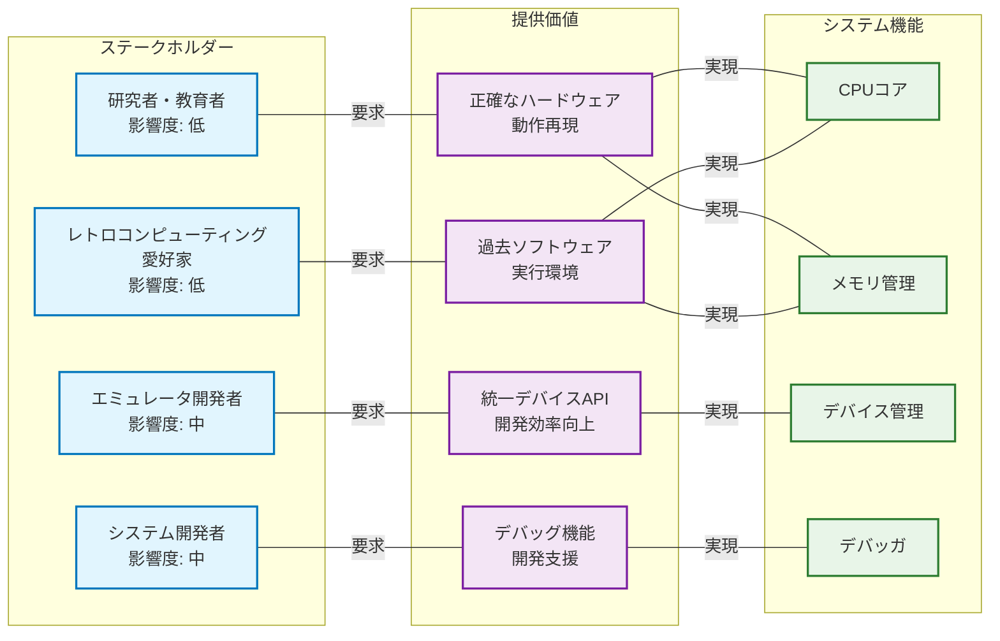
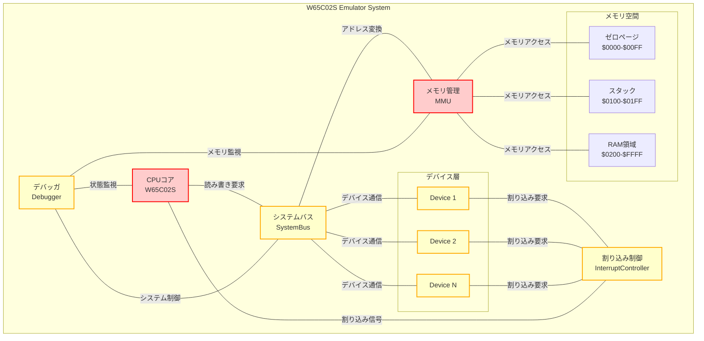
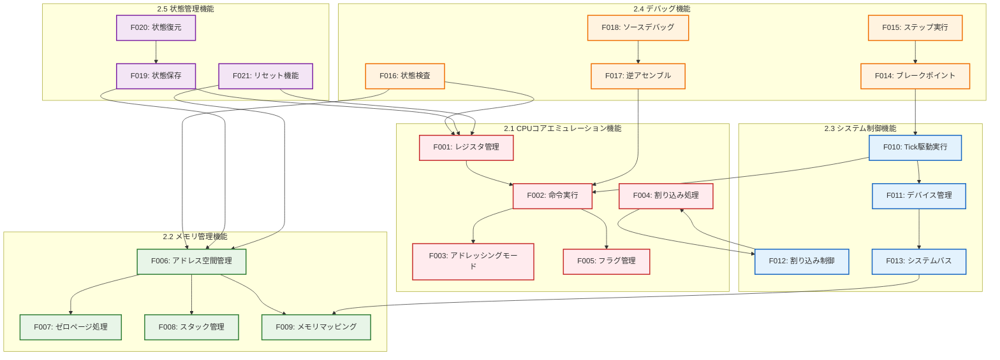

# W65C02S Pythonエミュレータ ソフトウェア要求仕様書

## 文書管理

| 項目 | 内容 |
| :--- | :--- |
| **バージョン** | 1.0 |

## 目次

1. [制約条件リスト (SW101)](#sw101-制約条件リスト)
2. [ソフトウェア機能要求リスト (SW102)](#sw102-ソフトウェア機能要求リスト)
3. [ソフトウェア非機能要求リスト (SW103)](#sw103-ソフトウェア非機能要求リスト)
4. [優先順位付けされたソフトウェア要求リスト (SW104)](#sw104-優先順位付けされたソフトウェア要求リスト)

---

## SW101 制約条件リスト

### 1. 製品企画・製品開発戦略

| 制約ID | 制約項目 | 制約内容 | 影響度 |
| :--- | :--- | :--- | :--- |
| C001 | 製品目標 | W65C02S CPUの物理ハードウェアと機能的・動作的に区別がつかないソフトウェアモデルの構築 | 高 |
| C002 | 技術戦略 | サイクル精度でのエミュレーション実現による高精度シミュレーション | 高 |
| C003 | 開発方針 | モジュール式で拡張可能な設計による再利用性の最大化 | 中 |
| C004 | 品質目標 | 決定論的実行による完全な再現可能性の保証 | 高 |

### 2. 製品特性

| 制約ID | 制約項目 | 制約内容 | 影響度 |
| :--- | :--- | :--- | :--- |
| C005 | 対象CPU | Western Design Center製 W65C02S 8ビットマイクロプロセッサ | 高 |
| C006 | アーキテクチャ | 8ビットデータバス、16ビットアドレスバス、64KBアドレス空間 | 高 |
| C007 | 命令セット | W65C02Sの全212個の有効オペコードの完全実装 | 高 |
| C008 | 互換性 | NMOS 6502からの差異点（バグ修正、動作改善）の正確な実装 | 高 |
| C009 | 実行モデル | Tick駆動実行モデルによる離散時間シミュレーション | 中 |

### 3. 製品のステークホルダ

| 制約ID | ステークホルダ | 制約内容 | 影響度 |
| :--- | :--- | :--- | :--- |
| C010 | エミュレータ開発者 | 統一デバイスAPIによる開発効率の向上 | 中 |
| C011 | システム開発者 | デバッグ機能による開発支援の提供 | 中 |
| C012 | 研究者・教育者 | 正確なハードウェア動作の再現による学習・研究支援 | 低 |
| C013 | レトロコンピューティング愛好家 | 過去のソフトウェア資産の実行環境提供 | 低 |

#### ステークホルダー関係図

### 4. 製品構成

| 制約ID | 構成要素 | 制約内容 | 影響度 |
| :--- | :--- | :--- | :--- |
| C014 | CPUコア | W65C02Sクラスによる完全なCPU状態とロジックの実装 | 高 |
| C015 | メモリ管理 | MMUクラスによる64KBアドレス空間の管理 | 高 |
| C016 | デバイスAPI | 統一Deviceプロトコルによる周辺機器の標準化 | 中 |
| C017 | 割り込み制御 | InterruptControllerによる集中的割り込み管理 | 中 |
| C018 | デバッガ | 統合デバッガによるソースレベルデバッグ機能 | 中 |
| C019 | システムバス | SystemBusによるデバイス間通信の仲介 | 中 |

#### 製品構成アーキテクチャ図

### 5. 再利用ソフトウェア

| 制約ID | 再利用対象 | 制約内容 | 影響度 |
| :--- | :--- | :--- | :--- |
| C020 | Python標準ライブラリ | typing.Protocol, dataclasses, enum等の活用 | 低 |
| C021 | 外部ライブラリ | 最小限の依存関係による移植性の確保 | 中 |
| C022 | 既存エミュレータ | RealBoyエミュレータ等の設計パターンの参考 | 低 |

### 6. 開発・テスト・導入環境

| 制約ID | 環境種別 | 制約内容 | 影響度 |
| :--- | :--- | :--- | :--- |
| C023 | 開発環境 | Python 3.8以上での開発 | 中 |
| C024 | テスト環境 | pytest等による自動テストの実装 | 中 |
| C025 | 導入環境 | クロスプラットフォーム対応（Windows, macOS, Linux） | 中 |
| C026 | パフォーマンス | Pythonの実行オーバーヘッドを考慮した最適化 | 中 |
| C027 | デバッグ環境 | .rpt/.lmapファイル解析によるソースレベルデバッグ | 低 |

---

## SW102 ソフトウェア機能要求リスト

### 機能要求全体構成図

### 2.1 CPUコアエミュレーション機能

| 要求ID | 機能名 | 機能概要 | 詳細要求 |
| :--- | :--- | :--- | :--- |
| F001 | レジスタ管理 | W65C02Sの全レジスタの状態管理 | A, X, Y, PC, S, Pレジスタの完全実装 |
| F002 | 命令実行 | 212個の有効オペコードの実行 | 各命令の正確なサイクル数とフラグ更新 |
| F003 | アドレッシングモード | 16種類のアドレッシングモードの実装 | 実効アドレス計算とサイクルタイミング |
| F004 | 割り込み処理 | RES/NMI/IRQ/BRKの処理 | 7サイクルシーケンスと優先順位制御 |
| F005 | フラグ管理 | プロセッサステータスフラグの管理 | N,V,B,D,I,Z,Cフラグの正確な更新 |

### 2.2 メモリ管理機能

| 要求ID | 機能名 | 機能概要 | 詳細要求 |
| :--- | :--- | :--- | :--- |
| F006 | アドレス空間管理 | 64KBフラットアドレス空間の提供 | リトルエンディアン形式での16ビット値処理 |
| F007 | ゼロページ処理 | ゼロページ特別処理の実装 | 高速アクセスとラップアラウンド処理 |
| F008 | スタック管理 | ページ1スタック領域の管理 | 下方向伸長とスタックポインタ管理 |
| F009 | メモリマッピング | デバイスのメモリマップ機能 | アドレス範囲とデバイスの動的マッピング |

### 2.3 システム制御機能

| 要求ID | 機能名 | 機能概要 | 詳細要求 |
| :--- | :--- | :--- | :--- |
| F010 | Tick駆動実行 | 離散時間シミュレーション制御 | マスタークロック管理と同期実行 |
| F011 | デバイス管理 | 統一デバイスAPIによる管理 | デバイス登録・初期化・リセット機能 |
| F012 | 割り込み制御 | 集中的割り込み管理 | 要求・承認・優先度解決機能 |
| F013 | システムバス | デバイス間通信の仲介 | 読み書きルーティングとバスマスタ制御 |

### 2.4 デバッグ機能

| 要求ID | 機能名 | 機能概要 | 詳細要求 |
| :--- | :--- | :--- | :--- |
| F014 | ブレークポイント | 実行停止ポイントの設定 | アドレス指定と条件付きブレーク |
| F015 | ステップ実行 | 段階的実行制御 | ステップイン・オーバー・アウト機能 |
| F016 | 状態検査 | CPU・メモリ状態の表示 | レジスタ・メモリダンプ・フラグ表示 |
| F017 | 逆アセンブル | マシンコードの逆アセンブル | リアルタイム逆アセンブルとラベル表示 |
| F018 | ソースデバッグ | ソースレベルデバッグ | .rpt/.lmapファイル解析とソース対応 |

### 2.5 状態管理機能

| 要求ID | 機能名 | 機能概要 | 詳細要求 |
| :--- | :--- | :--- | :--- |
| F019 | 状態保存 | システム状態のシリアライズ | 全デバイス状態のdict形式保存 |
| F020 | 状態復元 | 保存状態からの復元 | 完全な状態復元による再現性確保 |
| F021 | リセット機能 | システム・デバイスリセット | 初期状態への復帰機能 |

---

## SW103 ソフトウェア非機能要求リスト

### 非機能要求カテゴリ概要

### 3.1 信頼性要求

| 要求ID | 要求項目 | 要求内容 | 測定基準 |
| :--- | :--- | :--- | :--- |
| NF001 | 決定論的実行 | 同一入力に対する完全な再現性 | 100%の実行結果一致 |
| NF002 | エラー処理 | 不正な操作に対する適切な例外処理 | 未処理例外0件 |
| NF003 | 状態整合性 | デバイス間状態の一貫性保証 | 状態不整合0件 |
| NF004 | メモリ安全性 | メモリアクセス違反の防止 | セグメンテーション違反0件 |

### 3.2 性能要求

| 要求ID | 要求項目 | 要求内容 | 測定基準 |
| :--- | :--- | :--- | :--- |
| NF005 | 実行速度 | 実用的なエミュレーション速度 | 実機の10%以上の速度 |
| NF006 | メモリ使用量 | 効率的なメモリ利用 | 1GB以下のメモリ使用量 |
| NF007 | 起動時間 | 高速な初期化 | 5秒以内の起動時間 |
| NF008 | レスポンス性 | デバッガ操作の応答性 | 1秒以内の応答時間 |

### 3.3 保守性要求

| 要求ID | 要求項目 | 要求内容 | 測定基準 |
| :--- | :--- | :--- | :--- |
| NF009 | モジュール性 | 独立したコンポーネント設計 | 結合度の最小化 |
| NF010 | 拡張性 | 新デバイス追加の容易さ | 既存コード変更なしでの追加 |
| NF011 | コード品質 | 可読性・保守性の高いコード | PEP8準拠、型ヒント100% |
| NF012 | テスト容易性 | 単体テストの実装容易性 | テストカバレッジ90%以上 |

### 3.4 移植性要求

| 要求ID | 要求項目 | 要求内容 | 測定基準 |
| :--- | :--- | :--- | :--- |
| NF013 | プラットフォーム対応 | 主要OSでの動作保証 | Windows/macOS/Linux対応 |
| NF014 | Python版本対応 | 複数Python版本での動作 | Python 3.8-3.12対応 |
| NF015 | 依存関係最小化 | 外部ライブラリ依存の最小化 | 標準ライブラリ中心の実装 |

### 3.5 使用性要求

| 要求ID | 要求項目 | 要求内容 | 測定基準 |
| :--- | :--- | :--- | :--- |
| NF016 | API使いやすさ | 直感的なAPI設計 | 学習コスト1日以内 |
| NF017 | エラーメッセージ | 分かりやすいエラー表示 | 問題特定時間5分以内 |
| NF018 | ドキュメント | 充実した技術文書 | API仕様100%文書化 |

### 3.6 セキュリティ要求

| 要求ID | 要求項目 | 要求内容 | 測定基準 |
| :--- | :--- | :--- | :--- |
| NF019 | 入力検証 | 不正入力に対する検証 | 入力検証100%実装 |
| NF020 | リソース保護 | システムリソースの適切な管理 | リソースリーク0件 |

---

## SW104 優先順位付けされたソフトウェア要求リスト

### 4.1 優先順位分類基準

- **最高優先度 (P1)**: システムの基本動作に必須の要求
- **高優先度 (P2)**: 主要機能の実現に重要な要求  
- **中優先度 (P3)**: 利便性・品質向上に寄与する要求
- **低優先度 (P4)**: 将来的な拡張・改善に関する要求

### 4.2 機能要求の優先順位

| 優先度 | 要求ID | 機能名 | 理由 |
| :--- | :--- | :--- | :--- |
| P1 | F001 | レジスタ管理 | CPUの基本動作に必須 |
| P1 | F002 | 命令実行 | エミュレータの中核機能 |
| P1 | F006 | アドレス空間管理 | メモリアクセスの基盤 |
| P1 | F010 | Tick駆動実行 | システム制御の基盤 |
| P2 | F003 | アドレッシングモード | 命令実行の完全性に重要 |
| P2 | F004 | 割り込み処理 | システム動作の正確性に重要 |
| P2 | F005 | フラグ管理 | CPU動作の正確性に重要 |
| P2 | F007 | ゼロページ処理 | 性能と正確性に重要 |
| P2 | F011 | デバイス管理 | 拡張性の基盤 |
| P3 | F008 | スタック管理 | システム動作の完全性 |
| P3 | F009 | メモリマッピング | デバイス統合に有用 |
| P3 | F012 | 割り込み制御 | 複雑なシステムに有用 |
| P3 | F013 | システムバス | デバイス間通信に有用 |
| P3 | F014 | ブレークポイント | デバッグ支援に有用 |
| P3 | F015 | ステップ実行 | デバッグ支援に有用 |
| P3 | F019 | 状態保存 | 利便性向上に有用 |
| P3 | F020 | 状態復元 | 利便性向上に有用 |
| P4 | F016 | 状態検査 | デバッグ支援の拡張 |
| P4 | F017 | 逆アセンブル | デバッグ支援の拡張 |
| P4 | F018 | ソースデバッグ | 高度なデバッグ機能 |
| P4 | F021 | リセット機能 | 利便性向上 |

#### 機能要求優先順位マトリックス

### 4.3 非機能要求の優先順位

| 優先度 | 要求ID | 要求項目 | 理由 |
| :--- | :--- | :--- | :--- |
| P1 | NF001 | 決定論的実行 | エミュレータの基本要件 |
| P1 | NF002 | エラー処理 | システム安定性に必須 |
| P1 | NF004 | メモリ安全性 | システム安定性に必須 |
| P2 | NF003 | 状態整合性 | 正確性確保に重要 |
| P2 | NF005 | 実行速度 | 実用性に重要 |
| P2 | NF009 | モジュール性 | 保守性に重要 |
| P2 | NF010 | 拡張性 | 将来性に重要 |
| P2 | NF013 | プラットフォーム対応 | 利用範囲拡大に重要 |
| P3 | NF006 | メモリ使用量 | 実用性向上に有用 |
| P3 | NF007 | 起動時間 | 利便性向上に有用 |
| P3 | NF011 | コード品質 | 保守性向上に有用 |
| P3 | NF014 | Python版本対応 | 互換性向上に有用 |
| P3 | NF016 | API使いやすさ | 開発効率向上に有用 |
| P3 | NF019 | 入力検証 | 安全性向上に有用 |
| P4 | NF008 | レスポンス性 | ユーザー体験向上 |
| P4 | NF012 | テスト容易性 | 品質保証向上 |
| P4 | NF015 | 依存関係最小化 | 配布・保守の簡素化 |
| P4 | NF017 | エラーメッセージ | ユーザー体験向上 |
| P4 | NF018 | ドキュメント | 利用促進・保守性向上 |
| P4 | NF020 | リソース保護 | 長期安定性向上 |

### 4.4 開発フェーズ別実装計画

#### フェーズ1: 基盤構築 (P1要求)
- CPUコア基本機能 (F001, F002)
- メモリ管理基盤 (F006)
- システム制御基盤 (F010)
- 基本信頼性確保 (NF001, NF002, NF004)

#### フェーズ2: 機能完成 (P2要求)
- CPU機能完全実装 (F003, F004, F005)
- メモリ管理完成 (F007)
- デバイス統合基盤 (F011)
- 品質・性能確保 (NF003, NF005, NF009, NF010, NF013)

#### フェーズ3: 機能拡張 (P3要求)
- システム機能拡張 (F008, F009, F012, F013)
- 基本デバッグ機能 (F014, F015)
- 状態管理機能 (F019, F020)
- 利便性・品質向上 (NF006-NF008, NF011, NF014, NF016, NF019)

#### フェーズ4: 高度機能 (P4要求)
- 高度デバッグ機能 (F016, F017, F018)
- 付加機能 (F021)
- 品質・利便性向上 (NF012, NF015, NF017, NF018, NF020)

#### 開発ロードマップ

```mermaid
gantt
    title W65C02S エミュレータ開発ロードマップ
    dateFormat  X
    axisFormat %s
    
    section フェーズ1: 基盤構築
    レジスタ管理 (F001)        :p1-1, 0, 2
    命令実行 (F002)           :p1-2, after p1-1, 3
    アドレス空間管理 (F006)     :p1-3, 1, 2
    Tick駆動実行 (F010)       :p1-4, after p1-2, 2
    基本信頼性確保            :p1-5, after p1-3, 1
    
    section フェーズ2: 機能完成
    アドレッシングモード (F003) :p2-1, after p1-4, 2
    割り込み処理 (F004)        :p2-2, after p2-1, 2
    フラグ管理 (F005)         :p2-3, after p1-4, 1
    ゼロページ処理 (F007)      :p2-4, after p1-3, 1
    デバイス管理 (F011)        :p2-5, after p2-2, 2
    品質・性能確保            :p2-6, after p2-3, 1
    
    section フェーズ3: 機能拡張
    スタック管理 (F008)        :p3-1, after p2-4, 1
    メモリマッピング (F009)     :p3-2, after p2-5, 2
    割り込み制御 (F012)        :p3-3, after p2-2, 1
    システムバス (F013)        :p3-4, after p3-2, 2
    ブレークポイント (F014)     :p3-5, after p2-6, 1
    ステップ実行 (F015)        :p3-6, after p3-5, 1
    状態管理 (F019,F020)      :p3-7, after p3-1, 2
    
    section フェーズ4: 高度機能
    状態検査 (F016)           :p4-1, after p3-6, 1
    逆アセンブル (F017)        :p4-2, after p4-1, 2
    ソースデバッグ (F018)      :p4-3, after p4-2, 3
    リセット機能 (F021)        :p4-4, after p3-7, 1
    品質向上                  :p4-5, after p4-3, 2
```

---

## まとめ

本ソフトウェア要求仕様書は、W65C02S Pythonエミュレータの開発において、段階的かつ効率的な実装を可能にする要求の整理と優先順位付けを提供している。最高優先度の基盤機能から開始し、段階的に機能を拡張することで、リスクを最小化しながら高品質なエミュレータの開発が可能となる。
